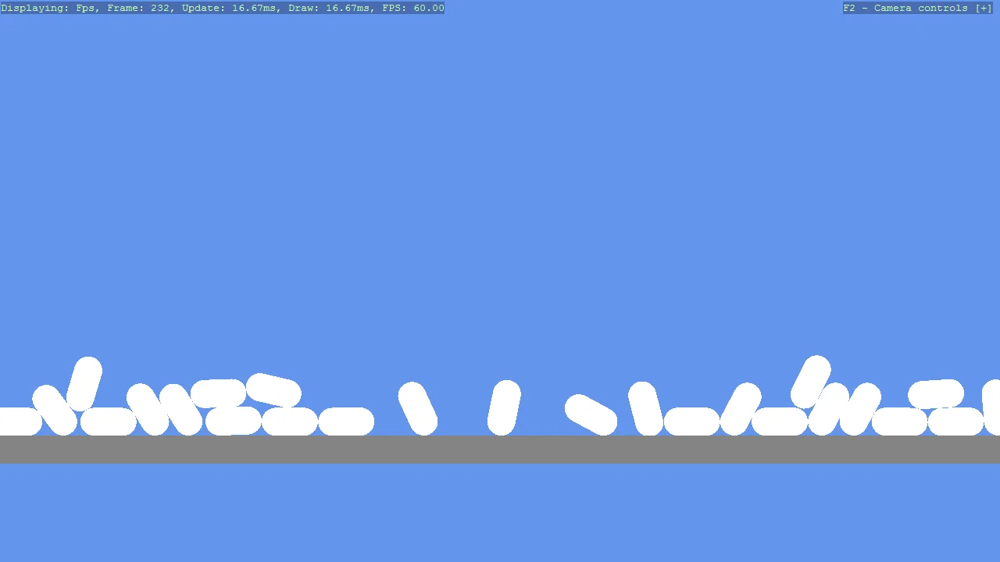

# Basic2D Scene (Capsule) - Bullet Physics

Create a minimal 2D scene using toolkit helpers and place a single capsule primitive.
Demonstrates entity creation, basic positioning, and attaching the entity to the scene.

The `Program.cs` file shows how to:

- Creating a 2D primitive (Capsule)
- Positioning an entity with Transform.Position
- Adding entities to a Scene (rootScene)
- Using helpers: SetupBase2DScene

View on [GitHub](https://github.com/stride3d/stride-community-toolkit/tree/main/examples/code-only/Example01_Basic2DScene_BulletPhysics).

[!code-csharp]
