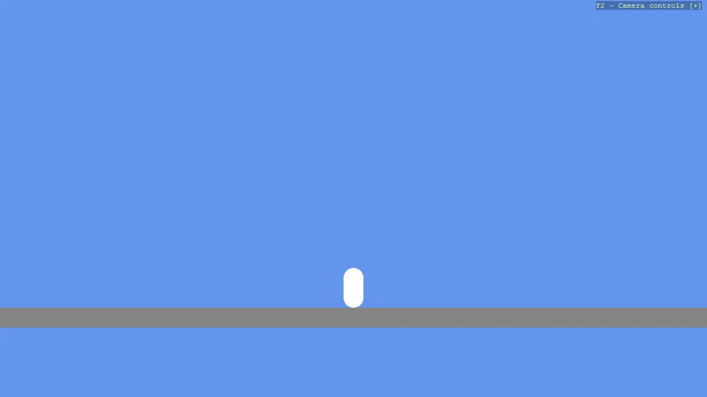

# Basic2D Scene (Capsule)

Create a minimal 2D scene using toolkit helpers and place a single capsule primitive with a flat material.
Demonstrates primitive creation, basic positioning, and attaching the entity to the scene.

The `Program.cs` file shows how to:

- Creating a 2D primitive with Create2DPrimitive
- Applying a flat material with CreateFlatMaterial
- Setting an entity position through primitive options
- Adding entities to a Scene (rootScene)
- Using helpers: SetupBase2DScene

View on [GitHub](https://github.com/stride3d/stride-community-toolkit/tree/main/examples/code-only/Example01_Basic2DScene).

[!code-csharp]
