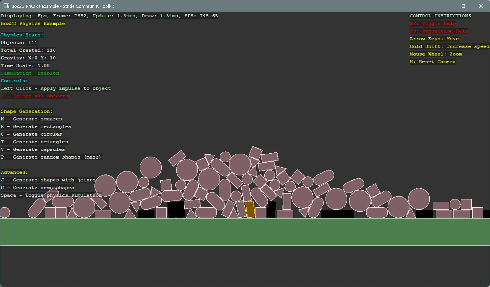

# Box2D.NET Physics

This example demonstrates how to integrate Box2D.NET with Stride to run a fixed‑step 2D physics simulation, create dynamic/kinematic/static bodies, and visualize interactions in a 2D scene.

This example shows how to:
- Initialize a reusable 2D physics world and bridge it to Stride entities
- Configure gravity
- Create bodies and shapes
- Synchronize entity transforms from physics bodies

[!INCLUDE [note-additional-packages](../../../includes/manual/examples/note-additional-packages.md)]

> [!NOTE]
> This example requires also an additional NuGet package `Box2D.NET`. Make sure to install it before running the code.

View on [GitHub](https://github.com/stride3d/stride-community-toolkit/tree/main/examples/code-only/Example18_Box2DPhysics).

[!code-csharp]