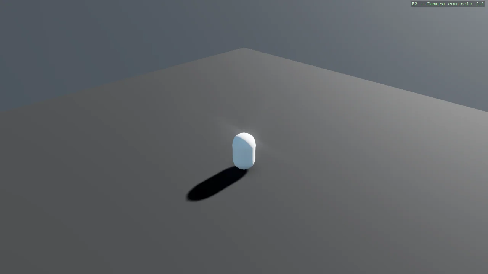

# Basic3D Scene (Capsule) - Bullet Physics

The same first scene as Example01_Basic3DScene, running on the legacy Bullet physics engine instead
of Bepu. The scene code is character-for-character identical; the only difference is which toolkit
package is referenced and which namespace is opened. That is the point of the example - physics is
swapped at the project level, not by rewriting the scene.

The `Program.cs` file shows how to:

- Running the base 3D scene on the legacy Bullet physics engine
- Switching engine by namespace: Stride.CommunityToolkit.Bullet in place of .Bepu
- Why the scene code needs no change when the physics engine does
- Using helpers: SetupBase3DScene, AddSkybox, Create3DPrimitive

View on [GitHub](https://github.com/stride3d/stride-community-toolkit/tree/main/examples/code-only/Example01_Basic3DScene_BulletPhysics).

[!code-csharp]
