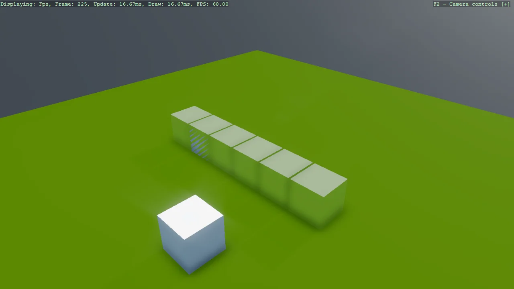

# Collidable Gizmo

A single-purpose demo of CollidableGizmoScript, which draws the collider Bepu is actually using so
it can be compared against the model you think you gave it. The cube here is created with
IncludeCollider set to false and the gizmo left visible, which makes the point directly: the gizmo
reports what physics knows about, and if nothing is drawn, nothing is there.

The `Program.cs` file shows how to:

- Drawing the collider a body is really using
- Suppressing the generated collider with IncludeCollider = false
- Showing or hiding the gizmo with its Visible property
- Diagnosing a body that does not collide as expected
- Using helpers: SetupBase3DScene, AddSkybox, AddProfiler, Create3DPrimitive

View on [GitHub](https://github.com/stride3d/stride-community-toolkit/tree/main/examples/code-only/Example08_CollidableGizmo).

[!code-csharp]
