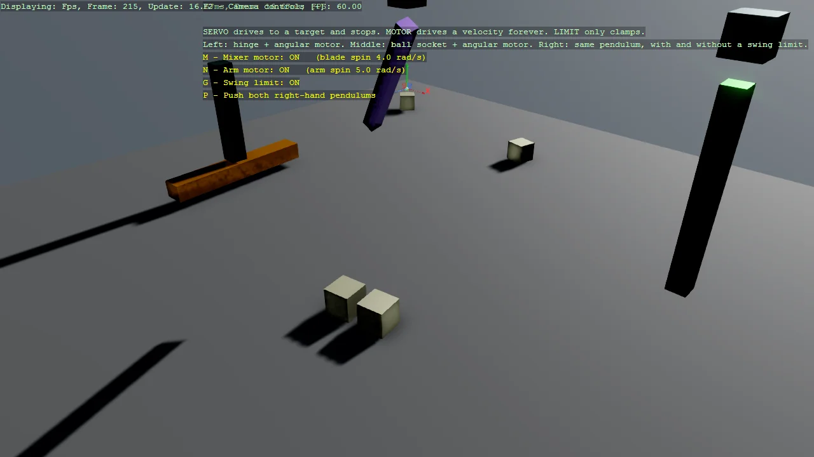

# Constraints - Servo vs Motor vs Limit

The three kinds of Bepu constraint, side by side. A servo drives towards a target position or
orientation and then stops; a motor drives towards a target velocity and never stops; a limit
drives nothing at all and only clamps a range. A mixer blade shows the motor case - a
HingeConstraint decides which way it may turn and a OneBodyAngularMotor makes it turn, and
neither does the job alone. Two identical pendulums show the limit case, where only one carries a
SwingLimit. Every constraint can be switched off while the scene is running, which is the
quickest way to see what it was contributing. The example also shows the trap that catches most
hand-built joints: a constraint does not stop two bodies colliding, so a joint whose parts share
space simply jams. Extends Example15_Constraint, which covers servos and limits but never motors.

The `Program.cs` file shows how to:

- The difference between a servo, a motor and a limit
- Restricting rotation to one axis with HingeConstraintComponent
- Driving continuous rotation with OneBodyAngularMotorConstraintComponent
- Sweeping a tilted arm with AngularAxisMotorConstraintComponent
- Why a whole-vector motor target flattens a cone and a single-axis one does not
- Clamping swing range with SwingLimitConstraintComponent
- Why a constraint does not stop the joined bodies colliding
- Placing a pivot in clear air so the joint does not jam
- Why BallSocketMotor drives linear, not angular, velocity
- Why MotorDamping does not read back the value passed to the constructor
- Switching a motor off does not brake anything, it only stops pushing
- Constraint offsets and axes are in each body's local space
- Enabling and disabling a constraint at runtime
- Why a constraint anchor must be a kinematic body, not a static one
- Why a velocity set from the start callback is lost
- Using helpers: SetupBase3DScene, AddSkybox, AddGroundGizmo, AddProfiler

View on [GitHub](https://github.com/stride3d/stride-community-toolkit/tree/main/examples/code-only/Example15_Constraint_Motors).

[!code-csharp]
