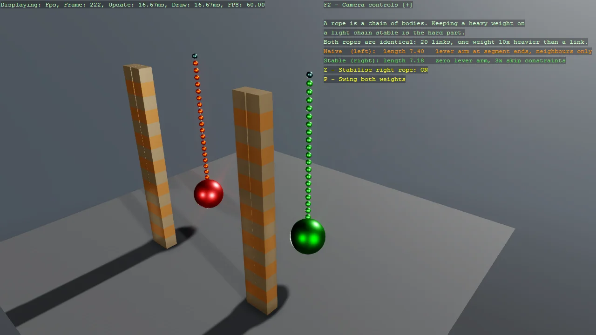

# Rope - building a stable chain of constraints

Bepu has no rope type, so a rope is a chain of small bodies tied together at runtime. Stringing
them together is the easy part; keeping a heavy weight on a light chain from thrashing itself
apart is the real problem, because the force holding that weight up has to travel link by link
to the fixed anchor and the solver only gets so many passes per frame. Two ropes hang side by
side carrying the same weight: the naive one anchors its constraints at the segment ends and ties
each segment only to its neighbour, while the stable one anchors at the segment centres and adds
skip constraints that let impulses take shortcuts along the chain. The skip constraints can be
switched off while it hangs, which shows immediately what they were holding together. Follows
Bepu's own RopeStabilityDemo rather than the more obvious ball-socket construction, which is
precisely the one that misbehaves.

The `Program.cs` file shows how to:

- Building a rope as a runtime chain of bodies and constraints
- Linking segments with DistanceLimitConstraintComponent rather than ball sockets
- Why a rope needs a minimum distance well below its maximum
- Why an unstable rope looks fine while slack and only misbehaves under load
- How the mass ratio between weight and links drives instability
- Why solver iteration count decides how extreme a ratio survives
- Removing angular feedback with a zero lever arm
- Letting impulses take shortcuts with skip constraints
- Moving a constraint's anchor points and allowed distance together at runtime
- Why a constraint shorter than the distance it spans distorts a rope before anything moves
- Deriving an impulse from mass so tuning one does not silently change the other
- Setting collider mass explicitly instead of using the generated collider
- Size for a sphere primitive is its radius, not its diameter
- Making the topmost segment kinematic to hold the chain up
- Applying an impulse from the update loop rather than a velocity at build time
- Using helpers: SetupBase3DScene, AddSkybox, AddProfiler

View on [GitHub](https://github.com/stride3d/stride-community-toolkit/tree/main/examples/code-only/Example15_Constraint_Rope).

[!code-csharp]
