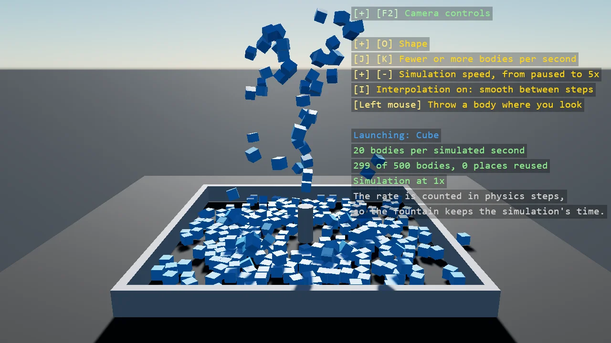

# Cube Fountain

A fountain of cubes, spheres and cylinders that runs on the physics clock. A nozzle launches
bodies at a steady rate counted in ISimulationUpdate, the callback Bepu makes once per fixed
physics step, so the fountain keeps the simulation's time: slow the simulation or pause it and
the fountain slows or stops with it. Slow motion also shows what body interpolation is for,
and a key turns it off to compare. Once the fountain owns as many bodies as it may, the oldest
one's place is reused, so it runs indefinitely with a fixed number of bodies. One instancing
master per shape draws them all.

The `Program.cs` file shows how to:

- A spawn rate counted in ISimulationUpdate, with the fraction of a body carried from step to step
- Why the physics clock - the fountain follows BepuSimulation.TimeScale with no code of its own
- BodyComponent.InterpolationMode - smooth motion between physics steps, seen in slow motion
- Reusing a body - Teleport, then a new velocity, and Awake so a sleeping body takes it
- A cap on the number of bodies, with the oldest one's place reused
- Throwing a body along the camera's forward vector
- Bodies without a model of their own, drawn by one BufferedEntityInstancing master per shape
- A DebugTextDropdown in the overlay to choose the shape

View on [GitHub](https://github.com/stride3d/stride-community-toolkit/tree/main/examples/code-only/E05_3D_CubeFountain).

[!code-csharp]