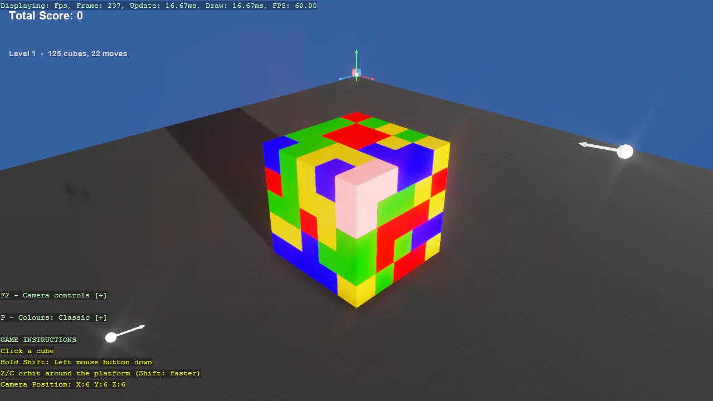

# Game - Cubicle Calamity

A colour-match collapse puzzle built entirely from code. A 10x10x10 platform of cubes builds
itself one layer at a time, clicking a cube clears every same-coloured cube connected to it, and
what is left above drops into the gap.
Shows how to structure a whole game without the editor: scene setup split from gameplay, a custom
Bepu body that constrains cubes to their own column, screen-space text drawn without the UI
system, and mouse picking through a physics raycast.

The `Program.cs` file shows how to:

- Structuring a code-only game into setup, components and scripts
- Constraining a Bepu body to one axis with a custom BodyComponent
- Locking rotation by zeroing the whole inverse inertia tensor
- Raising the solver substep count to settle a rotation-locked stack
- Picking entities with a camera raycast from the mouse
- Drawing screen-space text without the UI system: EntityTextComponent
- Flood filling a grid to find connected same-coloured neighbours
- Using helpers: Add3DCamera, Add3DGround, AddGizmo, Create3DPrimitive

View on [GitHub](https://github.com/stride3d/stride-community-toolkit/tree/main/examples/code-only/Example_CubicleCalamity).

[!code-csharp]
