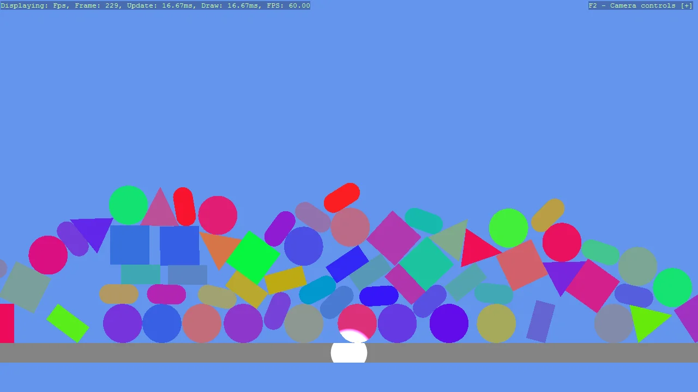

# Basic2D Scene (Debug Rendering)

A pile of falling 2D shapes with the physics debug overlays turned on, so what the simulation is
actually solving can be seen rather than inferred. P draws the colliders and F11 draws the debug
meshes. Both come from components on a single entity that has nothing else to do, which is the
cheapest way to add them to any scene. A spot light is included because 2D scenes are lit like any
other and look flat without one.

The `Program.cs` file shows how to:

- Drawing physics colliders with CollidableGizmoScript
- Toggling debug meshes with DebugRenderComponentScript
- Hanging both off one otherwise empty entity
- Lighting a 2D scene with a LightSpot
- Giving each shape its own colour with a flat material
- Using helpers: SetupBase2D, Add2DCameraController, Add2DGround, Create2DPrimitive

View on [GitHub](https://github.com/stride3d/stride-community-toolkit/tree/main/examples/code-only/Example01_Basic2DScene_DebugRender).

[!code-csharp]
