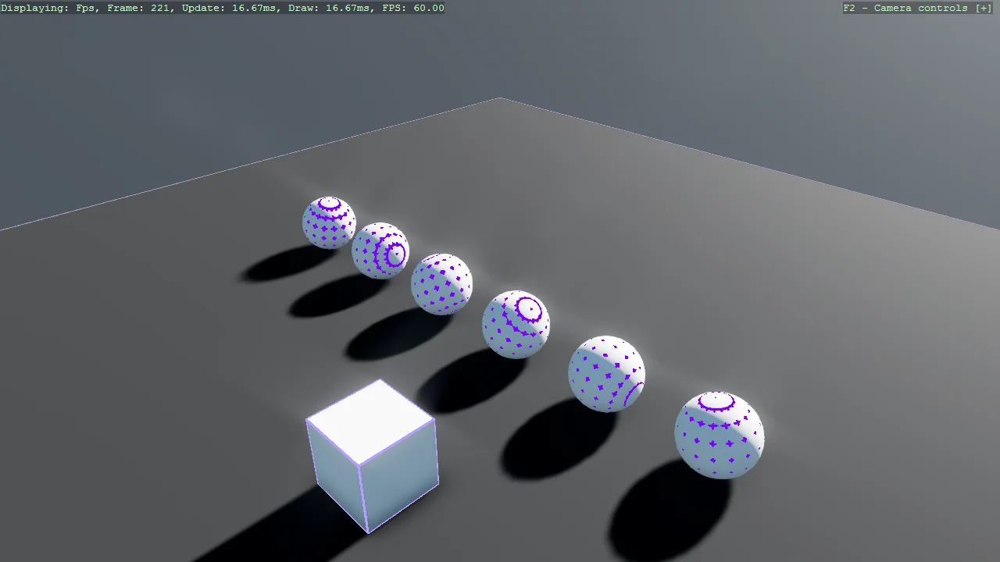

# Debug Render Component

The companion to the collidable gizmo: DebugRenderComponentScript draws the wireframe of an entity's
own mesh rather than its collider. Having both on the same scene is how you tell the two apart -
when a body behaves oddly, the question is usually whether the mesh and the collider agree, and each
script answers one half of that.

The `Program.cs` file shows how to:

- Drawing an entity's mesh as a wireframe overlay
- How this differs from CollidableGizmoScript, which draws the collider
- Toggling the overlay with its Visible property
- Comparing mesh against collider when a body misbehaves
- Using helpers: SetupBase3DScene, AddSkybox, AddProfiler, Create3DPrimitive

View on [GitHub](https://github.com/stride3d/stride-community-toolkit/tree/main/examples/code-only/Example08_DebugRenderComponent).

[!code-csharp]
