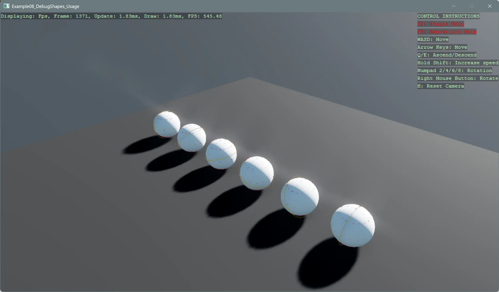

# DebugShapes Usage

This example demonstrates how to use the DebugShapes helpers to draw transient shapes (lines, boxes, spheres, text) in the scene for debugging purposes.

The `Program.cs` file shows how to:
- Initialize the DebugShapes system and enable it for the scene
- Draw lines, AABBs, wireframe primitives, arrows, and text annotations
- Update or clear debug shapes per frame and control lifetimes/colors
- Toggle debug visualization via input

[!INCLUDE [note-additional-packages](../../../includes/manual/examples/note-additional-packages.md)]

> [!NOTE]
> Other required NuGet packages: `Stride.CommunityToolkit.DebugShapes`

View on [GitHub](https://github.com/stride3d/stride-community-toolkit/tree/main/examples/code-only/Example08_DebugShapes_Usage).

[!code-csharp]