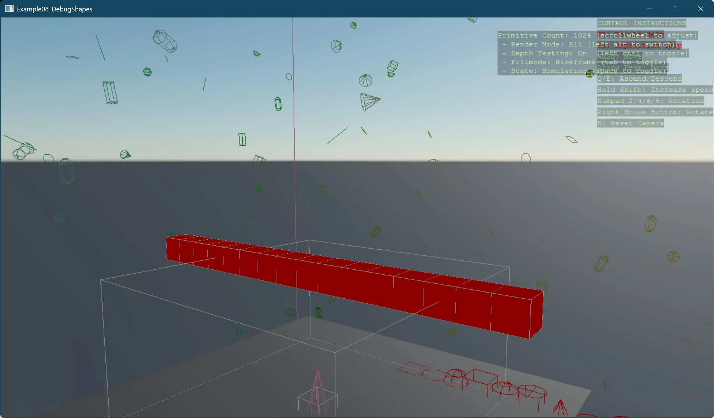

# Debug Shapes

This example sets up a basic 3D scene and adds debugging visuals. A special entity with a `ShapeUpdater` component is added to update and render debug shapes in the scene, making it easier to visualize spatial information during development.

[!INCLUDE [note-additional-packages](../../../includes/manual/examples/note-additional-packages.md)]

View on [GitHub](https://github.com/stride3d/stride-community-toolkit/tree/main/examples/code-only/Example08_DebugShapes).

[!code-csharp]