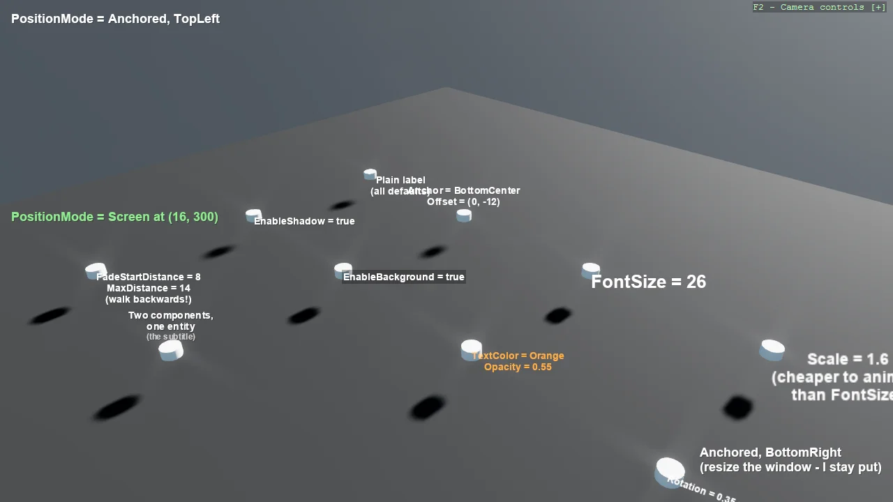

# Entity Text (Screen-Space)

A gallery of everything EntityTextComponent can do, one feature per pole: anchoring, shadows,
backgrounds, scaling, rotation, opacity, distance fading, several texts on one entity, and
HUD text pinned to window corners that survives resizing.
Screen-space text keeps its pixel size at any distance and is never hidden by geometry.

The `Program.cs` file shows how to:

- Registering the text renderer once: AddEntityTextRenderer
- Centring a label over an object with TextAnchor, not TextAlignment
- Shadow and background for readability over a 3D scene
- Animating Scale instead of FontSize
- Distance fading with FadeStartDistance and MaxDistance
- Several EntityTextComponents on one entity
- HUD text that survives window resizing: TextPositionMode.Anchored

View on [GitHub](https://github.com/stride3d/stride-community-toolkit/tree/main/examples/code-only/Example01_EntityText).

[!code-csharp]
