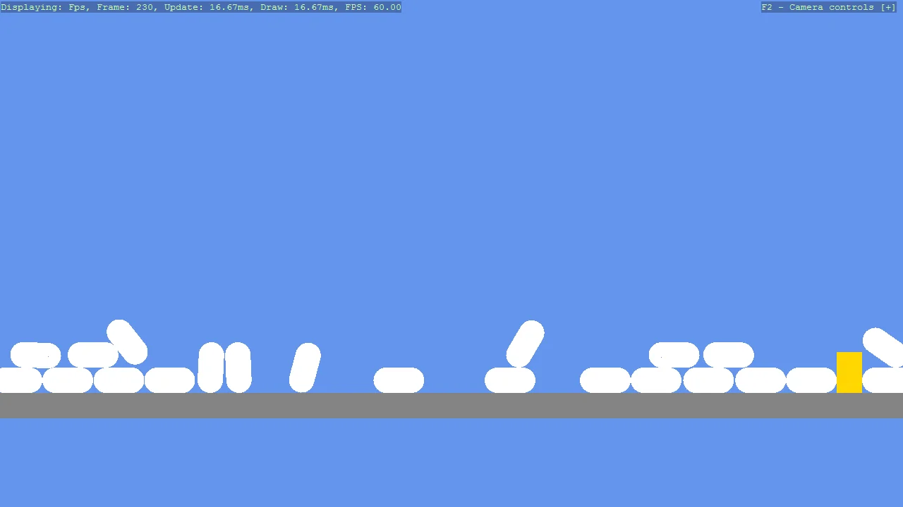

# Basic2D Scene (Falling Shapes)

Create a minimal 2D scene using toolkit helpers and place multiple capsule primitives with flat materials.
Demonstrates primitive creation, basic positioning, and attaching the entities to the scene.
The shapes will fall due to physics, showcasing the integration of Bepu physics in a 2D scene.

The `Program.cs` file shows how to:

- Creating a 2D primitive with Create2DPrimitive
- Applying a flat material with CreateFlatMaterial
- Setting an entity position through primitive options
- Adding entities to a Scene (rootScene)
- Using helpers: SetupBase2DScene

View on [GitHub](https://github.com/stride3d/stride-community-toolkit/tree/main/examples/code-only/Example01_Basic2DScene_FallingShapes).

[!code-csharp]
