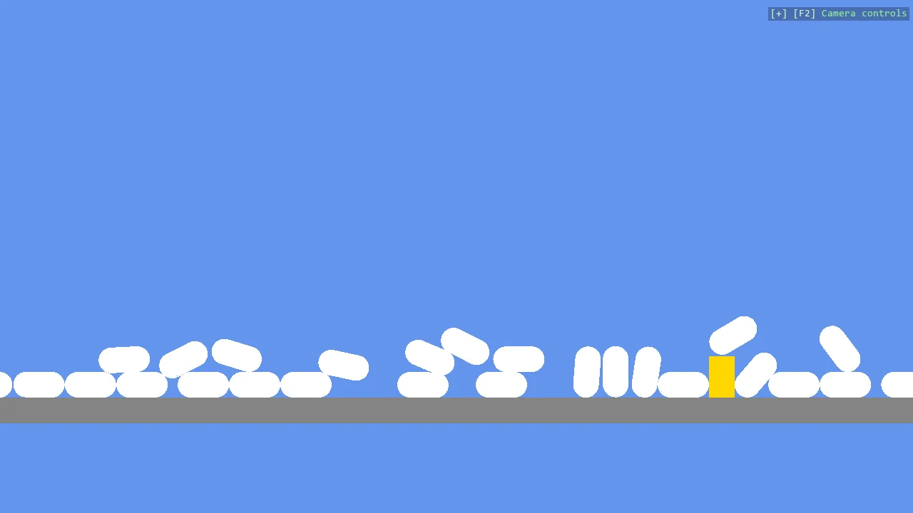

# Falling Shapes with Physics Options (2D)

Thirty capsules and a rectangle dropped in a column, as in E01_2D_FallingShapes, with one thing
added: each capsule is given its own Body2DComponent with a lower FrictionCoefficient, so the pile
spreads wider than with the default. It shows where a body's physics options go when a primitive
is created.

The `Program.cs` file shows how to:

- Passing a Body2DComponent to Create2DPrimitive to set physics options
- FrictionCoefficient - a lower value lets the pile spread
- An empty CompoundCollider that the helper fills with the fitted shape
- Using helpers: SetupBase2DScene, AddProfiler, Create2DPrimitive, CreateFlatMaterial

View on [GitHub](https://github.com/stride3d/stride-community-toolkit/tree/main/examples/code-only/E05_2D_FallingShapes).

[!code-csharp]