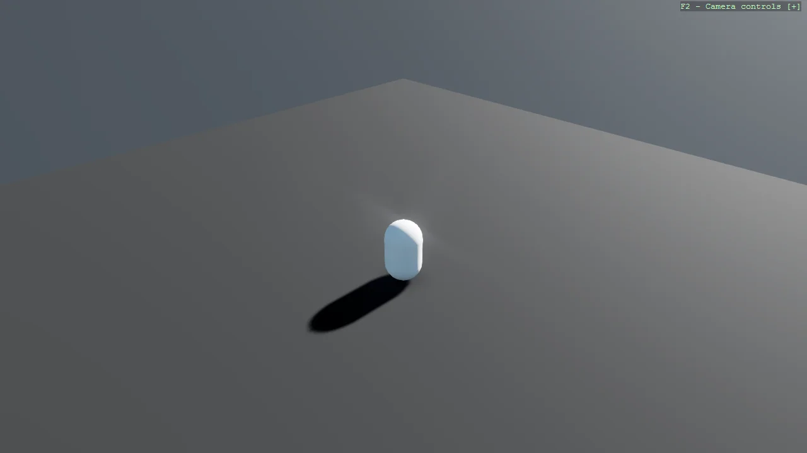

# Basic3D Scene (Capsule) - File-Based App

The same minimal 3D scene as Example01_Basic3DScene, written as a .NET 10 file-based app: a single
C# file with no .csproj. NuGet packages, project references and MSBuild properties are declared
inline with #:package, #:project and #:property directives, so the example runs with
"dotnet run Program.cs". Use "dotnet project convert" to turn it back into a regular project.

The `Program.cs` file shows how to:

- Running a Stride game as a .NET 10 file-based app (no .csproj)
- Declaring NuGet packages inline with #:package
- Referencing projects inline with #:project
- Setting MSBuild properties inline with #:property
- Converting a file-based app to a project with dotnet project convert
- Using helpers: SetupBase3DScene
- Using helpers: AddSkybox

View on [GitHub](https://github.com/stride3d/stride-community-toolkit/tree/main/examples/code-only/Example01_Basic3DScene_FileBasedApp).

[!code-csharp]
