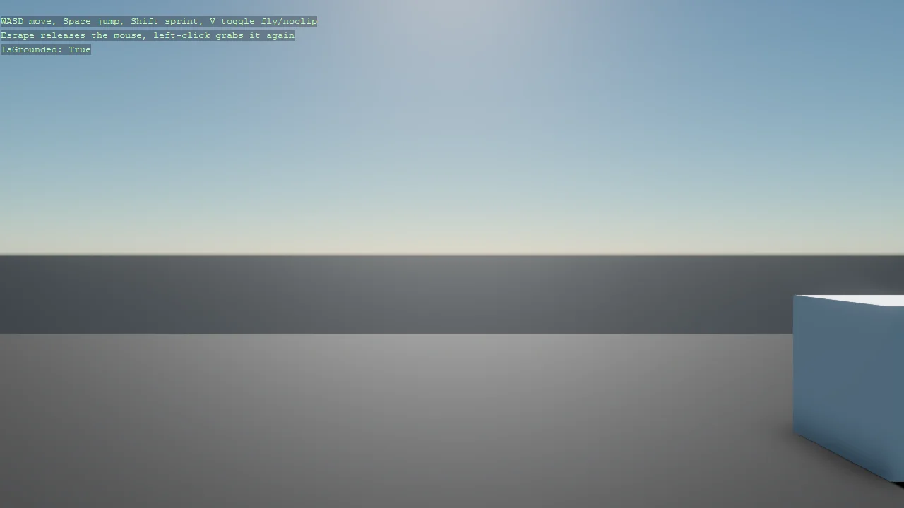

# First-Person Character (Bepu)

A first-person character built entirely from code - no Game Studio scene - on a Bepu
CharacterComponent, with boxes to walk into and jump onto. Two details make it work. The scene uses
SetupBase3D rather than SetupBase3DScene, because the latter attaches the fly-around debug camera
that would fight the controller for the same camera. And the controller is a component plus a
processor pair, registered automatically by DefaultEntityComponentProcessor, which is how you add
per-frame behaviour to many entities without a script on each one.

The `Program.cs` file shows how to:

- Building a character controller with Bepu CharacterComponent
- Attaching a collider by passing the component through Bepu3DPhysicsOptions
- Why SetupBase3D, not SetupBase3DScene, for a custom camera
- Pairing an EntityComponent with an EntityProcessor
- Auto-registering a processor with [DefaultEntityComponentProcessor]
- Driving a physics body from the camera entity
- Using helpers: SetupBase3D, Add3DGround, AddSkybox, Create3DPrimitive

View on [GitHub](https://github.com/stride3d/stride-community-toolkit/tree/main/examples/code-only/Example20_BepuFirstPersonCharacter).

[!code-csharp]
