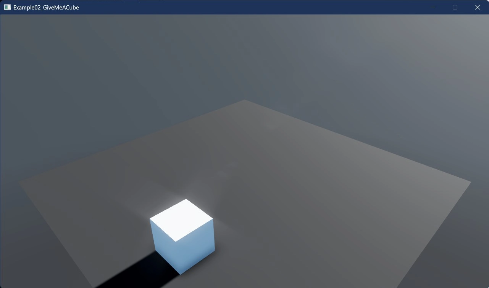

# Give me a cube

This example demonstrates the essential steps to create a 3D cube in Stride. Just like the previous example, the cube entity comes automatically equipped with a rigid body and a collider, thanks to the `CreatePrimitive()` method.

The cube is positioned at `(1f, 0.5f, 3f)` in the 3D world space. This example is perfect for those who are new to 3D game development with Stride.

[!INCLUDE [note-additional-pakcages](../../../includes/manual/examples/note-additional-pakcages.md)]

View on [GitHub](https://github.com/stride3d/stride-community-toolkit/tree/main/examples/code-only/Example02_GiveMeACube).

[!code-csharp]