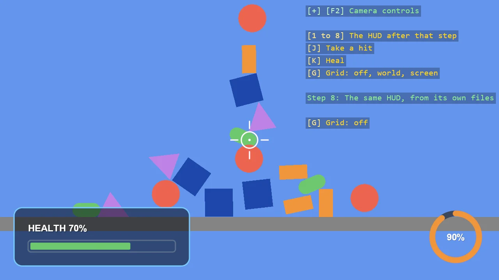

# HUD Basics (Step by Step)

A simple HUD built in eight steps with ShapeBatch: a panel in a corner, a health bar, an energy
dial, a crosshair, labels, a warning light and a damage flash, and at the end the same HUD moved
into files of its own. The number keys show the HUD as it stood after each step. It is the
program of the tutorial "Build a simple HUD with ShapeBatch", which walks through it a step at
a time.

The `Program.cs` file shows how to:

- Drawing on the screen in pixels with ShapeBatch.Screen, Corner and ScreenSize
- Outline and fill - BorderWidth and Fill as the state each draw call takes
- Immediate mode - a bar and a dial that are redrawn from a value every frame
- Arcs and angles, rings, pixel lines
- Screen-space text with EntityTextComponent, since ShapeBatch does not draw text
- Glow and Opacity, and putting the state back afterwards
- Draw order - what is submitted first lies underneath
- Moving a HUD out of Program.cs into a class and a style

View on [GitHub](https://github.com/stride3d/stride-community-toolkit/tree/main/examples/code-only/E03_2D_HUD_Basics).

[!code-csharp]