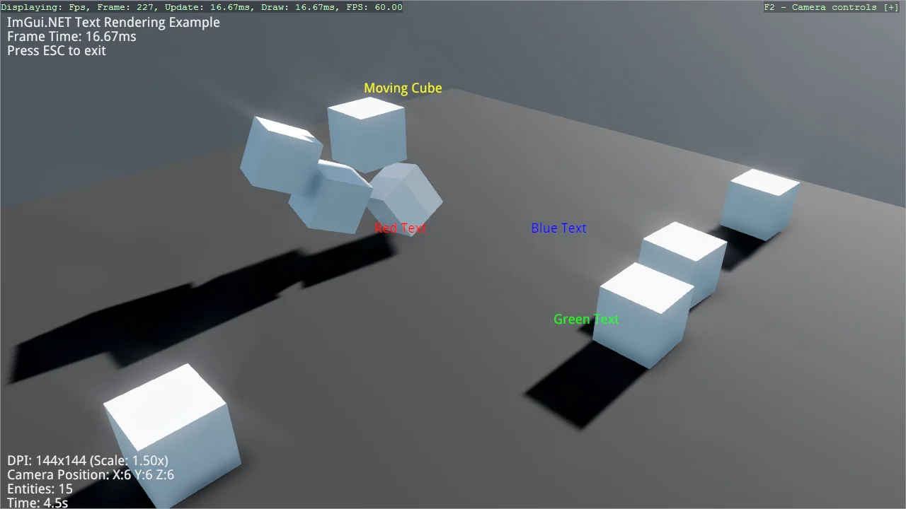

# ImGui.NET Text Rendering

Render debug text with ImGui.NET, both in screen space and anchored to positions in the 3D scene.
A kinematic Bepu body follows a circular path and knocks over stacks of dynamic boxes, showing why
SetTargetPose moves a physics body while writing Transform.Position does not. The ImGui font atlas
is rebuilt for the monitor's DPI so the overlay stays crisp on high-DPI displays.

The `Program.cs` file shows how to:

- Drawing screen-space text with DrawText
- Anchoring text to a world-space position
- Driving a kinematic BodyComponent with SetTargetPose
- Why writing Transform.Position does not move a physics body
- Rebuilding the ImGui font atlas for the window DPI
- Using helpers: AddImGuiNet
- Using helpers: SetupBase3DScene
- Using helpers: AddProfiler

View on [GitHub](https://github.com/stride3d/stride-community-toolkit/tree/main/examples/code-only/Example11_ImGuiNet).

[!code-csharp]
