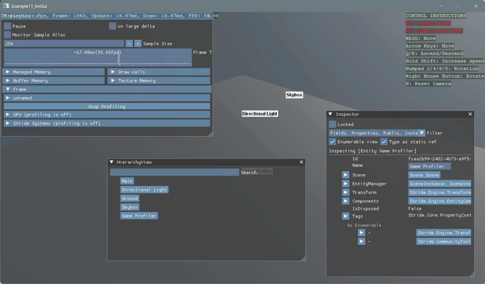

# ImGui UI

This example demonstrates how to integrate [ImGui](https://github.com/HexaEngine/Hexa.NET.ImGui) with the Stride game engine to render an immediate‑mode UI overlay for in‑game tools, debugging, and live controls.

This project will show how to: 
- Initialize and configure the ImGui integration
- Draw ImGui windows, menus, and controls every frame
- Handle input events and toggle UI visibility
- Display real‑time stats or debug panels

[!INCLUDE [note-additional-packages](../../../includes/manual/examples/note-additional-packages.md)]

View on [GitHub](https://github.com/stride3d/stride-community-toolkit/tree/main/examples/code-only/Example11_ImGui).

[!code-csharp]