# Code-Only Examples

Every code-only example, with a screenshot of what it actually renders. Each one is a complete, self-contained program you can copy and run - no Game Studio project, no assets to import.

Prefer a list? Each level has its own page, linked from the table of contents.

## C# Getting Started

    

        

            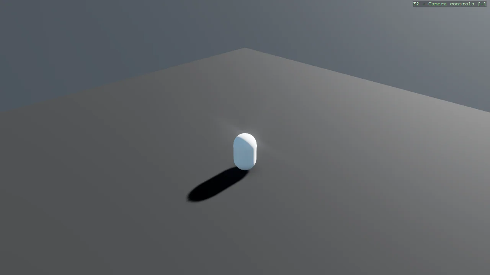
            

                <h3 class="card-title h6">Basic3D Scene (Capsule)</h3>
                
Shapes

                
Create a minimal 3D scene using toolkit helpers, add a skybox, and place a single capsule primitive.

            

            
<a class="stretched-link" href="capsule-with-rigid-body.md">Open example</a>

        

    

    

        

            
            

                <h3 class="card-title h6">Basic3D Scene (Capsule) - File-Based App</h3>
                
Shapes

                
The same minimal 3D scene as Example01_Basic3DScene, written as a .NET 10 file-based app: a single C# file with no .csproj.

            

            
<a class="stretched-link" href="file-based-app.md">Open example</a>

        

    

    

        

            
            

                <h3 class="card-title h6">Basic2D Scene (Capsule)</h3>
                
Shapes

                
Create a minimal 2D scene using toolkit helpers and place a single capsule primitive with a flat material.

            

            
<a class="stretched-link" href="basic-2d-scene.md">Open example</a>

        

    

    

        

            
            

                <h3 class="card-title h6">Basic2D Scene (Capsule) - Bullet Physics</h3>
                
Shapes

                
Create a minimal 2D scene using toolkit helpers and place a single capsule primitive.

            

            
<a class="stretched-link" href="basic-2d-scene-bullet.md">Open example</a>

        

    

    

        

            
            

                <h3 class="card-title h6">Basic3D Scene (Capsule) - Bullet Physics</h3>
                
Shapes

                
The same first scene as Example01_Basic3DScene, running on the legacy Bullet physics engine instead of Bepu.

            

            
<a class="stretched-link" href="capsule-with-rigid-body-bullet.md">Open example</a>

        

    

## C# Beginner

    

        

            
            

                <h3 class="card-title h6">Basic3D Scene (Every Primitive)</h3>
                
Shapes

                
Every 3D primitive the toolkit can build - cube, cone, capsule, sphere, cylinder, teapot, torus and triangular prism - dropped into one scene so the...

            

            
<a class="stretched-link" href="primitives-3d.md">Open example</a>

        

    

    

        

            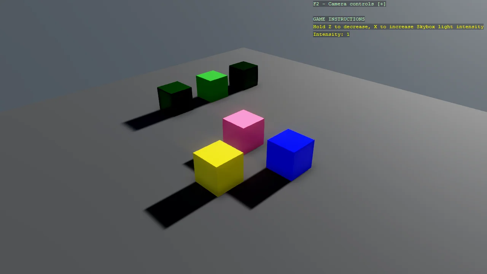
            

                <h3 class="card-title h6">Material</h3>
                
Rendering

                
A row of cubes that differ only in their material, so the effect of each property is visible in isolation.

            

            
<a class="stretched-link" href="material.md">Open example</a>

        

    

    

        

            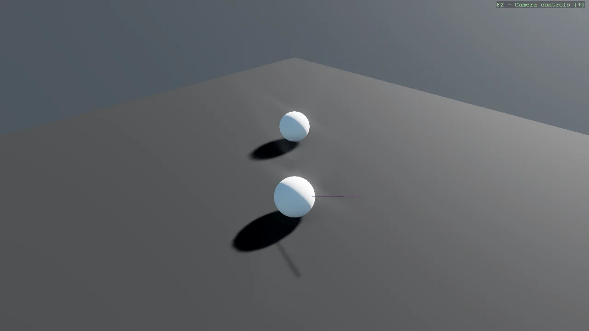
            

                <h3 class="card-title h6">Mesh Line</h3>
                
Geometry

                
A line drawn between two spheres, built as a real mesh rather than a debug primitive.

            

            
<a class="stretched-link" href="mesh-line.md">Open example</a>

        

    

    

        

            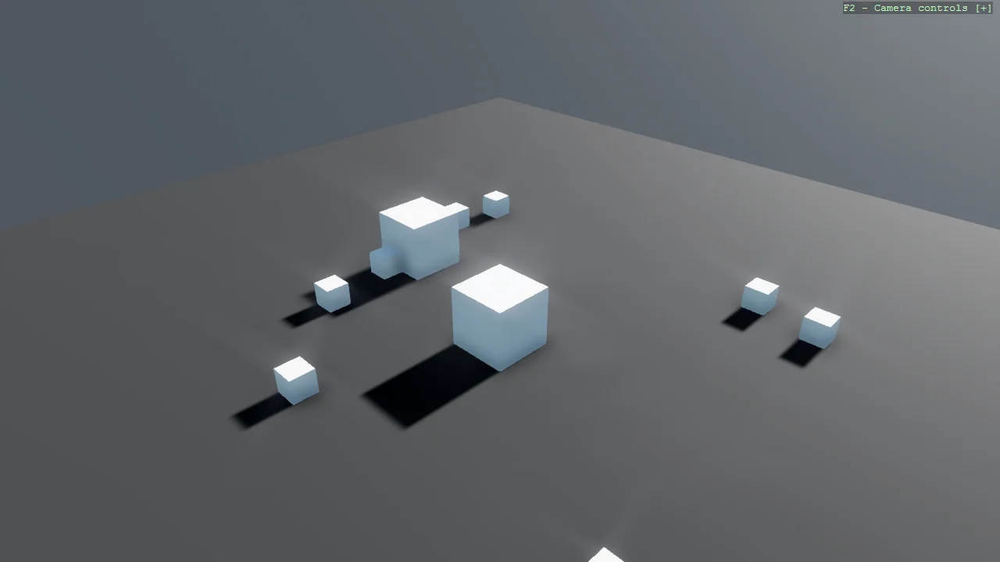
            

                <h3 class="card-title h6">Give Me a Cube</h3>
                
Scripts

                
Add behaviour to an entity with a SyncScript component instead of the update callback of game.Run.

            

            
<a class="stretched-link" href="give-me-cube-body.md">Open example</a>

        

    

    

        

            
            

                <h3 class="card-title h6">SyncScript - moving a body every frame</h3>
                
Scripts

                
A cube driven in a circle by a SyncScript, which is the ordinary way to run code every frame.

            

            
<a class="stretched-link" href="sync-script.md">Open example</a>

        

    

    

        

            
            

                <h3 class="card-title h6">Entity Text (Screen-Space)</h3>
                
Text

                
A gallery of everything EntityTextComponent can do, one feature per pole: anchoring, shadows, backgrounds, scaling, rotation, opacity, distance...

            

            
<a class="stretched-link" href="entity-text.md">Open example</a>

        

    

    

        

            
            

                <h3 class="card-title h6">World Text (In-Scene)</h3>
                
Text

                
A gallery of everything WorldTextComponent can do, one setting per station: billboarding that stays upright, free billboarding, text fixed in place,...

            

            
<a class="stretched-link" href="world-text.md">Open example</a>

        

    

    

        

            
            

                <h3 class="card-title h6">Basic2D Scene (Multiple Primitives)</h3>
                
Shapes

                
Create a minimal 2D scene using toolkit helpers and place multiple different primitive shapes.

            

            
<a class="stretched-link" href="primitives-2d.md">Open example</a>

        

    

    

        

            
            

                <h3 class="card-title h6">Basic2D Scene (Falling Shapes)</h3>
                
Physics

                
Create a minimal 2D scene using toolkit helpers and place multiple capsule primitives with flat materials.

            

            
<a class="stretched-link" href="falling-shapes-2d.md">Open example</a>

        

    

    

        

            
            

                <h3 class="card-title h6">Basic2D Scene (Debug Rendering)</h3>
                
Debug

                
A pile of falling 2D shapes with the physics debug overlays turned on, so what the simulation is actually solving can be seen rather than inferred.

            

            
<a class="stretched-link" href="debug-render-2d.md">Open example</a>

        

    

    

        

            
            

                <h3 class="card-title h6">DPI-Aware Window</h3>
                
Debug

                
The capsule scene again, with one difference that is not in the C# at all: an app.manifest declaring the process per-monitor DPI aware, referenced...

            

            
<a class="stretched-link" href="dpi-aware.md">Open example</a>

        

    

## C# Intermediate

    

        

            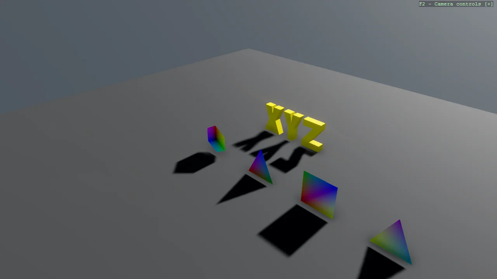
            

                <h3 class="card-title h6">Procedural Geometry</h3>
                
Geometry

                
A triangle, a plane and a circle built at runtime with MeshBuilder, which handles the vertex layout and buffer bookkeeping that raw buffers make you...

            

            
<a class="stretched-link" href="procedural-geometry.md">Open example</a>

        

    

    

        

            
            

                <h3 class="card-title h6">Simple Geometry (Labelled Triangle)</h3>
                
Geometry

                
The smallest possible custom mesh - one triangle from three vertices - with each vertex labelled on screen so the relationship between the numbers in...

            

            
<a class="stretched-link" href="simple-geometry.md">Open example</a>

        

    

    

        

            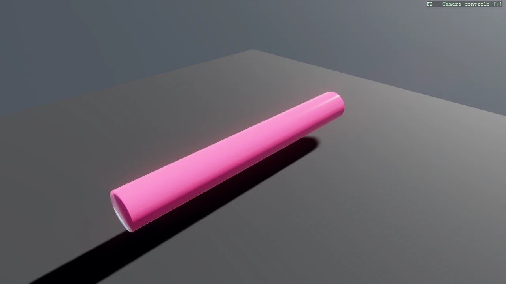
            

                <h3 class="card-title h6">Cylinder Mesh</h3>
                
Geometry

                
A cylinder generated with MeshBuilder, split into the three jobs any surface of revolution needs: place a ring of vertices, join consecutive rings...

            

            
<a class="stretched-link" href="cylinder-mesh.md">Open example</a>

        

    

    

        

            
            

                <h3 class="card-title h6">Partial Torus Mesh</h3>
                
Geometry

                
A torus defined parametrically from two angles - one around the tube, one around the ring - and cut short by limiting the second, which turns the same...

            

            
<a class="stretched-link" href="partial-torus-mesh.md">Open example</a>

        

    

    

        

            
            

                <h3 class="card-title h6">3D Letters (Mesh Text)</h3>
                
Text

                
A gallery of every glyph LetterMeshFactory can build - the digits, the full A-Z alphabet and the dash - as solid extruded meshes that catch the light...

            

            
<a class="stretched-link" href="letters-3d.md">Open example</a>

        

    

    

        

            
            

                <h3 class="card-title h6">Give Me a Cube (SimulationUpdate)</h3>
                
Physics

                
Drive an entity from the physics clock instead of the render loop.

            

            
<a class="stretched-link" href="simulation-update.md">Open example</a>

        

    

    

        

            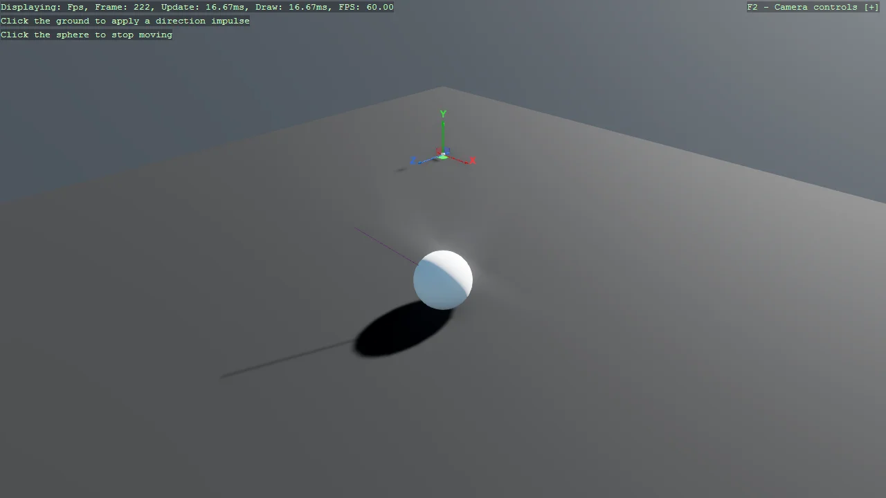
            

                <h3 class="card-title h6">Raycast</h3>
                
Physics

                
Click the ground and a sphere is kicked towards where you clicked; click the sphere and it stops dead.

            

            
<a class="stretched-link" href="raycast.md">Open example</a>

        

    

    

        

            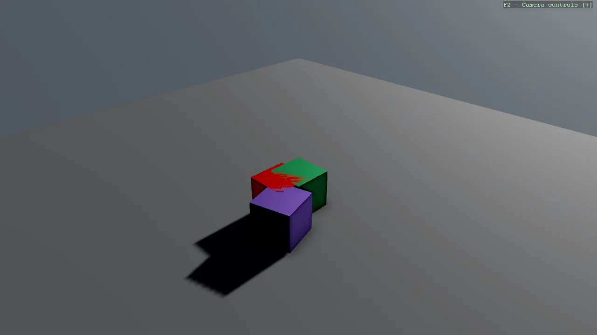
            

                <h3 class="card-title h6">Collision Group</h3>
                
Physics

                
Two players and an enemy, where the players collide with each other but the enemy passes through both.

            

            
<a class="stretched-link" href="collision-group.md">Open example</a>

        

    

    

        

            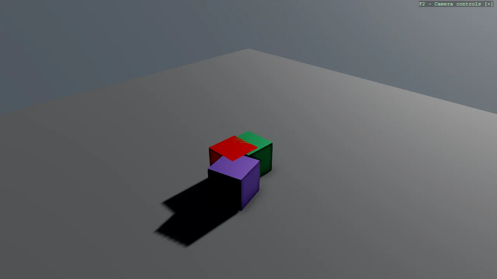
            

                <h3 class="card-title h6">Collision Layer</h3>
                
Physics

                
The same players-and-enemy scene as the collision group example, solved the other way.

            

            
<a class="stretched-link" href="collision-layer.md">Open example</a>

        

    

    

        

            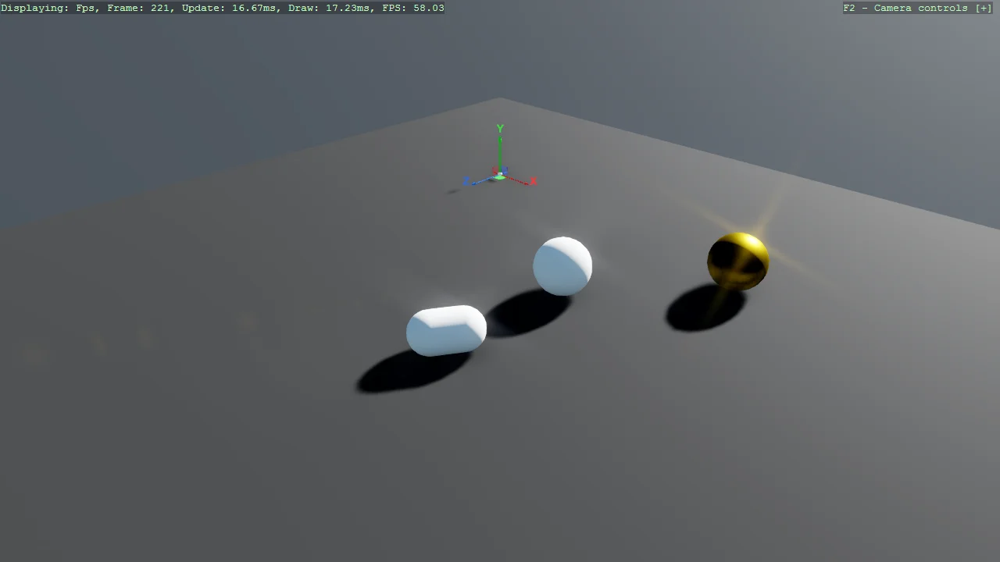
            

                <h3 class="card-title h6">Simple Constraint</h3>
                
Physics

                
One constraint, doing one thing: a distance servo holding two spheres three units apart, pulling them together or pushing them apart until they settle...

            

            
<a class="stretched-link" href="simple-constraint.md">Open example</a>

        

    

    

        

            
            

                <h3 class="card-title h6">Constraints - Servo vs Motor vs Limit</h3>
                
Physics

                
The three kinds of Bepu constraint, side by side.

            

            
<a class="stretched-link" href="constraint-motors.md">Open example</a>

        

    

    

        

            
            

                <h3 class="card-title h6">First-Person Character (Bepu)</h3>
                
Physics

                
A first-person character built entirely from code - no Game Studio scene - on a Bepu CharacterComponent, with boxes to walk into and jump onto.

            

            
<a class="stretched-link" href="first-person-character.md">Open example</a>

        

    

    

        

            
            

                <h3 class="card-title h6">GPU Instancing</h3>
                
Performance

                
Render two identical walls of cubes built two different ways, side by side.

            

            
<a class="stretched-link" href="instancing.md">Open example</a>

        

    

    

        

            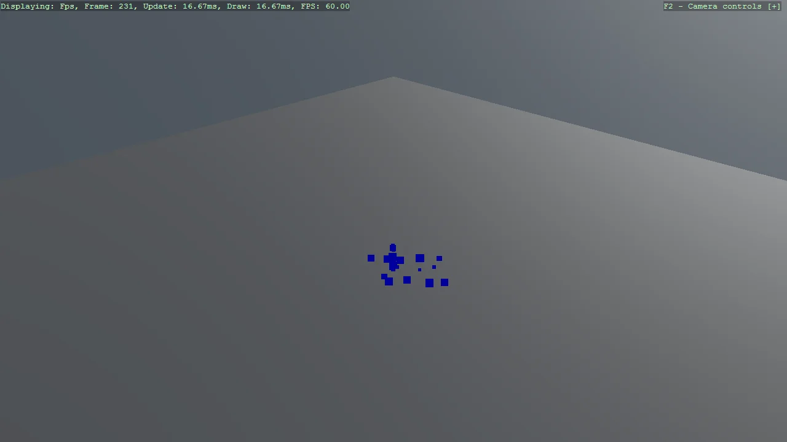
            

                <h3 class="card-title h6">Particles</h3>
                
Rendering

                
A blue fountain: fifty particles a second launched upward from a small area, pulled back down by gravity, each rendered as a camera-facing billboard.

            

            
<a class="stretched-link" href="particles.md">Open example</a>

        

    

    

        

            
            

                <h3 class="card-title h6">Debug Shapes</h3>
                
Debug

                
The full tour of the DebugShapes package: every immediate-mode primitive it can draw, exercised from a ShapeUpdater component so the shapes animate...

            

            
<a class="stretched-link" href="debug-shapes.md">Open example</a>

        

    

    

        

            
            

                <h3 class="card-title h6">Debug Shapes Usage</h3>
                
Debug

                
The short version of the debug shapes example: turn the system on, draw a sphere and a circle, done.

            

            
<a class="stretched-link" href="debug-shapes-usage.md">Open example</a>

        

    

    

        

            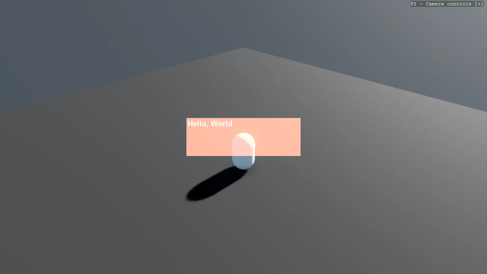
            

                <h3 class="card-title h6">Stride UI - Capsule and Window</h3>
                
UI

                
A capsule in a 3D scene with a "Hello, World" panel drawn over it using Stride's built-in UI.

            

            
<a class="stretched-link" href="stride-ui-capsule-with-rigid-body.md">Open example</a>

        

    

    

        

            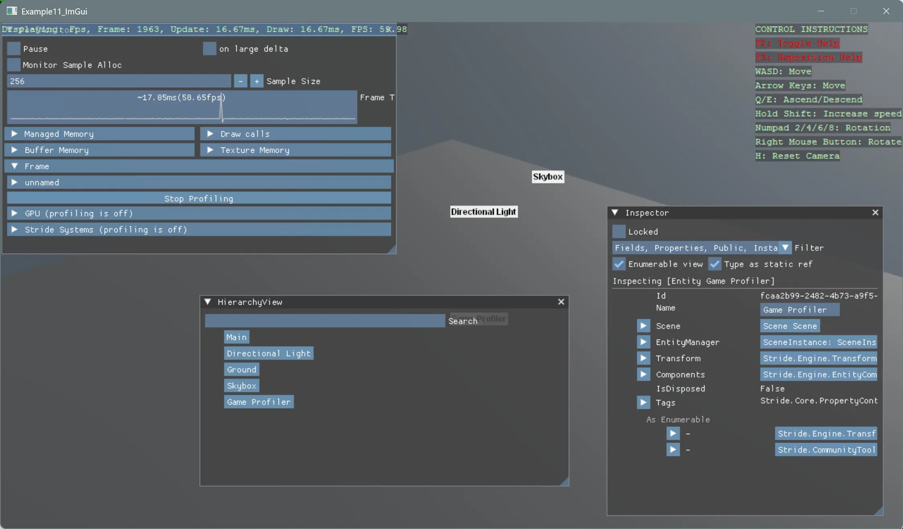
            

                <h3 class="card-title h6">ImGui UI</h3>
                
UI

                
An ImGui overlay for in-game tools, debug panels and live tweaking.

            

            
<a class="stretched-link" href="imgui-ui.md">Open example</a>

        

    

    

        

            
            

                <h3 class="card-title h6">2D Spawn Menu</h3>
                
Input

                
Drive a scene from the keyboard without filling the screen with instructions.

            

            
<a class="stretched-link" href="spawn-menu-2d.md">Open example</a>

        

    

## C# Advanced

    

        

            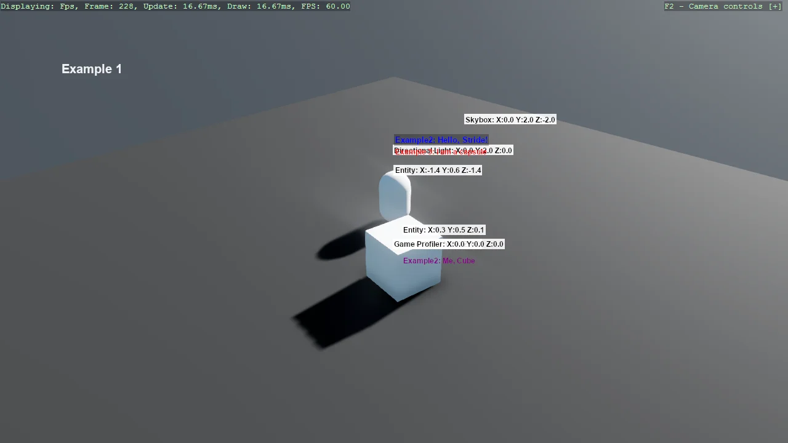
            

                <h3 class="card-title h6">Custom Scene Renderers</h3>
                
Rendering

                
Two ways to draw your own 2D content over a 3D scene, side by side.

            

            
<a class="stretched-link" href="renderer.md">Open example</a>

        

    

    

        

            
            

                <h3 class="card-title h6">Root Renderer Shader</h3>
                
Rendering

                
An animated ribbon background drawn by a custom RootRenderFeature, which is the deepest extension point Stride offers short of writing your own...

            

            
<a class="stretched-link" href="root-renderer-shader.md">Open example</a>

        

    

    

        

            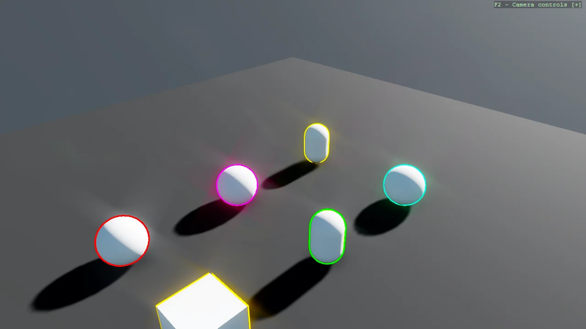
            

                <h3 class="card-title h6">Mesh Outline Render Feature</h3>
                
Rendering

                
Draw coloured outlines around 3D primitives with a custom RootRenderFeature.

            

            
<a class="stretched-link" href="mesh-outline.md">Open example</a>

        

    

    

        

            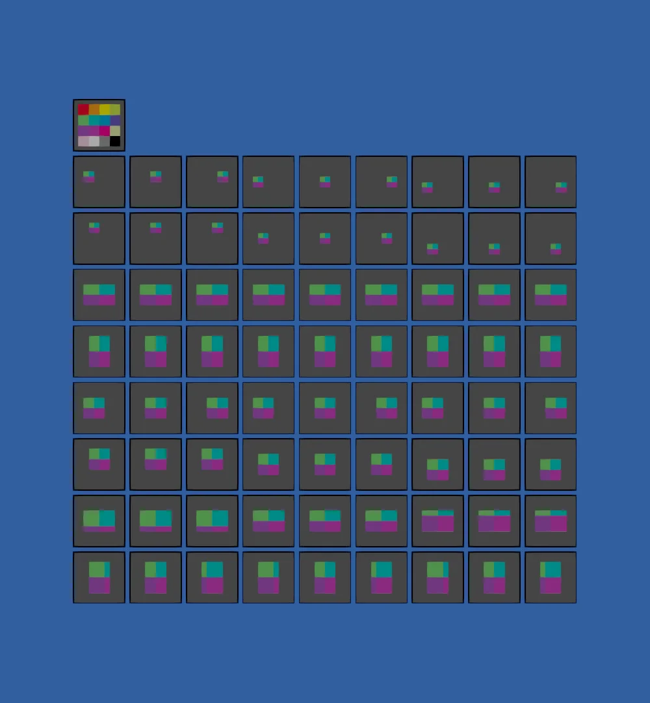
            

                <h3 class="card-title h6">Image Processing (TextureCanvas)</h3>
                
Rendering

                
Every combination of anchor and stretch that TextureCanvas can apply, drawn as a grid of thumbnails so the options can be compared rather than read...

            

            
<a class="stretched-link" href="image-processing.md">Open example</a>

        

    

    

        

            
            

                <h3 class="card-title h6">Instancing with Entity Transforms</h3>
                
Performance

                
Keep every object a real entity - with a transform, a physics body and anything else you need - while still drawing the whole crowd in a single draw...

            

            
<a class="stretched-link" href="instancing-entity-transform.md">Open example</a>

        

    

    

        

            
            

                <h3 class="card-title h6">Basic2D Scene (Stress Pile)</h3>
                
Performance

                
Thousands of 2D physics bodies piling up, drawn in a single draw call through instancing, with the shape, batch size and spawn layout switchable while...

            

            
<a class="stretched-link" href="stress-pile-2d.md">Open example</a>

        

    

    

        

            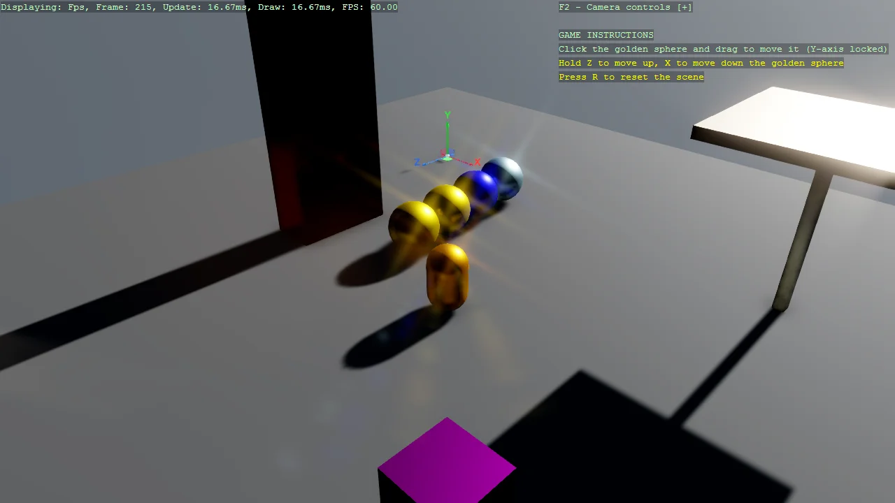
            

                <h3 class="card-title h6">Various Constraints</h3>
                
Physics

                
The full tour of Bepu constraints in one interactive scene: a distance limit holding two spheres within a range, a distance servo actively driving a...

            

            
<a class="stretched-link" href="constraints.md">Open example</a>

        

    

    

        

            
            

                <h3 class="card-title h6">Rope - building a stable chain of constraints</h3>
                
Physics

                
Bepu has no rope type, so a rope is a chain of small bodies tied together at runtime.

            

            
<a class="stretched-link" href="constraint-rope.md">Open example</a>

        

    

    

        

            
            

                <h3 class="card-title h6">Box2D.NET Physics</h3>
                
Physics

                
A 2D simulation run by Box2D.NET rather than by Stride's own physics, with Stride reduced to drawing the result.

            

            
<a class="stretched-link" href="box2d-physics.md">Open example</a>

        

    

    

        

            
            

                <h3 class="card-title h6">Jitter2 Physics Integration</h3>
                
Physics

                
Demonstrates integrating Jitter2 physics engine with Stride.

            

            
<a class="stretched-link" href="jitter2-physics.md">Open example</a>

        

    

    

        

            
            

                <h3 class="card-title h6">Jitter2 Physics - Constraining to 2D</h3>
                
Physics

                
Demonstrates constraining a Jitter2 3D physics simulation to 2D-style behaviour.

            

            
<a class="stretched-link" href="jitter2-constraints.md">Open example</a>

        

    

    

        

            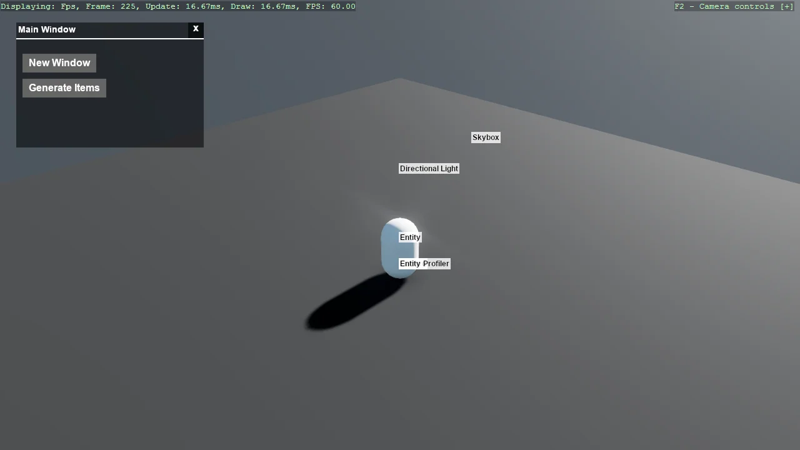
            

                <h3 class="card-title h6">Stride UI - Draggable Window</h3>
                
UI

                
A windowing system built on Stride's UI: windows with title bars and close buttons that can be dragged around, and that come to the front when...

            

            
<a class="stretched-link" href="stride-ui-draggable-window.md">Open example</a>

        

    

    

        

            
            

                <h3 class="card-title h6">Stride UI - Draggable Window - Bullet Physics</h3>
                
UI

                
The draggable window example running on the legacy Bullet physics engine.

            

            
<a class="stretched-link" href="stride-ui-draggable-window-bullet.md">Open example</a>

        

    

    

        

            
            

                <h3 class="card-title h6">ImGui.NET Text Rendering</h3>
                
UI

                
Render debug text with ImGui.NET, both in screen space and anchored to positions in the 3D scene.

            

            
<a class="stretched-link" href="imgui-net.md">Open example</a>

        

    

    

        

            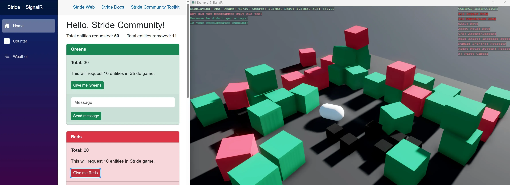
            

                <h3 class="card-title h6">Stride + SignalR</h3>
                
Networking

                
A Stride game and a Blazor web page talking to each other in real time over a SignalR hub, so a button in a browser can spawn an entity in the running...

            

            
<a class="stretched-link" href="stride-signalr.md">Open example</a>

        

    

    

        

            
            

                <h3 class="card-title h6">Game - Cubicle Calamity</h3>
                
Game

                
A colour-match collapse puzzle built entirely from code.

            

            
<a class="stretched-link" href="cubicle-calamity.md">Open example</a>

        

    

## C# Other

    

        

            
            

                <h3 class="card-title h6">Collidable Gizmo</h3>
                
Debug

                
A single-purpose demo of CollidableGizmoScript, which draws the collider Bepu is actually using so it can be compared against the model you think you...

            

            
<a class="stretched-link" href="collidable-gizmo.md">Open example</a>

        

    

    

        

            
            

                <h3 class="card-title h6">Debug Render Component</h3>
                
Debug

                
The companion to the collidable gizmo: DebugRenderComponentScript draws the wireframe of an entity's own mesh rather than its collider.

            

            
<a class="stretched-link" href="debug-render-component.md">Open example</a>

        

    

## F# Getting Started

    

        

            
            

                <h3 class="card-title h6">Capsule with rigid body in F#</h3>
                
Shapes

                
The first code-only scene written in F#.

            

            
<a class="stretched-link" href="capsule-with-rigid-body-fs.md">Open example</a>

        

    

## F# Intermediate

    

        

            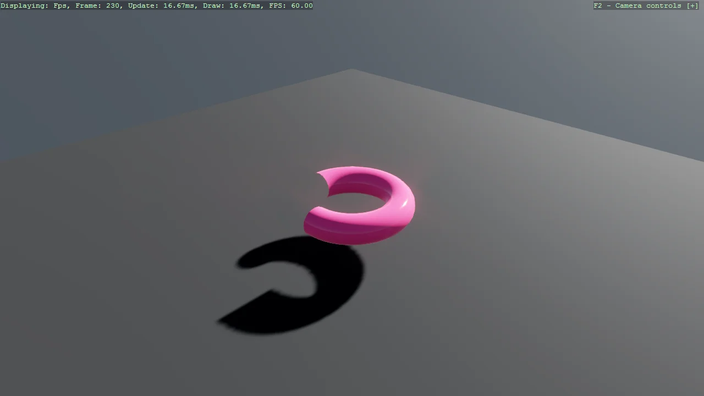
            

                <h3 class="card-title h6">Partial Torus Mesh in F#</h3>
                
Geometry

                
The parametric partial torus, written in F#.

            

            
<a class="stretched-link" href="partial-torus-mesh-fs.md">Open example</a>

        

    

## Visual Basic Getting Started

    

        

            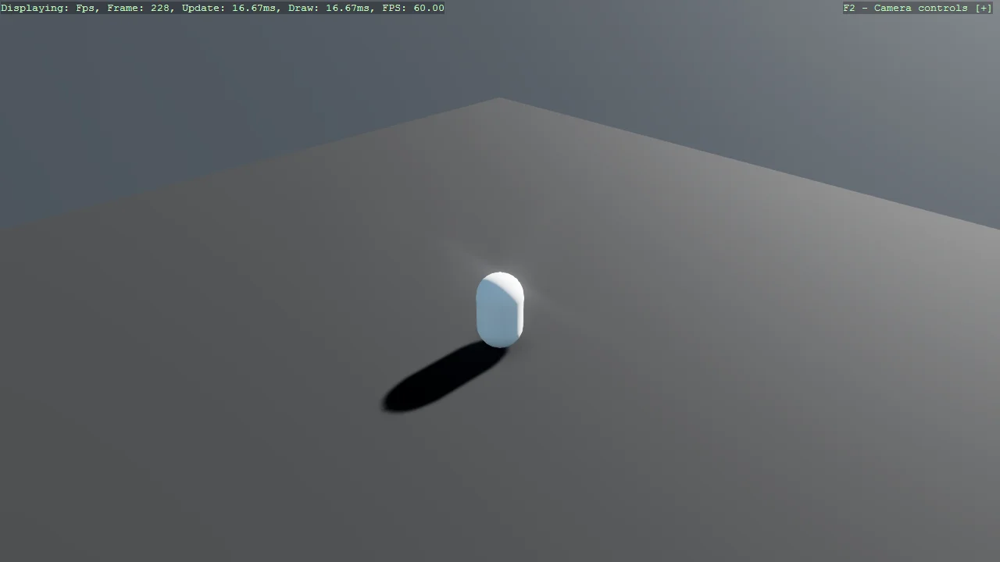
            

                <h3 class="card-title h6">Capsule with rigid body in Visual Basic</h3>
                
Shapes

                
The first code-only scene written in Visual Basic.

            

            
<a class="stretched-link" href="capsule-with-rigid-body-vb.md">Open example</a>

        

    

