# Code-Only Examples

Every code-only example, with a screenshot of what it actually renders. Each one is a complete, self-contained program you can copy and run.

Prefer a list? Each level has its own page, linked from the table of contents.

> [!NOTE]
> Most examples run from a copy of their project with the toolkit packages from NuGet. `Stride.CommunityToolkit.Box2D`, `Stride.CommunityToolkit.Charts` and `Stride.CommunityToolkit.ImGuiNet` are not on NuGet yet,
> so the examples built on them run from a clone of the repository: [Box2D Explosion](box2d-explosion.md), [Box2D Joints](box2d-joints.md), [Box2D Car](box2d-car.md), [Box2D Character Mover](box2d-character-mover.md), [Charts 2D](charts-2d.md), [Charts 3D](charts-3d.md), [Basic 2D Scene (Stress Pile, Box2D)](stress-pile-2d-box2d.md), [Junkyard (Box2D)](junkyard-box2d.md), [Junkyard Playground (Box2D)](junkyard-playground-box2d.md), [Box2D.NET Physics](box2d-physics.md), [ImGui.NET Text Rendering](imgui-net.md).

## C# Getting Started

    

        

            
            

                <h3 class="card-title h6"><a class="stretched-link text-decoration-none text-body" href="capsule-with-rigid-body.md">Basic3D Scene (Capsule)</a></h3>
                
Shapes

                
Create a minimal 3D scene using toolkit helpers, add a skybox, and place a single capsule primitive.

            

        

    

    

        

            
            

                <h3 class="card-title h6"><a class="stretched-link text-decoration-none text-body" href="basic-scene-engine-only.md">Basic3D Scene (Engine Only)</a></h3>
                
Shapes

                
A ground, a cube and a camera written against Stride alone, with no toolkit package: the graphics compositor, the camera, the lights, the procedural...

            

        

    

    

        

            
            

                <h3 class="card-title h6"><a class="stretched-link text-decoration-none text-body" href="file-based-app.md">Basic3D Scene (Capsule) - File-Based App</a></h3>
                
Shapes

                
The same minimal 3D scene as E01_3D_BasicScene, written as a .NET 10 file-based app: a single C# file with no .csproj.

            

        

    

    

        

            
            

                <h3 class="card-title h6"><a class="stretched-link text-decoration-none text-body" href="basic-2d-scene.md">Basic2D Scene (Capsule)</a></h3>
                
Shapes

                
Create a minimal 2D scene using toolkit helpers and place a single capsule primitive with a flat material.

            

        

    

    

        

            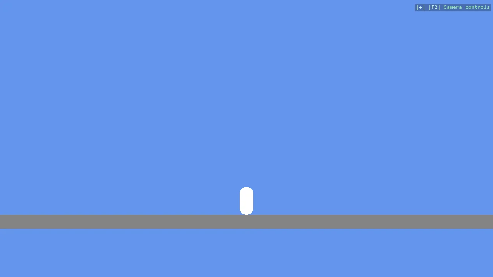
            

                <h3 class="card-title h6"><a class="stretched-link text-decoration-none text-body" href="basic-2d-scene-bullet.md">Basic2D Scene (Capsule) - Bullet Physics</a></h3>
                
Shapes

                
Create a minimal 2D scene using toolkit helpers and place a single capsule primitive.

            

        

    

    

        

            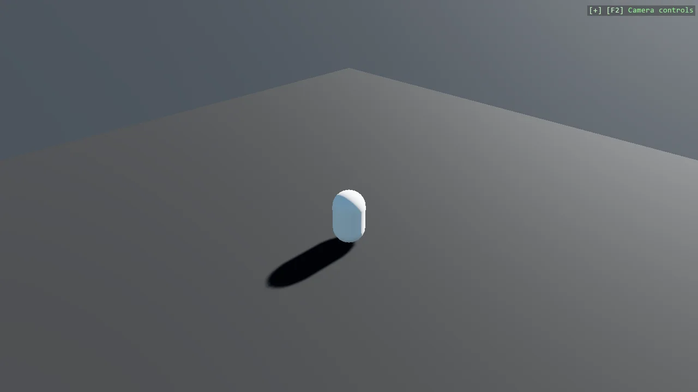
            

                <h3 class="card-title h6"><a class="stretched-link text-decoration-none text-body" href="capsule-with-rigid-body-bullet.md">Basic3D Scene (Capsule) - Bullet Physics</a></h3>
                
Shapes

                
The same first scene as E01_3D_BasicScene, running on the legacy Bullet physics engine instead of Bepu.

            

        

    

## C# Beginner

    

        

            
            

                <h3 class="card-title h6"><a class="stretched-link text-decoration-none text-body" href="primitives-3d.md">Basic3D Scene (Every Primitive)</a></h3>
                
Shapes

                
Every 3D primitive the toolkit can build - cube, cone, capsule, sphere, cylinder, teapot, torus and triangular prism - dropped into one scene so the...

            

        

    

    

        

            
            

                <h3 class="card-title h6"><a class="stretched-link text-decoration-none text-body" href="gum-stride-ui-basic.md">Basic Gum UI Setup</a></h3>
                
UI

                
Initialize Gum UI in Stride using the official Gum.Stride runtime and the Stride Community Toolkit.

            

        

    

    

        

            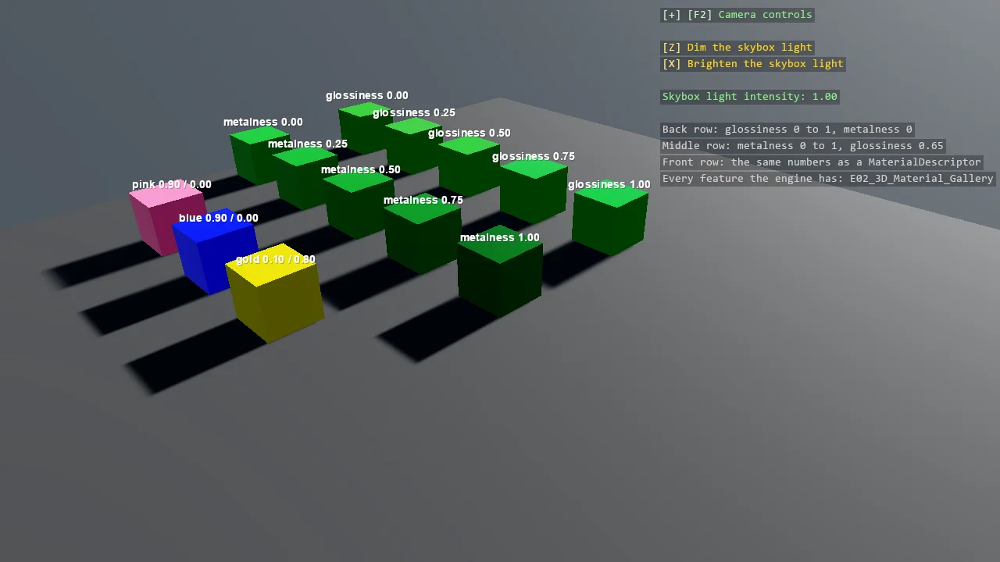
            

                <h3 class="card-title h6"><a class="stretched-link text-decoration-none text-body" href="material.md">Material</a></h3>
                
Rendering

                
The four numbers of a material, one per row of cubes: a glossiness sweep from rough to mirror, a metalness sweep from dielectric to metal, and a front...

            

        

    

    

        

            
            

                <h3 class="card-title h6"><a class="stretched-link text-decoration-none text-body" href="post-effects.md">Post Effects</a></h3>
                
Rendering

                
Every post effect Stride ships, one key each: bloom, ambient occlusion, screen-space reflections, depth of field, light streaks, lens flare, fog,...

            

        

    

    

        

            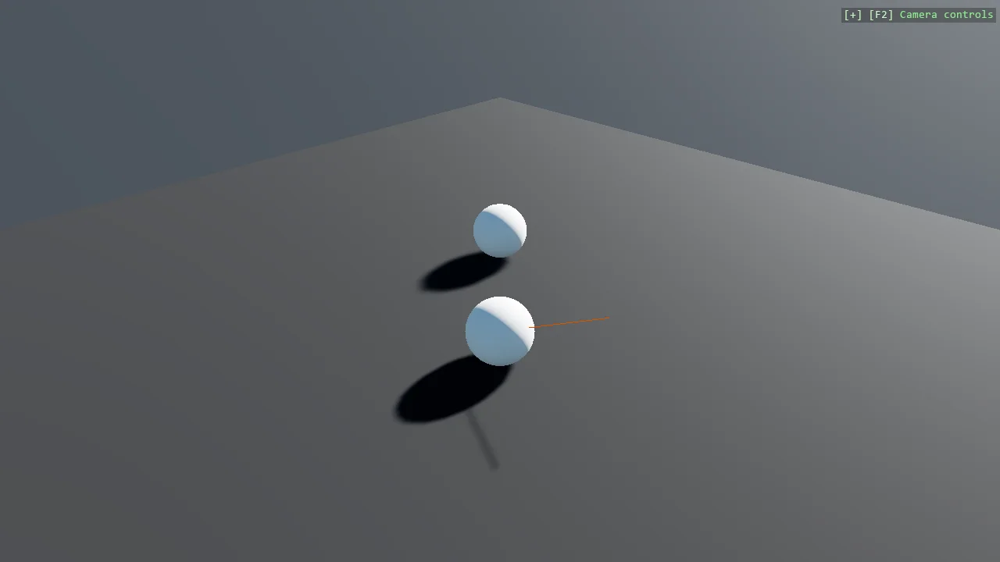
            

                <h3 class="card-title h6"><a class="stretched-link text-decoration-none text-body" href="mesh-line.md">Mesh Line</a></h3>
                
Geometry

                
A line drawn between two spheres, built as a real mesh rather than a debug primitive.

            

        

    

    

        

            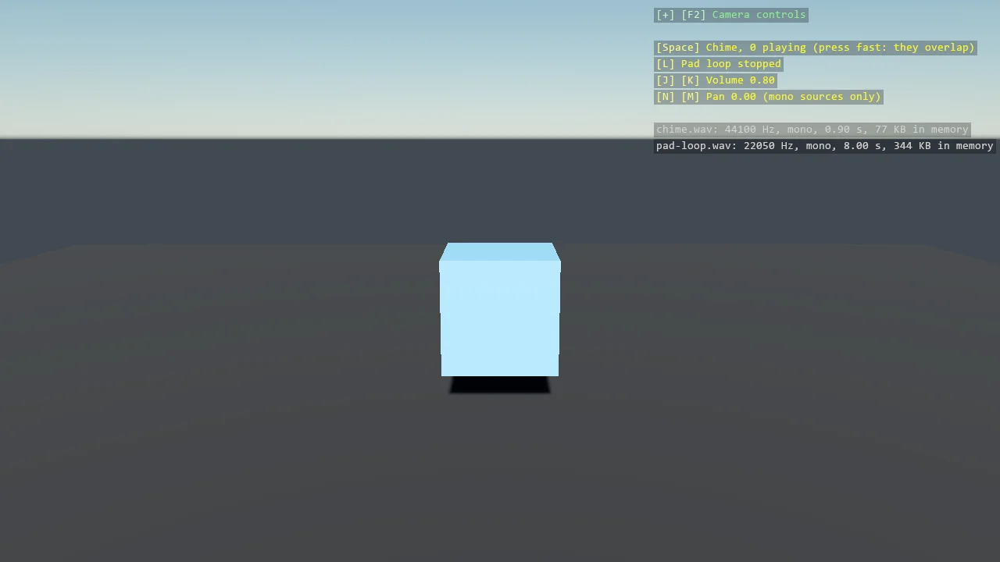
            

                <h3 class="card-title h6"><a class="stretched-link text-decoration-none text-body" href="wav-file.md">Wav File</a></h3>
                
Audio

                
Play a .wav read from disk at runtime, with no compiled asset: LoadWav decodes the file into memory and each CreateInstance is an independent...

            

        

    

    

        

            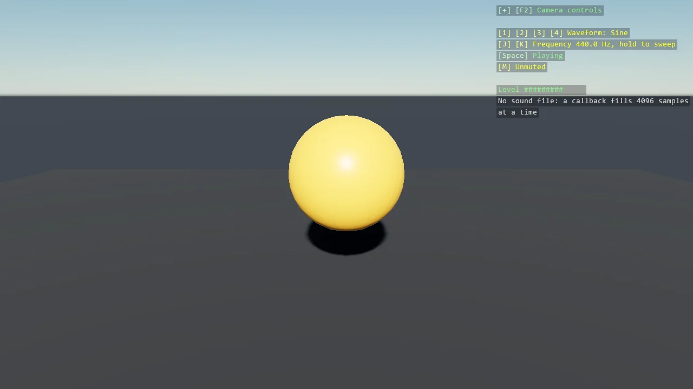
            

                <h3 class="card-title h6"><a class="stretched-link text-decoration-none text-body" href="procedural-sound.md">Procedural Sound</a></h3>
                
Audio

                
A tone with no sound file: a callback computes the samples as they play.

            

        

    

    

        

            
            

                <h3 class="card-title h6"><a class="stretched-link text-decoration-none text-body" href="give-me-cube-body.md">Give Me a Cube</a></h3>
                
Scripts

                
Add behaviour to an entity with a SyncScript component instead of the update callback of game.Run.

            

        

    

    

        

            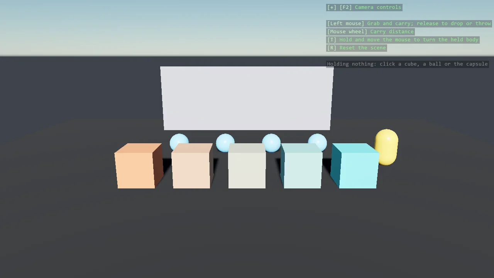
            

                <h3 class="card-title h6"><a class="stretched-link text-decoration-none text-body" href="grabber.md">Grabber</a></h3>
                
Physics

                
A gravity gun: click any body to pick it up, carry it on the end of the camera ray, and let go - with its velocity, so a flick throws it.

            

        

    

    

        

            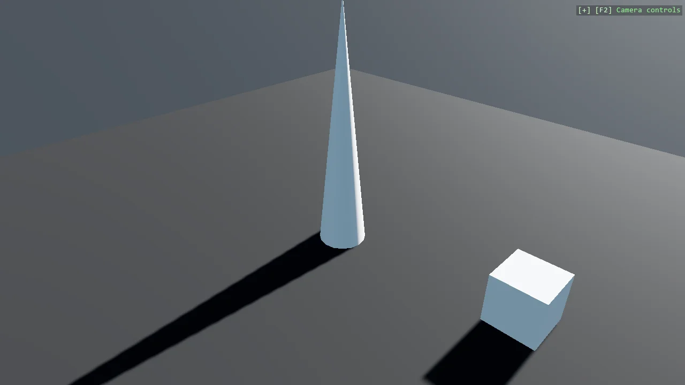
            

                <h3 class="card-title h6"><a class="stretched-link text-decoration-none text-body" href="sync-script.md">SyncScript - moving a body every frame</a></h3>
                
Scripts

                
A cube driven in a circle by a SyncScript, which is the ordinary way to run code every frame.

            

        

    

    

        

            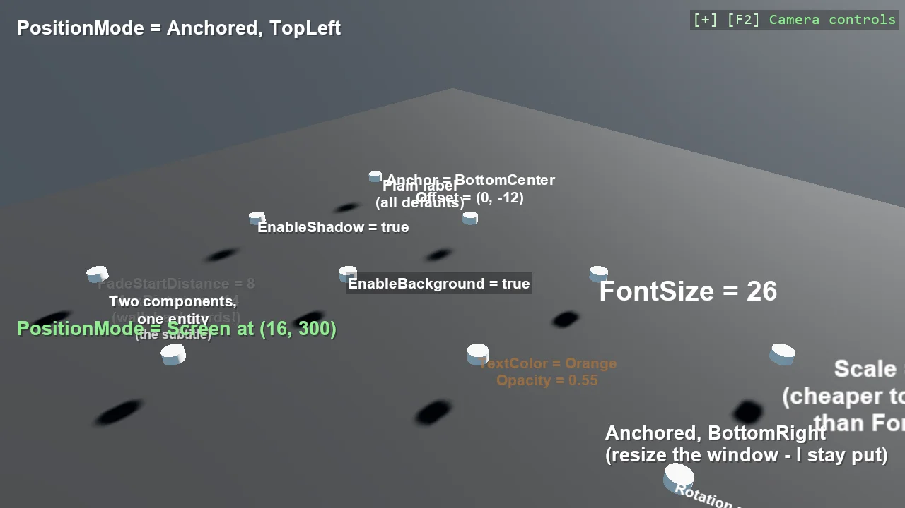
            

                <h3 class="card-title h6"><a class="stretched-link text-decoration-none text-body" href="entity-text.md">Entity Text (Screen-Space)</a></h3>
                
Text

                
A gallery of everything EntityTextComponent can do, one feature per pole: anchoring, shadows, backgrounds, scaling, rotation, opacity, distance...

            

        

    

    

        

            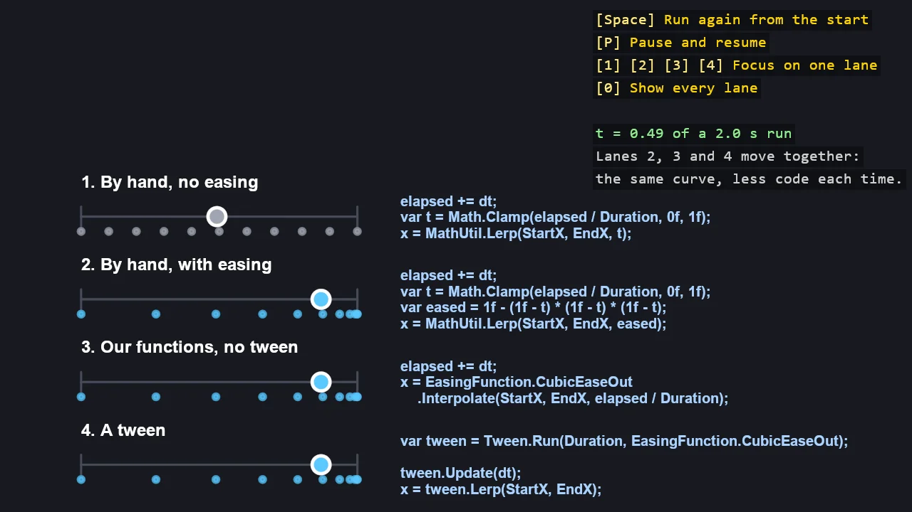
            

                <h3 class="card-title h6"><a class="stretched-link text-decoration-none text-body" href="easing-basics.md">Easing Basics</a></h3>
                
Mathematics

                
Easing from the ground up, in four lanes that move a disc over the same two seconds: by hand with no easing, by hand with one formula, with the...

            

        

    

    

        

            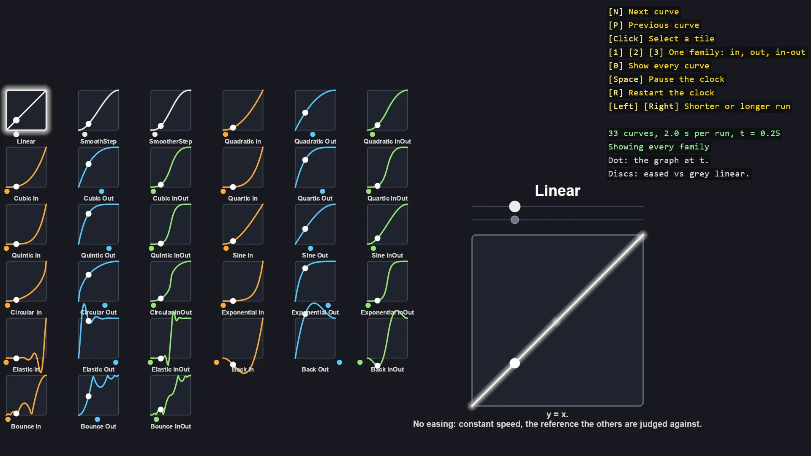
            

                <h3 class="card-title h6"><a class="stretched-link text-decoration-none text-body" href="easing.md">Easing Cheat Sheet</a></h3>
                
Mathematics

                
Every easing curve in the toolkit on one screen: a tile per curve with its graph, a dot riding the graph on a shared clock, and a slider that moves...

            

        

    

    

        

            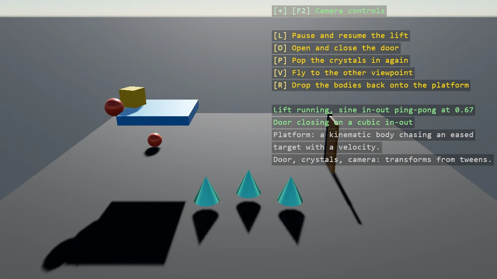
            

                <h3 class="card-title h6"><a class="stretched-link text-decoration-none text-body" href="easing-3d-game.md">Easing in a 3D Game</a></h3>
                
Mathematics

                
Easing doing real work in a 3D scene, four ways, each one a Tween: a kinematic platform lifts a stack of physics bodies on a sine curve and comes back...

            

        

    

    

        

            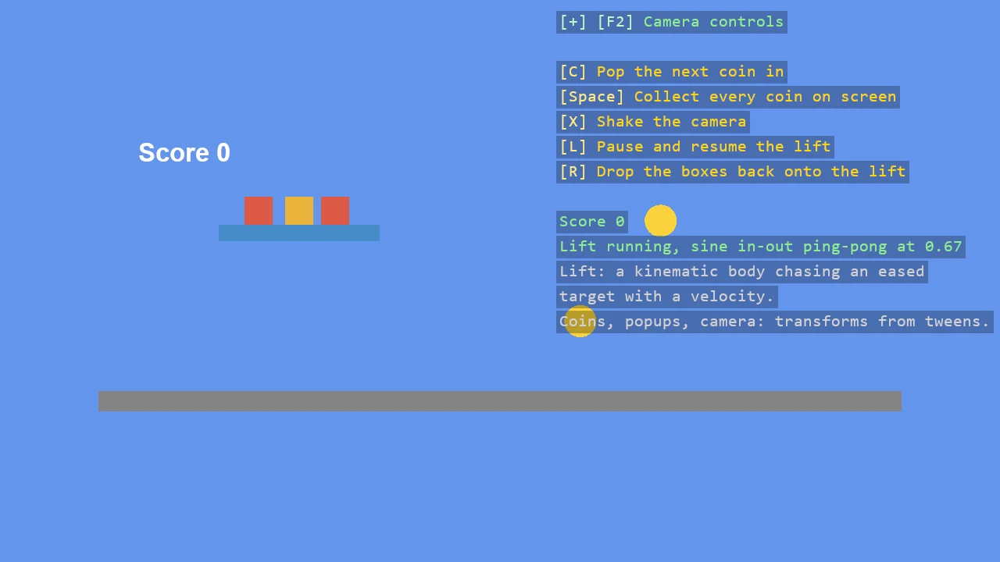
            

                <h3 class="card-title h6"><a class="stretched-link text-decoration-none text-body" href="easing-2d-game.md">Easing in a 2D Game</a></h3>
                
Mathematics

                
Easing doing real work in a 2D physics scene, each piece a Tween: a kinematic lift carries a stack of boxes up and down on a sine curve, coins pop in...

            

        

    

    

        

            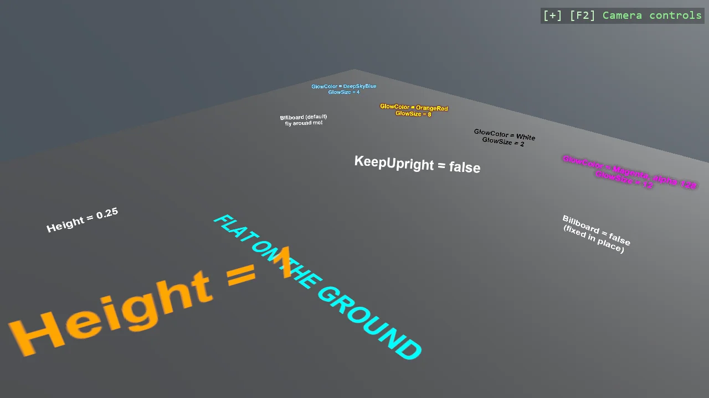
            

                <h3 class="card-title h6"><a class="stretched-link text-decoration-none text-body" href="world-text.md">World Text (In-Scene)</a></h3>
                
Text

                
A gallery of everything WorldTextComponent can do, one setting per station: billboarding that stays upright, free billboarding, text fixed in place,...

            

        

    

    

        

            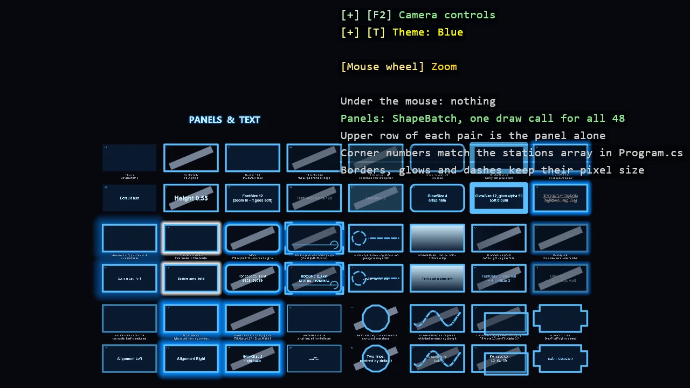
            

                <h3 class="card-title h6"><a class="stretched-link text-decoration-none text-body" href="2d-scene-panels.md">2D Panels and Text</a></h3>
                
Shapes

                
Twenty-four HUD panel recipes side by side, each one property away from the last: fill only, border only, transparent fill over a stripe that proves...

            

        

    

    

        

            
            

                <h3 class="card-title h6"><a class="stretched-link text-decoration-none text-body" href="primitives-2d.md">Basic2D Scene (Multiple Primitives)</a></h3>
                
Shapes

                
Create a minimal 2D scene using toolkit helpers and place multiple different primitive shapes.

            

        

    

    

        

            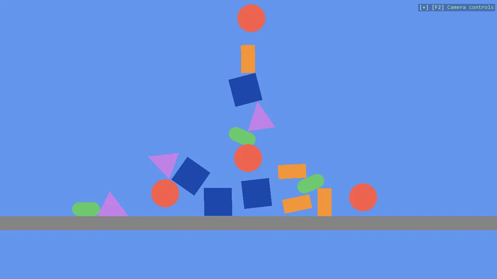
            

                <h3 class="card-title h6"><a class="stretched-link text-decoration-none text-body" href="falling-shapes-2d.md">Basic2D Scene (Falling Shapes)</a></h3>
                
Physics

                
Create a minimal 2D scene using toolkit helpers and place multiple capsule primitives with flat materials.

            

        

    

    

        

            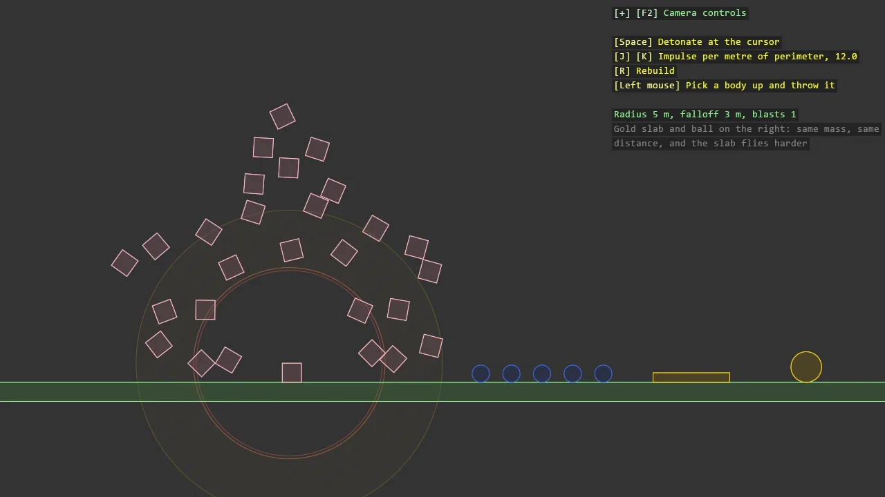
            

                <h3 class="card-title h6"><a class="stretched-link text-decoration-none text-body" href="box2d-explosion.md">Box2D Explosion</a></h3>
                
Physics

                
A grenade in one call: Explode gives every shape within a radius an impulse away from the centre, per metre of perimeter facing the blast, so a wide...

            

        

    

    

        

            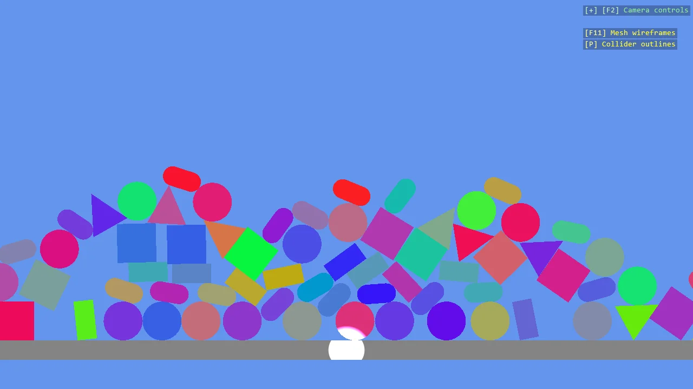
            

                <h3 class="card-title h6"><a class="stretched-link text-decoration-none text-body" href="debug-render-2d.md">Basic2D Scene (Debug Rendering)</a></h3>
                
Debug

                
A pile of falling 2D shapes with the physics debug overlays turned on, so what the simulation is actually solving can be seen rather than inferred.

            

        

    

    

        

            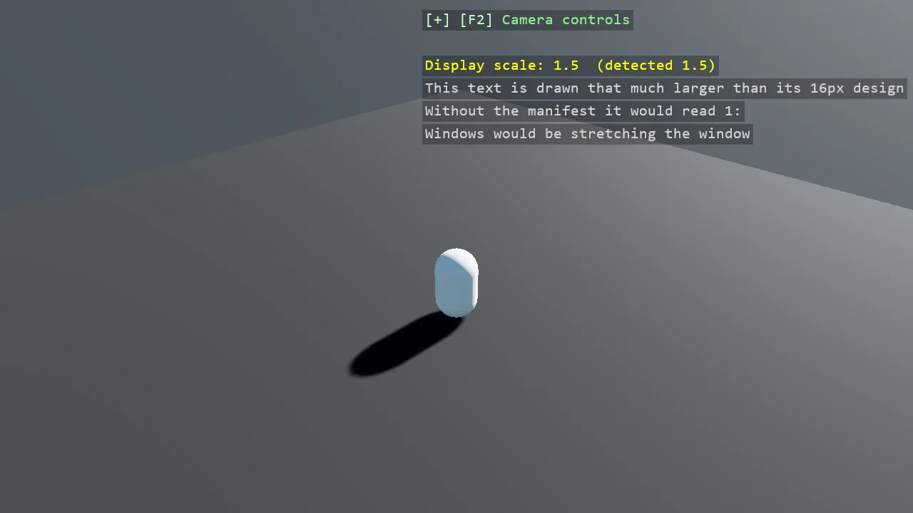
            

                <h3 class="card-title h6"><a class="stretched-link text-decoration-none text-body" href="dpi-aware.md">DPI-Aware Window</a></h3>
                
Debug

                
The capsule scene again, with two differences.

            

        

    

## C# Intermediate

    

        

            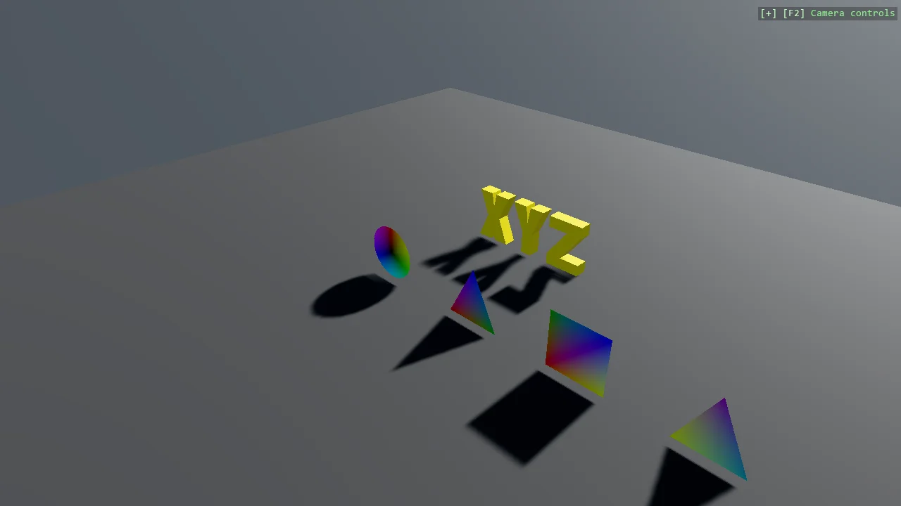
            

                <h3 class="card-title h6"><a class="stretched-link text-decoration-none text-body" href="procedural-geometry.md">Procedural Geometry</a></h3>
                
Geometry

                
A triangle, a plane and a circle built at runtime with MeshBuilder, which handles the vertex layout and buffer bookkeeping that raw buffers make you...

            

        

    

    

        

            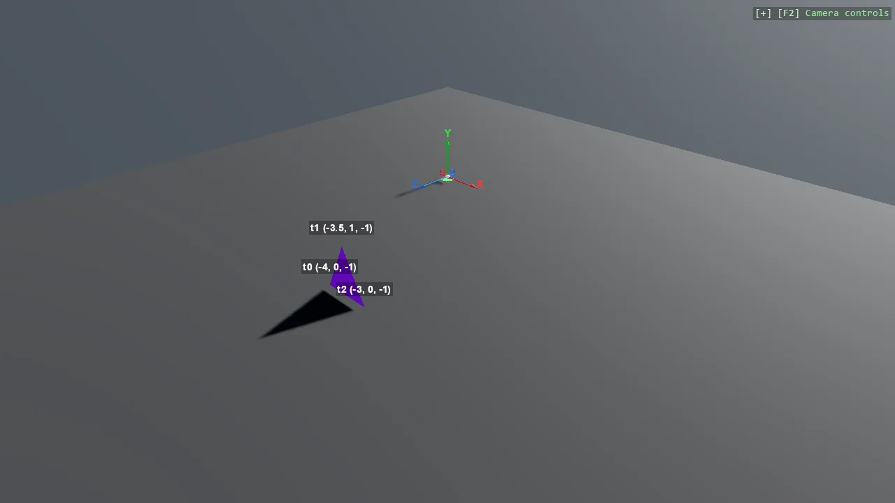
            

                <h3 class="card-title h6"><a class="stretched-link text-decoration-none text-body" href="simple-geometry.md">Simple Geometry (Labelled Triangle)</a></h3>
                
Geometry

                
The smallest possible custom mesh - one triangle from three vertices - with each vertex labelled on screen so the relationship between the numbers in...

            

        

    

    

        

            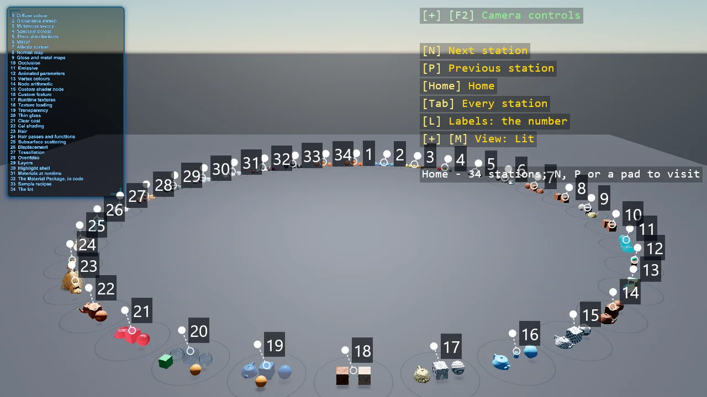
            

                <h3 class="card-title h6"><a class="stretched-link text-decoration-none text-body" href="material-gallery.md">Material Gallery</a></h3>
                
Rendering

                
The engine's material system on a ring of stations, all from code: the four numbers of a PBR material first, then the maps, the inputs a map can be...

            

        

    

    

        

            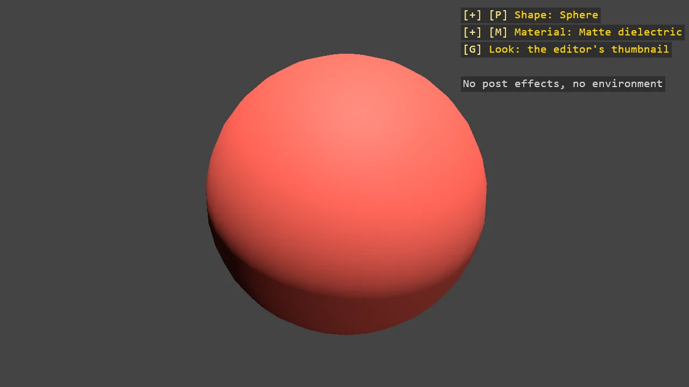
            

                <h3 class="card-title h6"><a class="stretched-link text-decoration-none text-body" href="material-preview.md">Material Preview</a></h3>
                
Rendering

                
Game Studio's material thumbnail rebuilt in code, with the editor's own numbers: the forward renderer with no post effects on a grey background, a...

            

        

    

    

        

            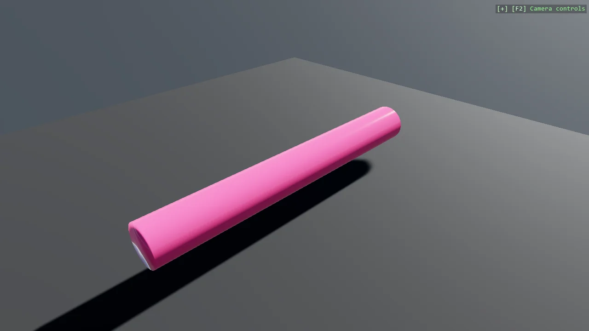
            

                <h3 class="card-title h6"><a class="stretched-link text-decoration-none text-body" href="cylinder-mesh.md">Cylinder Mesh</a></h3>
                
Geometry

                
A cylinder generated with MeshBuilder, split into the three jobs any surface of revolution needs: place a ring of vertices, join consecutive rings...

            

        

    

    

        

            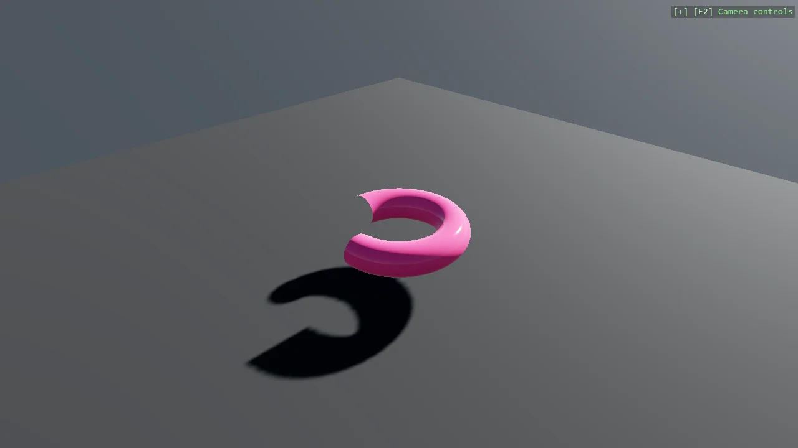
            

                <h3 class="card-title h6"><a class="stretched-link text-decoration-none text-body" href="partial-torus-mesh.md">Partial Torus Mesh</a></h3>
                
Geometry

                
A torus defined parametrically from two angles - one around the tube, one around the ring - and cut short by limiting the second, which turns the same...

            

        

    

    

        

            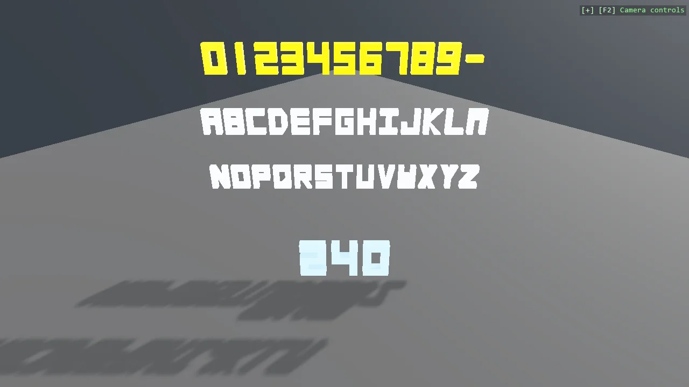
            

                <h3 class="card-title h6"><a class="stretched-link text-decoration-none text-body" href="letters-3d.md">3D Letters (Mesh Text)</a></h3>
                
Text

                
A gallery of every glyph LetterMeshFactory can build - the digits, the full A-Z alphabet and the dash - as solid extruded meshes that catch the light...

            

        

    

    

        

            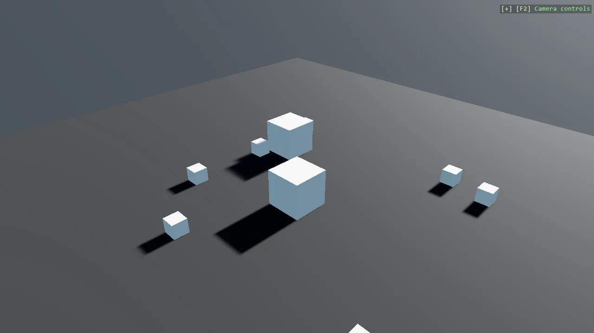
            

                <h3 class="card-title h6"><a class="stretched-link text-decoration-none text-body" href="simulation-update.md">Give Me a Cube (SimulationUpdate)</a></h3>
                
Physics

                
Drive an entity from the physics clock instead of the render loop.

            

        

    

    

        

            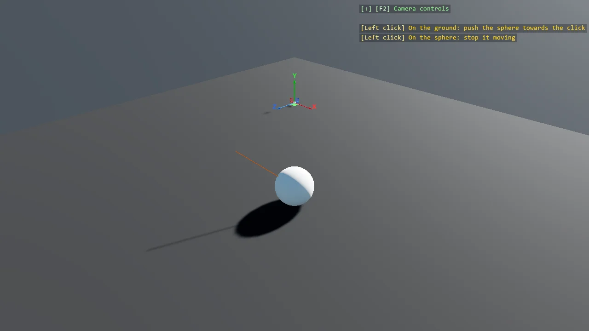
            

                <h3 class="card-title h6"><a class="stretched-link text-decoration-none text-body" href="raycast.md">Raycast</a></h3>
                
Physics

                
Click the ground and a sphere is kicked towards where you clicked; click the sphere and it stops dead.

            

        

    

    

        

            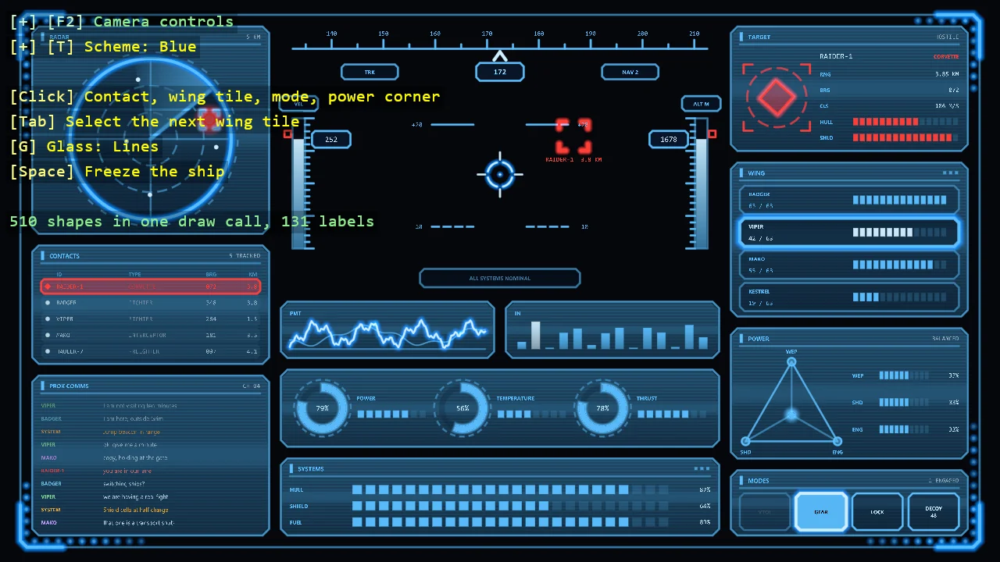
            

                <h3 class="card-title h6"><a class="stretched-link text-decoration-none text-body" href="hud.md">Ship HUD</a></h3>
                
Shapes

                
A cockpit HUD composed from the toolkit's shapes and world text, with one widget per file.

            

        

    

    

        

            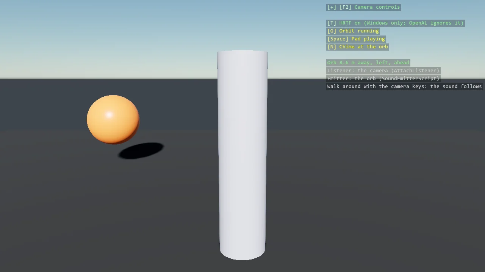
            

                <h3 class="card-title h6"><a class="stretched-link text-decoration-none text-body" href="spatial-sound.md">Spatial Sound</a></h3>
                
Audio

                
3D positional audio for a runtime sound: a looping pad on an orb that circles a pillar, heard from the camera.

            

        

    

    

        

            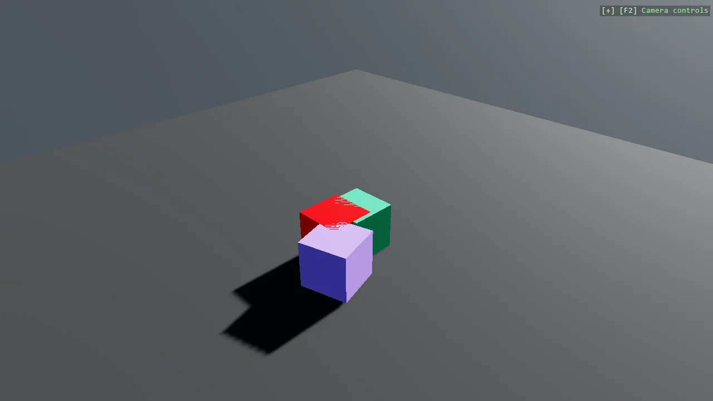
            

                <h3 class="card-title h6"><a class="stretched-link text-decoration-none text-body" href="collision-group.md">Collision Group</a></h3>
                
Physics

                
Two players and an enemy, where the players collide with each other but the enemy passes through both.

            

        

    

    

        

            
            

                <h3 class="card-title h6"><a class="stretched-link text-decoration-none text-body" href="collision-layer.md">Collision Layer</a></h3>
                
Physics

                
The same players-and-enemy scene as the collision group example, solved the other way.

            

        

    

    

        

            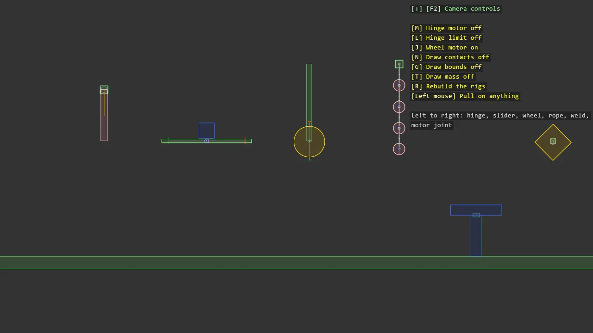
            

                <h3 class="card-title h6"><a class="stretched-link text-decoration-none text-body" href="box2d-joints.md">Box2D Joints</a></h3>
                
Physics

                
Every Box2D joint, one rig each, in a row you can pull on: a hinge pendulum with a motor and a limit, a slider on a spring, a wheel on a suspension, a...

            

        

    

    

        

            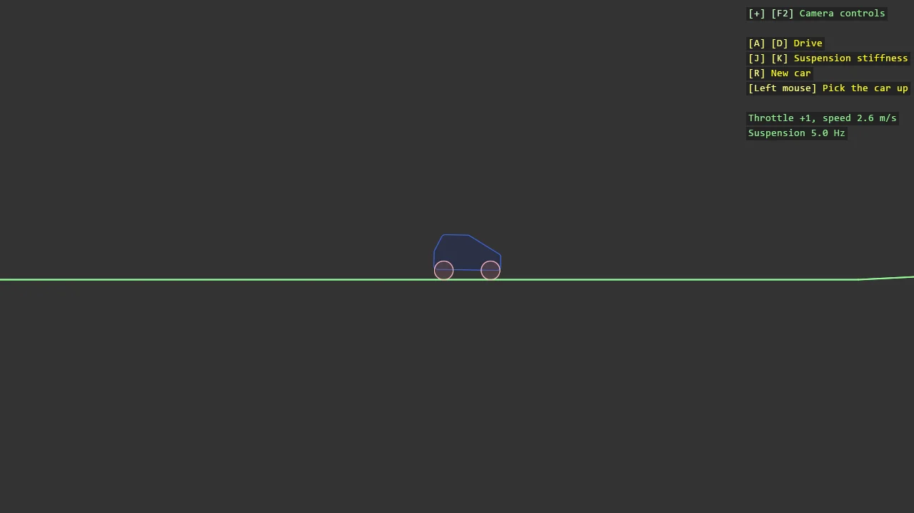
            

                <h3 class="card-title h6"><a class="stretched-link text-decoration-none text-body" href="box2d-car.md">Box2D Car</a></h3>
                
Physics

                
A car on two wheel joints over hilly terrain: the wheel joint pins the wheel, lets it turn, springs it along the suspension axis with a travel limit,...

            

        

    

    

        

            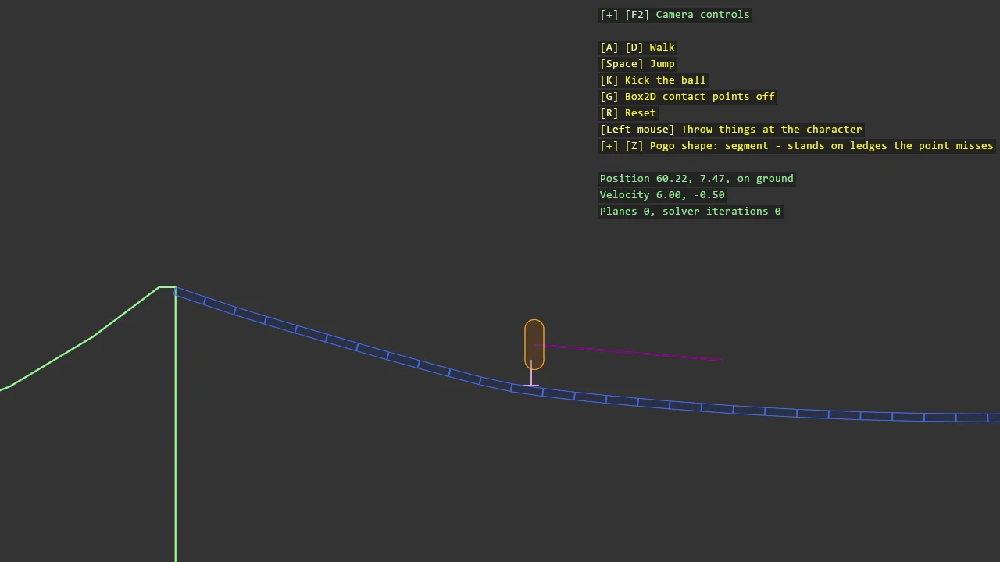
            

                <h3 class="card-title h6"><a class="stretched-link text-decoration-none text-body" href="box2d-character-mover.md">Box2D Character Mover</a></h3>
                
Physics

                
A platformer character with no rigid body, on Box2D v3's mover API: a capsule the game moves itself, Quake style, asking the world only what it...

            

        

    

    

        

            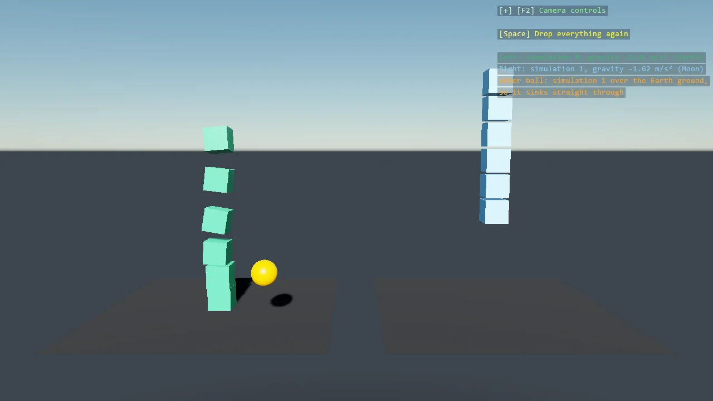
            

                <h3 class="card-title h6"><a class="stretched-link text-decoration-none text-body" href="multiple-simulations.md">Multiple Physics Simulations</a></h3>
                
Physics

                
Two Bepu simulations in one game, side by side: the left lane falls under Earth gravity, the right under Moon gravity, and an amber ball that belongs...

            

        

    

    

        

            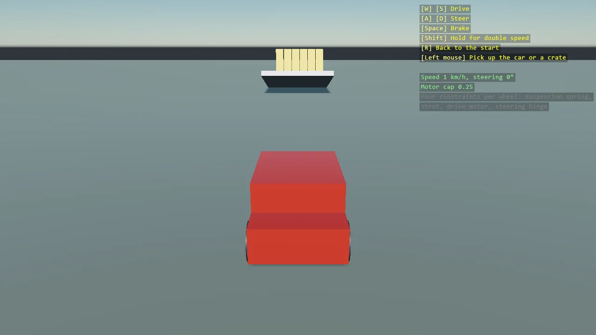
            

                <h3 class="card-title h6"><a class="stretched-link text-decoration-none text-body" href="car.md">Car</a></h3>
                
Physics

                
A drivable car from four constraints per wheel, the recipe of bepuphysics2's own car demo in Stride's components: a linear axis servo as the...

            

        

    

    

        

            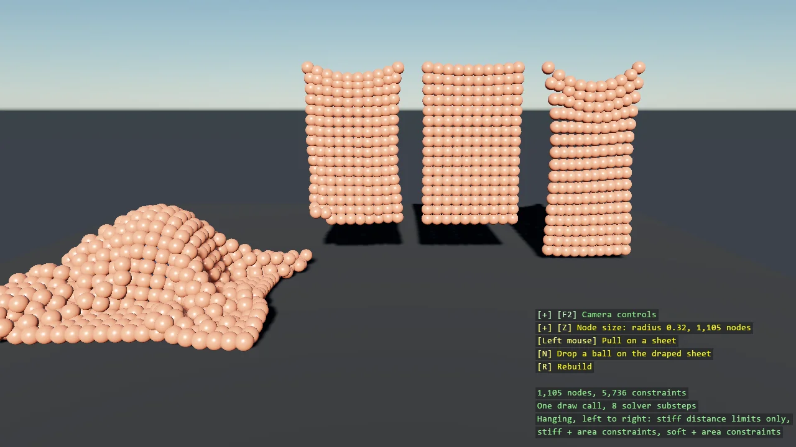
            

                <h3 class="card-title h6"><a class="stretched-link text-decoration-none text-body" href="cloth.md">Cloth</a></h3>
                
Physics

                
Cloth from ordinary bodies and constraints, the way bepuphysics2's own demo does it: a lattice of sphere nodes tied by distance limits that may bunch...

            

        

    

    

        

            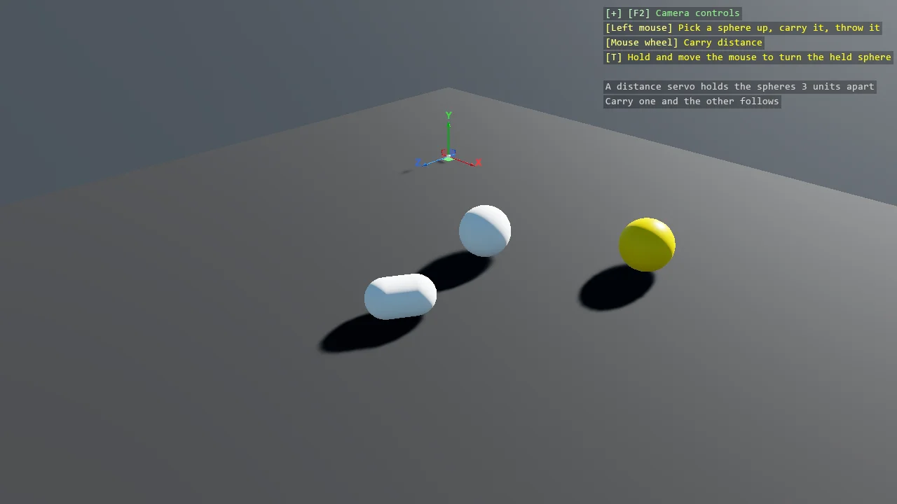
            

                <h3 class="card-title h6"><a class="stretched-link text-decoration-none text-body" href="simple-constraint.md">Simple Constraint</a></h3>
                
Physics

                
One constraint, doing one thing: a distance servo holding two spheres three units apart, pulling them together or pushing them apart until they settle...

            

        

    

    

        

            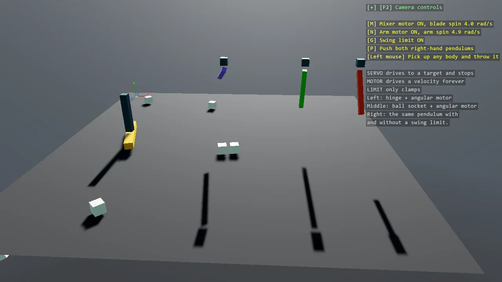
            

                <h3 class="card-title h6"><a class="stretched-link text-decoration-none text-body" href="constraint-motors.md">Constraints - Servo vs Motor vs Limit</a></h3>
                
Physics

                
The three kinds of Bepu constraint, side by side.

            

        

    

    

        

            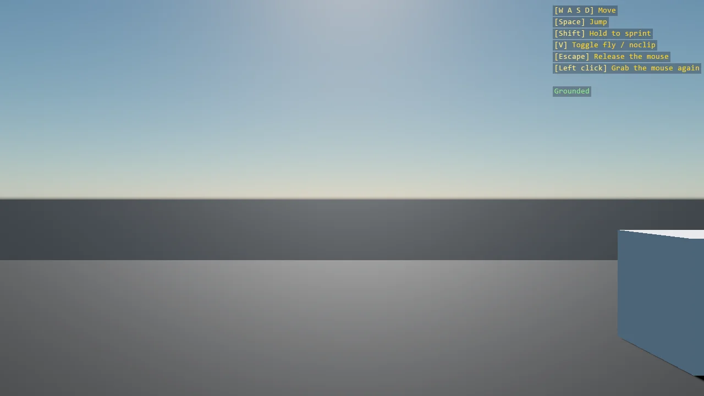
            

                <h3 class="card-title h6"><a class="stretched-link text-decoration-none text-body" href="first-person-character.md">First-Person Character (Bepu)</a></h3>
                
Physics

                
A first-person character built entirely from code - no Game Studio scene - on a Bepu CharacterComponent, with boxes to walk into and jump onto.

            

        

    

    

        

            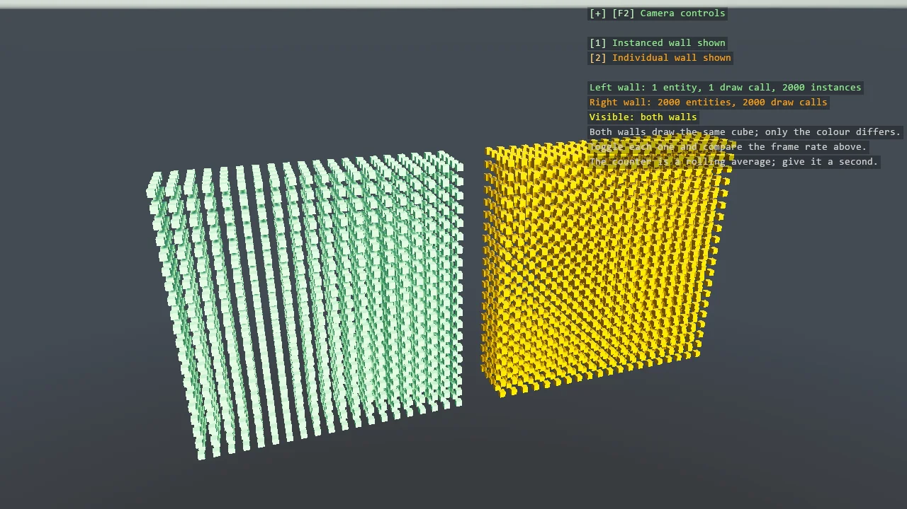
            

                <h3 class="card-title h6"><a class="stretched-link text-decoration-none text-body" href="instancing.md">GPU Instancing</a></h3>
                
Performance

                
Render two identical walls of cubes built two different ways, side by side.

            

        

    

    

        

            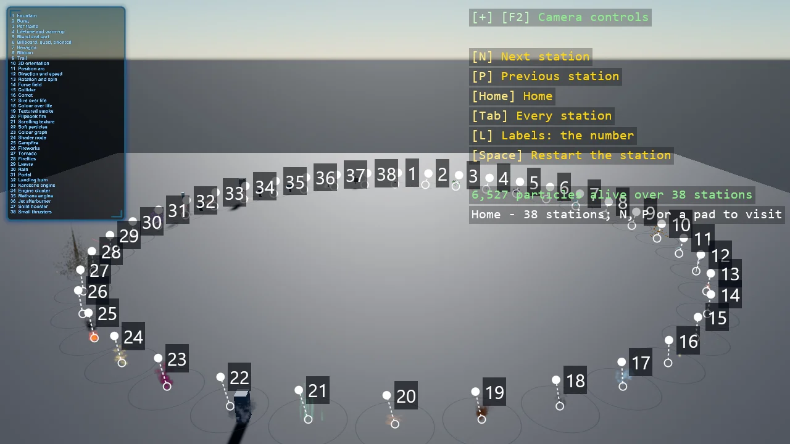
            

                <h3 class="card-title h6"><a class="stretched-link text-decoration-none text-body" href="particles.md">Particle Gallery</a></h3>
                
Rendering

                
Thirty-eight particle systems on a ring of stations, all built from code: the building blocks one at a time - spawners, shapes, initializers,...

            

        

    

    

        

            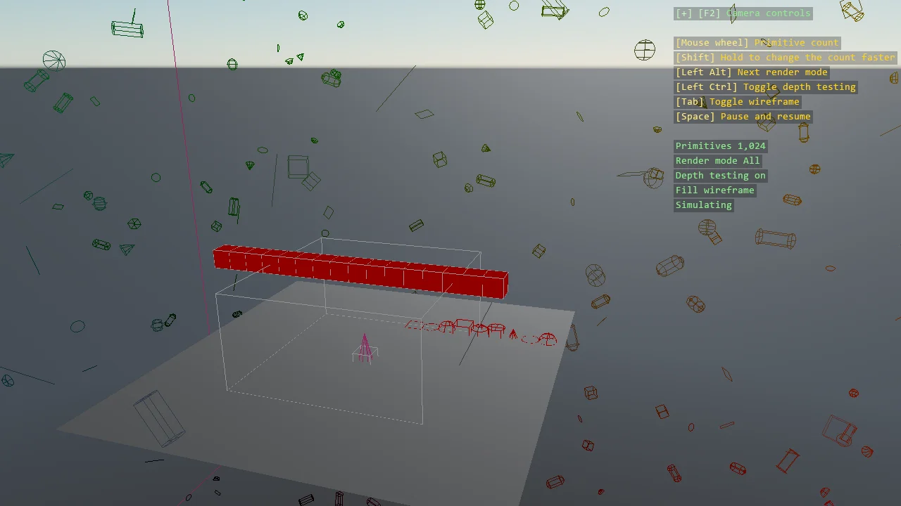
            

                <h3 class="card-title h6"><a class="stretched-link text-decoration-none text-body" href="debug-shapes.md">Debug Shapes</a></h3>
                
Debug

                
The full tour of the DebugShapes package: every immediate-mode primitive it can draw, exercised from a ShapeUpdater component so the shapes animate...

            

        

    

    

        

            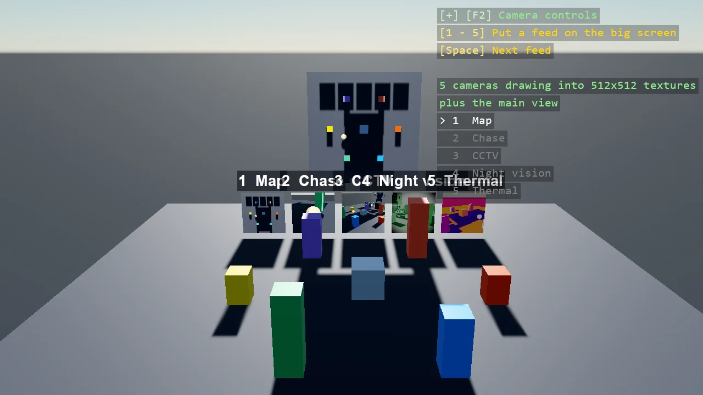
            

                <h3 class="card-title h6"><a class="stretched-link text-decoration-none text-body" href="render-to-texture.md">Render to Texture</a></h3>
                
Rendering

                
Five cameras watch one scene and each draws into a texture shown on a monitor: an overhead map, a chase camera following an orbiting ball, a fixed...

            

        

    

    

        

            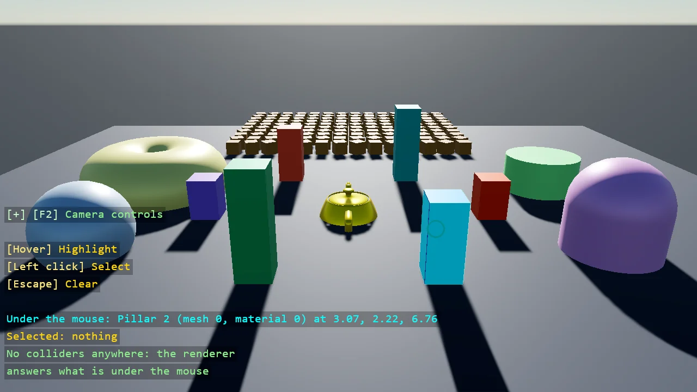
            

                <h3 class="card-title h6"><a class="stretched-link text-decoration-none text-body" href="gpu-picking.md">GPU Picking</a></h3>
                
Rendering

                
What is under the mouse, answered by the renderer instead of by physics.

            

        

    

    

        

            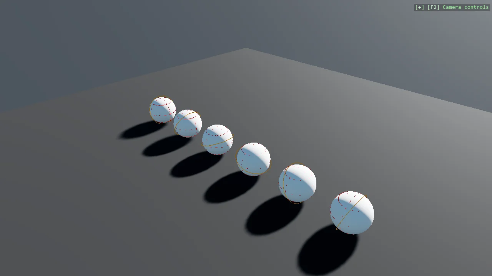
            

                <h3 class="card-title h6"><a class="stretched-link text-decoration-none text-body" href="debug-shapes-usage.md">Debug Shapes Usage</a></h3>
                
Debug

                
The short version of the debug shapes example: turn the system on, draw a sphere and a circle, done.

            

        

    

    

        

            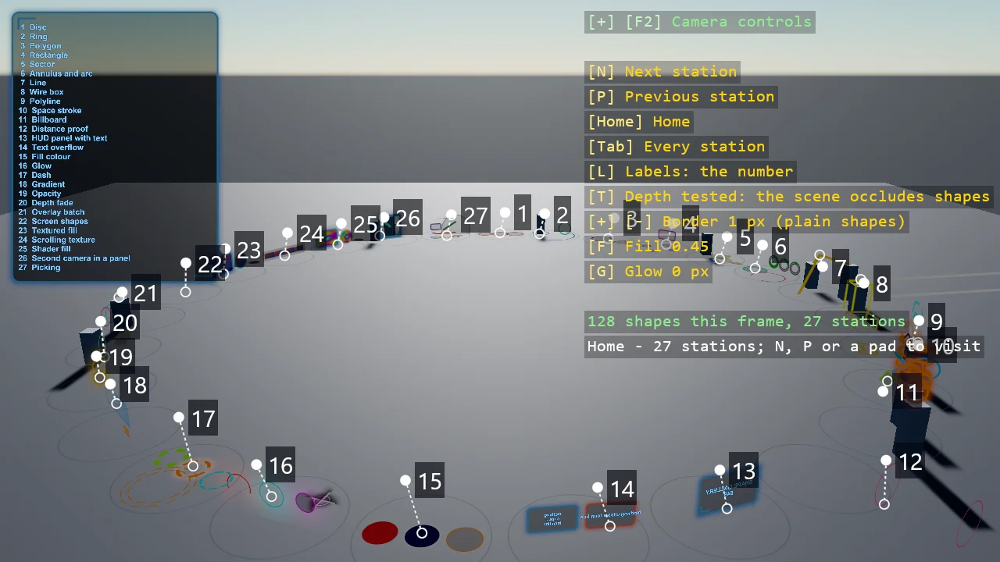
            

                <h3 class="card-title h6"><a class="stretched-link text-decoration-none text-body" href="shape-batch.md">ShapeBatch Gallery</a></h3>
                
Rendering

                
A ring of numbered stations, one ShapeBatch idea each, from a single disc to a scrolling textured panel: discs, rings, polygons and rectangles on any...

            

        

    

    

        

            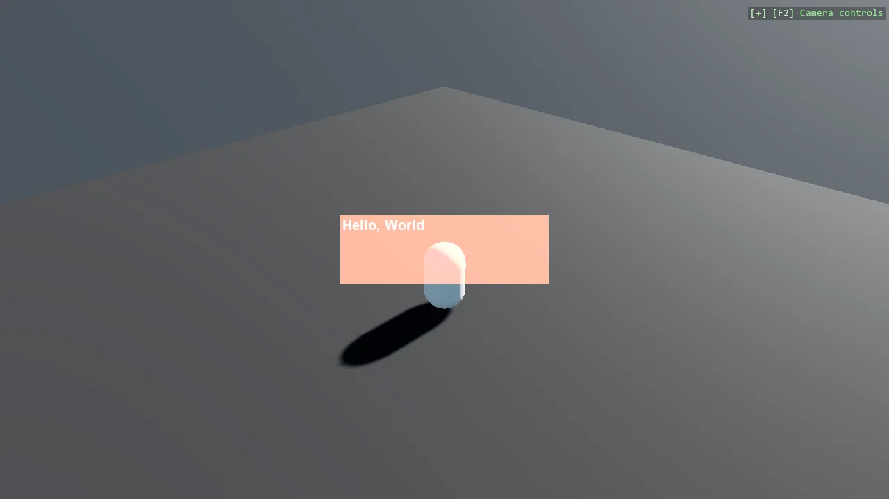
            

                <h3 class="card-title h6"><a class="stretched-link text-decoration-none text-body" href="stride-ui-capsule-with-rigid-body.md">Stride UI - Capsule and Window</a></h3>
                
UI

                
A capsule in a 3D scene with a "Hello, World" panel drawn over it using Stride's built-in UI.

            

        

    

    

        

            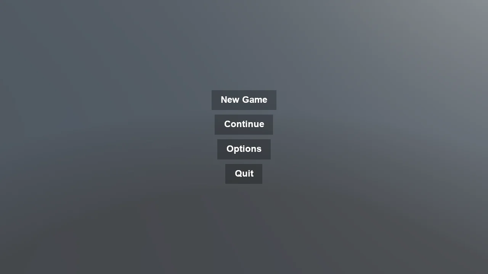
            

                <h3 class="card-title h6"><a class="stretched-link text-decoration-none text-body" href="stride-ui-button-hover-animation.md">Stride UI - Button Hover Animation</a></h3>
                
UI

                
A main menu built from code whose buttons grow a blue underline while the pointer is over them.

            

        

    

    

        

            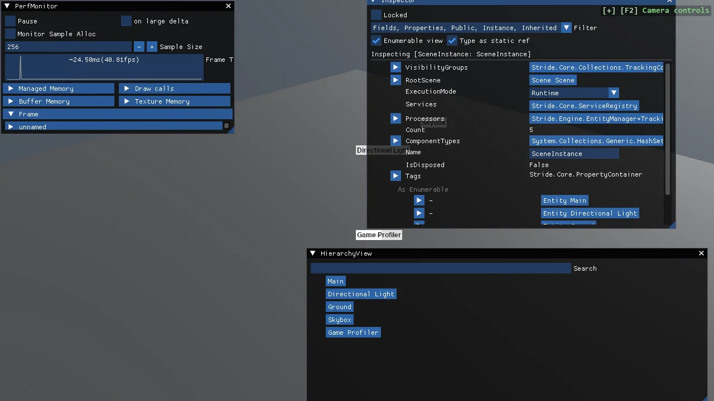
            

                <h3 class="card-title h6"><a class="stretched-link text-decoration-none text-body" href="imgui-ui.md">ImGui UI</a></h3>
                
UI

                
An ImGui overlay for in-game tools, debug panels and live tweaking.

            

        

    

    

        

            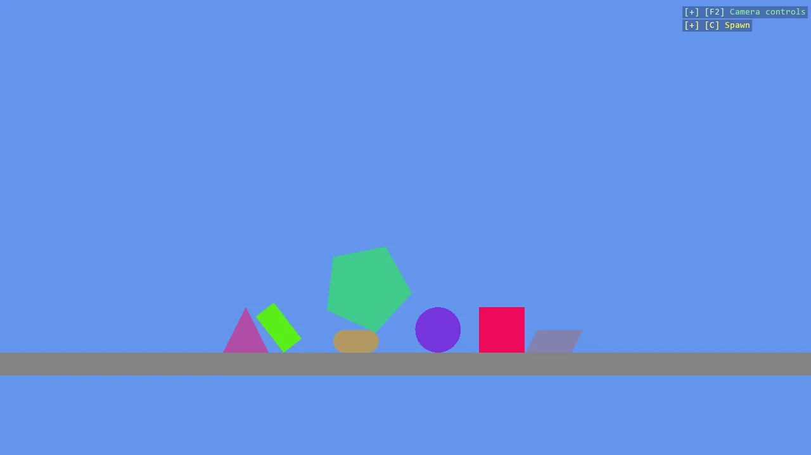
            

                <h3 class="card-title h6"><a class="stretched-link text-decoration-none text-body" href="spawn-menu-2d.md">2D Spawn Menu</a></h3>
                
Input

                
Drive a scene from the keyboard without filling the screen with instructions.

            

        

    

    

        

            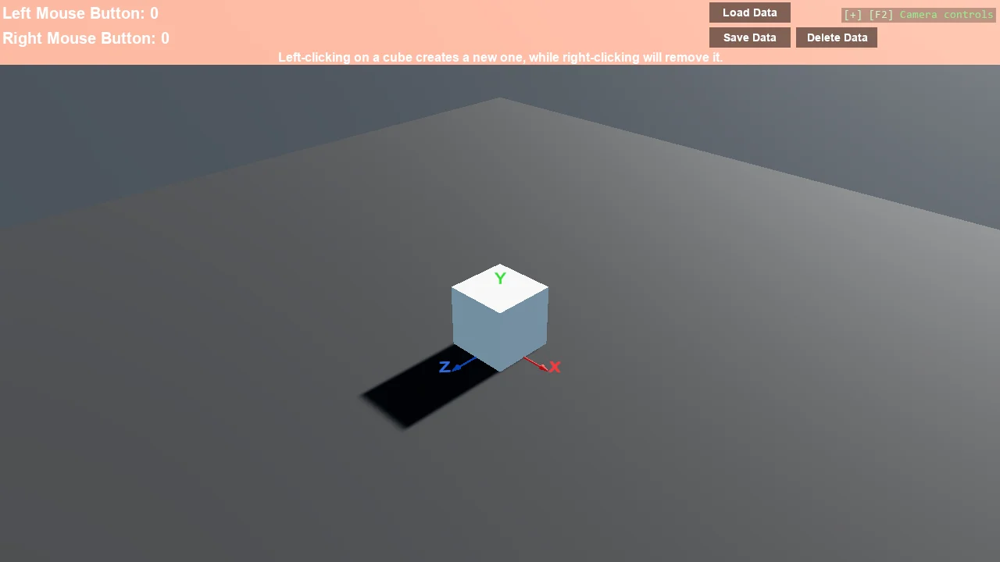
            

                <h3 class="card-title h6"><a class="stretched-link text-decoration-none text-body" href="stride-ui-cube-clicker.md">Cube Clicker</a></h3>
                
UI

                
A small clicker game: cubes appear, left and right clicks are counted, and both the score and the cube positions are written to disk so the next run...

            

        

    

    

        

            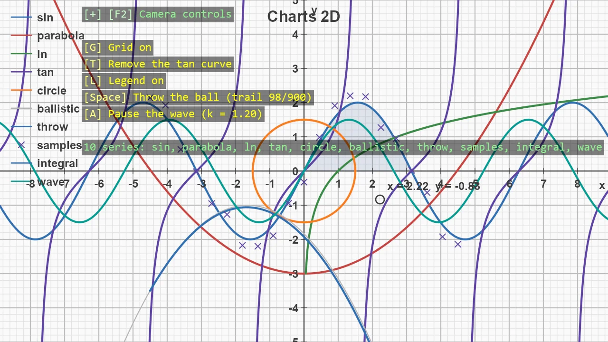
            

                <h3 class="card-title h6"><a class="stretched-link text-decoration-none text-body" href="charts-2d.md">Charts 2D</a></h3>
                
Rendering

                
A flat, paper-like chart drawn entirely in code - no assets, no chart control, every line a pixel-width stroke in a shape batch.

            

        

    

    

        

            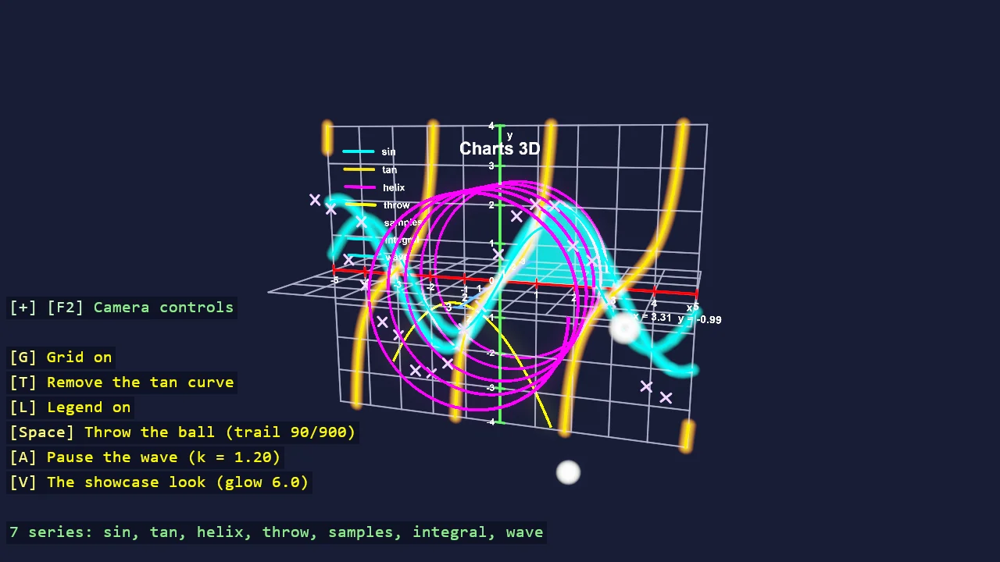
            

                <h3 class="card-title h6"><a class="stretched-link text-decoration-none text-body" href="charts-3d.md">Charts 3D</a></h3>
                
Rendering

                
The same code-only chart API as the 2D example, in a lit 3D scene.

            

        

    

## C# Advanced

    

        

            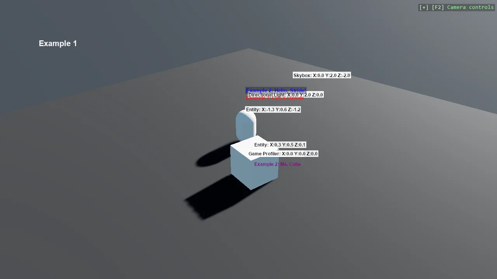
            

                <h3 class="card-title h6"><a class="stretched-link text-decoration-none text-body" href="renderer.md">Custom Scene Renderers</a></h3>
                
Rendering

                
Two ways to draw your own 2D content over a 3D scene, side by side.

            

        

    

    

        

            
            

                <h3 class="card-title h6"><a class="stretched-link text-decoration-none text-body" href="root-renderer-shader.md">Root Renderer Shader</a></h3>
                
Rendering

                
An animated ribbon background drawn by a custom RootRenderFeature, which is the deepest extension point Stride offers short of writing your own...

            

        

    

    

        

            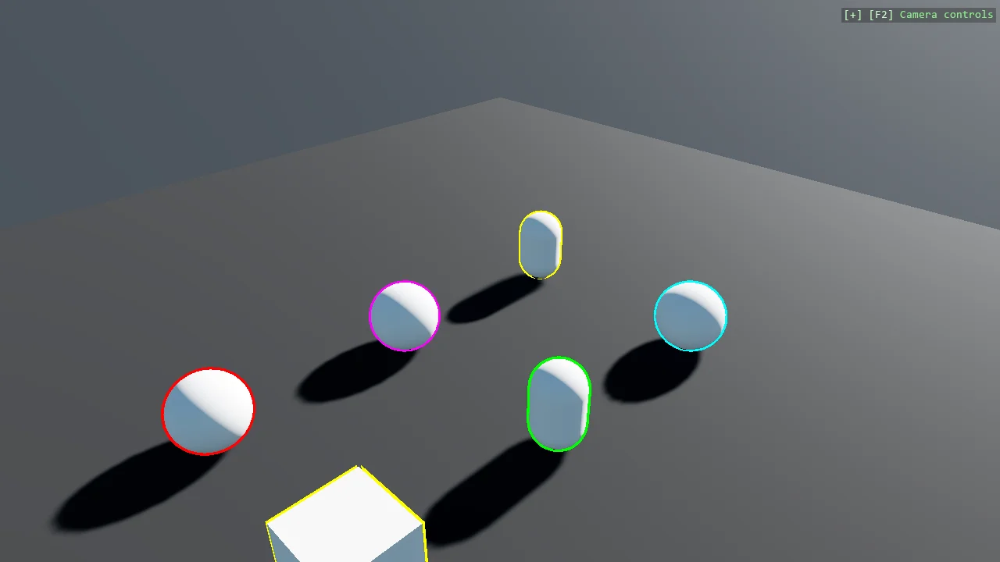
            

                <h3 class="card-title h6"><a class="stretched-link text-decoration-none text-body" href="mesh-outline.md">Mesh Outline Render Feature</a></h3>
                
Rendering

                
Draw coloured outlines around 3D primitives with a custom RootRenderFeature.

            

        

    

    

        

            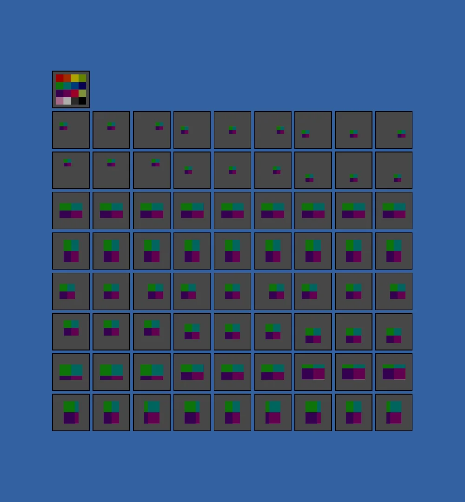
            

                <h3 class="card-title h6"><a class="stretched-link text-decoration-none text-body" href="image-processing.md">Image Processing (TextureCanvas)</a></h3>
                
Rendering

                
Every combination of anchor and stretch that TextureCanvas can apply, drawn as a grid of thumbnails so the options can be compared rather than read...

            

        

    

    

        

            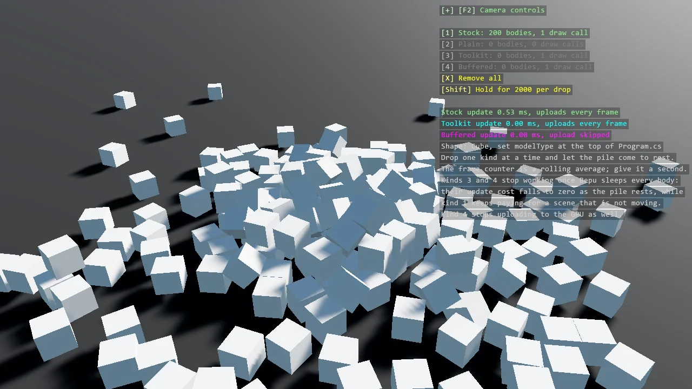
            

                <h3 class="card-title h6"><a class="stretched-link text-decoration-none text-body" href="instancing-entity-transform.md">Instancing with Entity Transforms</a></h3>
                
Performance

                
Keep every object a real entity - with a transform, a physics body and anything else you need - while still drawing the whole crowd in a single draw...

            

        

    

    

        

            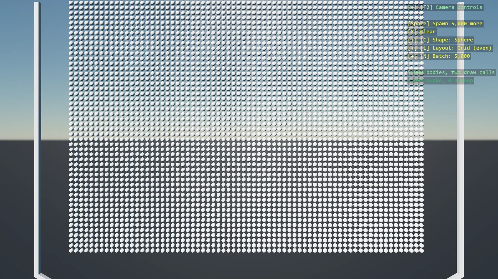
            

                <h3 class="card-title h6"><a class="stretched-link text-decoration-none text-body" href="stress-pile-2d.md">Basic2D Scene (Stress Pile)</a></h3>
                
Performance

                
Thousands of 2D physics bodies piling up, drawn in two instanced draw calls - awake bodies through one master, sleeping bodies tinted green through...

            

        

    

    

        

            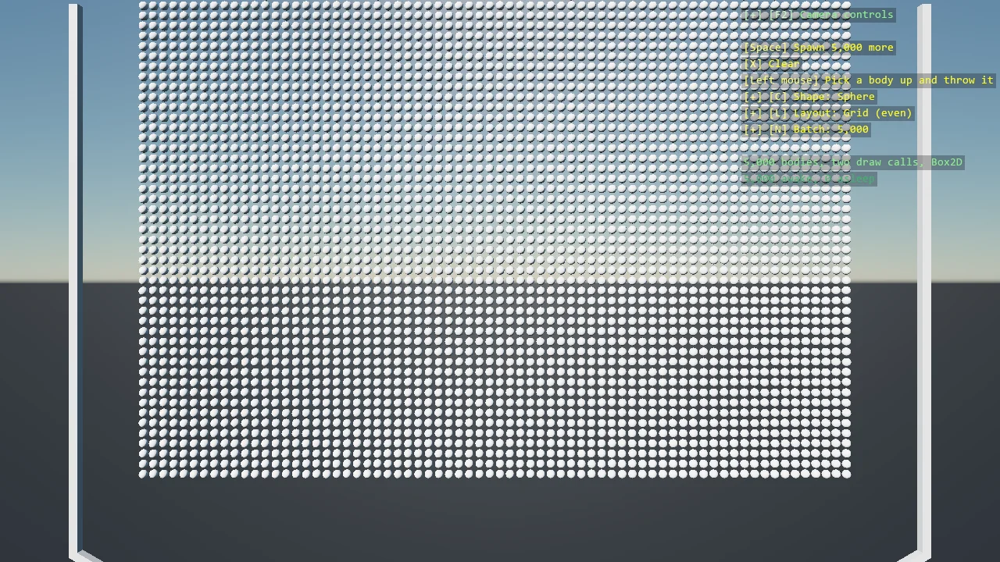
            

                <h3 class="card-title h6"><a class="stretched-link text-decoration-none text-body" href="stress-pile-2d-box2d.md">Basic 2D Scene (Stress Pile, Box2D)</a></h3>
                
Performance

                
The Box2D twin of the stress pile: thousands of bodies piling up, drawn in two instanced draw calls - awake bodies through one master, sleeping bodies...

            

        

    

    

        

            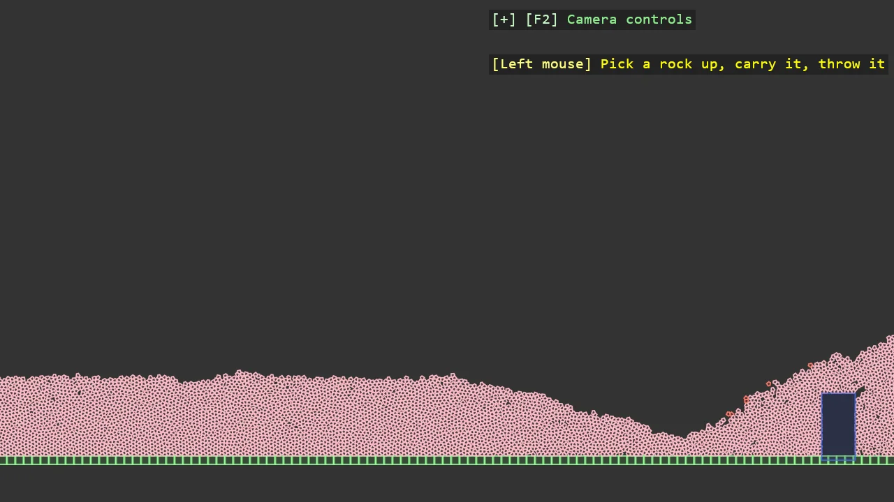
            

                <h3 class="card-title h6"><a class="stretched-link text-decoration-none text-body" href="junkyard-box2d.md">Junkyard (Box2D)</a></h3>
                
Performance

                
A faithful replica of the Box2D.NET BenchmarkJunkyard sample: 8,000 small five-sided rocks rain into a walled yard and a kinematic plow sweeps back...

            

        

    

    

        

            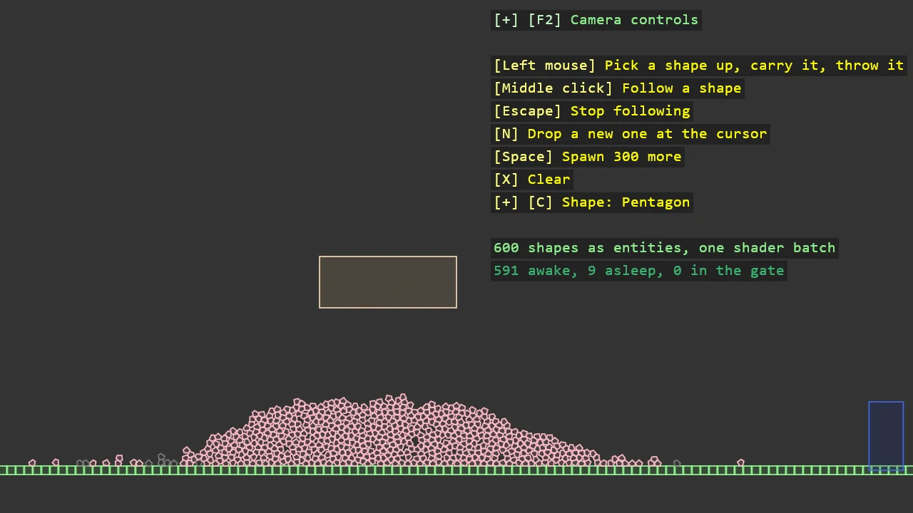
            

                <h3 class="card-title h6"><a class="stretched-link text-decoration-none text-body" href="junkyard-playground-box2d.md">Junkyard Playground (Box2D)</a></h3>
                
Physics

                
The playground sibling of the Junkyard replica: the same walled yard and sweeping plow, built the Stride way - every shape is an entity carrying...

            

        

    

    

        

            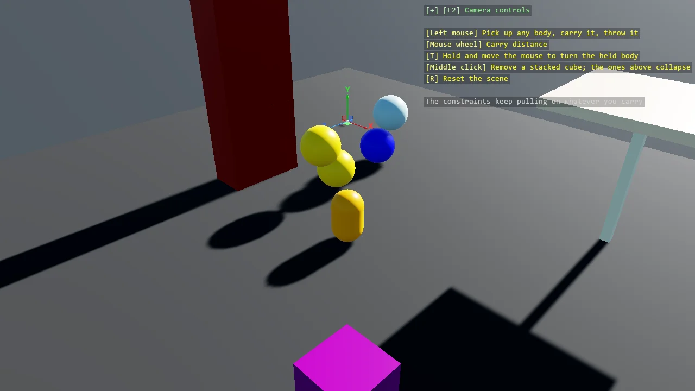
            

                <h3 class="card-title h6"><a class="stretched-link text-decoration-none text-body" href="constraints.md">Various Constraints</a></h3>
                
Physics

                
The full tour of Bepu constraints in one interactive scene: a distance limit holding two spheres within a range, a distance servo actively driving a...

            

        

    

    

        

            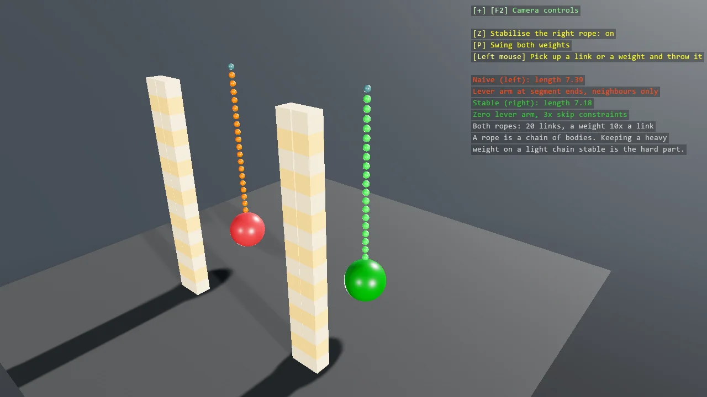
            

                <h3 class="card-title h6"><a class="stretched-link text-decoration-none text-body" href="constraint-rope.md">Rope - building a stable chain of constraints</a></h3>
                
Physics

                
Bepu has no rope type, so a rope is a chain of small bodies tied together at runtime.

            

        

    

    

        

            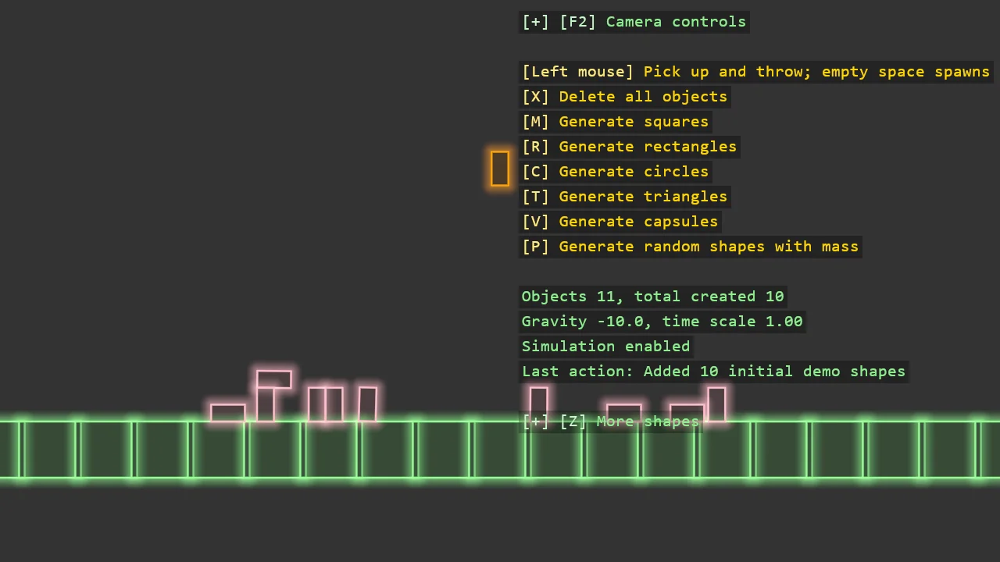
            

                <h3 class="card-title h6"><a class="stretched-link text-decoration-none text-body" href="box2d-physics.md">Box2D.NET Physics</a></h3>
                
Physics

                
A 2D simulation run by Box2D.NET rather than by Stride's own physics, with Stride reduced to drawing the result.

            

        

    

    

        

            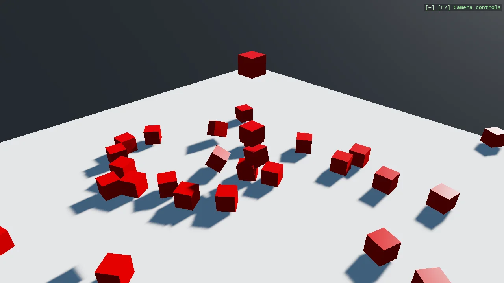
            

                <h3 class="card-title h6"><a class="stretched-link text-decoration-none text-body" href="jitter2-physics.md">Jitter2 Physics Integration</a></h3>
                
Physics

                
Demonstrates integrating Jitter2 physics engine with Stride.

            

        

    

    

        

            
            

                <h3 class="card-title h6"><a class="stretched-link text-decoration-none text-body" href="jitter2-constraints.md">Jitter2 Physics - Constraining to 2D</a></h3>
                
Physics

                
Demonstrates constraining a Jitter2 3D physics simulation to 2D-style behaviour.

            

        

    

    

        

            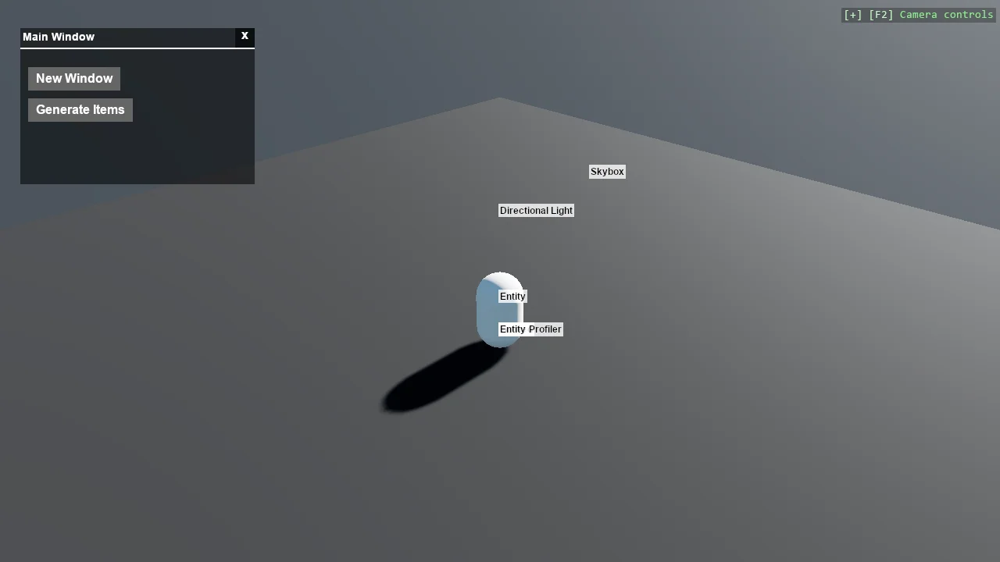
            

                <h3 class="card-title h6"><a class="stretched-link text-decoration-none text-body" href="stride-ui-draggable-window.md">Stride UI - Draggable Window</a></h3>
                
UI

                
A windowing system built on Stride's UI: windows with title bars and close buttons that can be dragged around, and that come to the front when...

            

        

    

    

        

            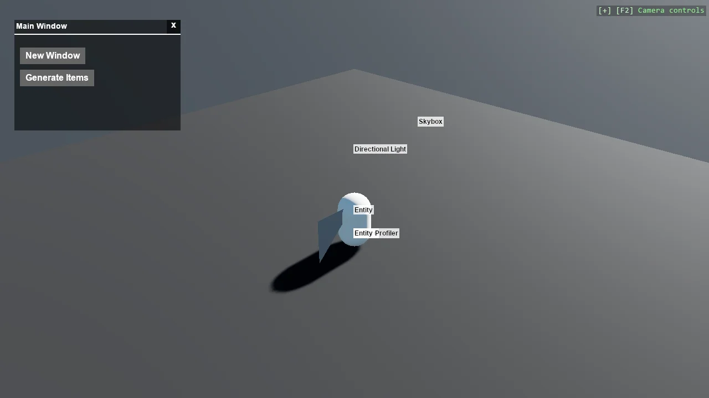
            

                <h3 class="card-title h6"><a class="stretched-link text-decoration-none text-body" href="stride-ui-draggable-window-bullet.md">Stride UI - Draggable Window - Bullet Physics</a></h3>
                
UI

                
The draggable window example running on the legacy Bullet physics engine.

            

        

    

    

        

            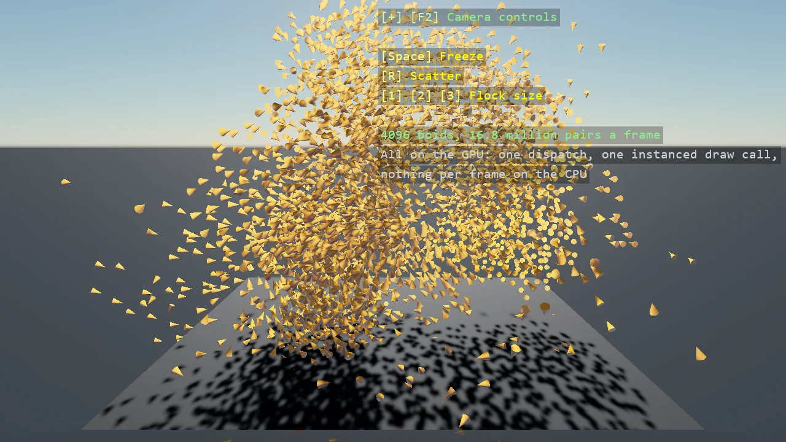
            

                <h3 class="card-title h6"><a class="stretched-link text-decoration-none text-body" href="compute-boids.md">Compute Shader Boids</a></h3>
                
Performance

                
A flock of thousands of boids that lives entirely on the GPU.

            

        

    

    

        

            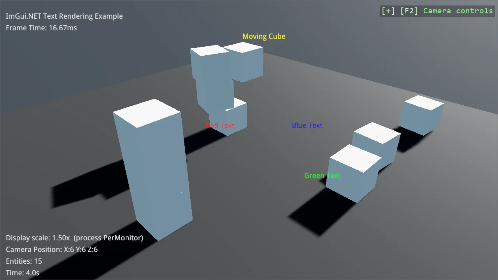
            

                <h3 class="card-title h6"><a class="stretched-link text-decoration-none text-body" href="imgui-net.md">ImGui.NET Text Rendering</a></h3>
                
UI

                
Render debug text with ImGui.NET, both in screen space and anchored to positions in the 3D scene.

            

        

    

    

        

            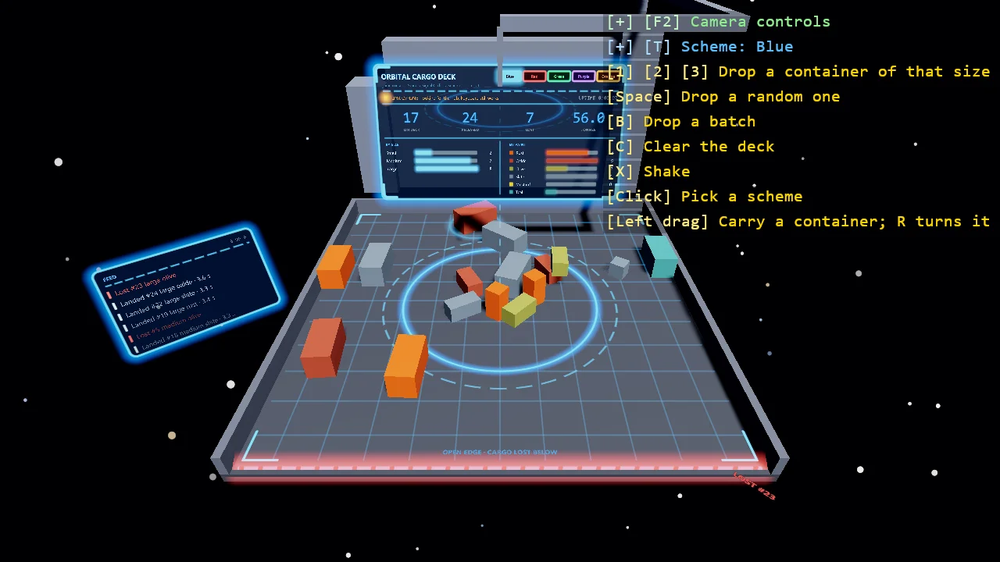
            

                <h3 class="card-title h6"><a class="stretched-link text-decoration-none text-body" href="stride-signalr.md">Stride + SignalR - Orbital Cargo Deck</a></h3>
                
Networking

                
A Stride game and a Blazor web page as two consoles of the same orbital cargo deck, talking both ways over a SignalR hub.

            

        

    

    

        

            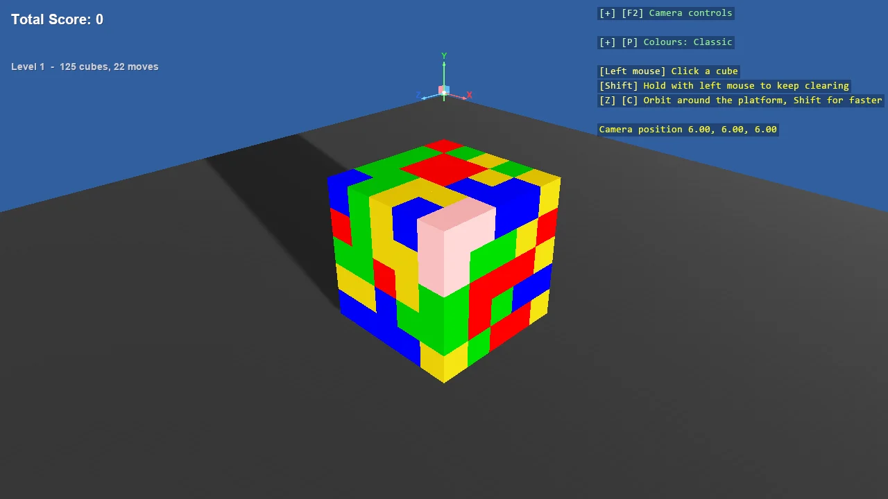
            

                <h3 class="card-title h6"><a class="stretched-link text-decoration-none text-body" href="cube-collapse.md">Game - Cube Collapse</a></h3>
                
Game

                
A colour-match collapse puzzle built entirely from code.

            

        

    

## C# Other

    

        

            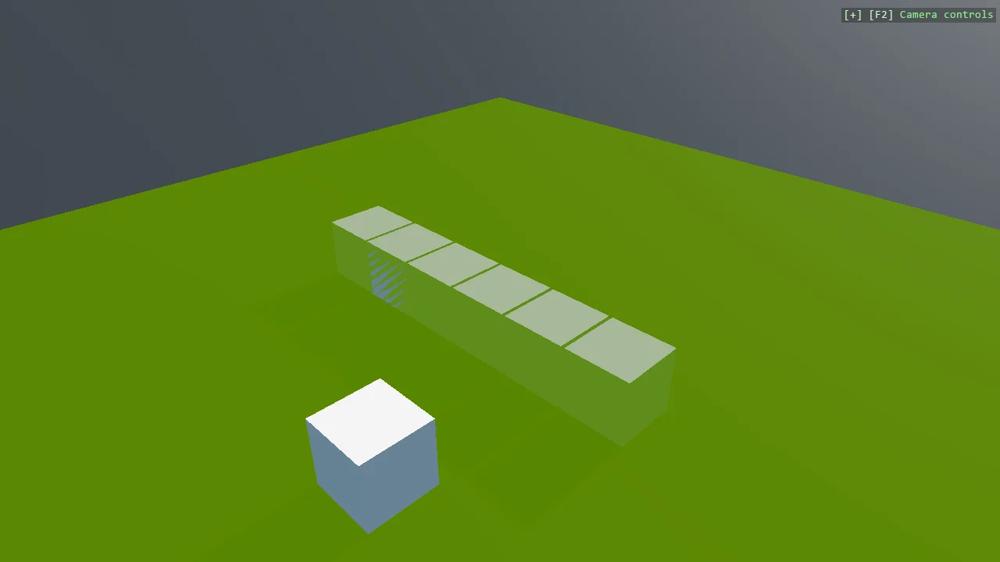
            

                <h3 class="card-title h6"><a class="stretched-link text-decoration-none text-body" href="collidable-gizmo.md">Collidable Gizmo</a></h3>
                
Debug

                
A single-purpose demo of CollidableGizmoScript, which draws the collider Bepu is actually using so it can be compared against the model you think you...

            

        

    

    

        

            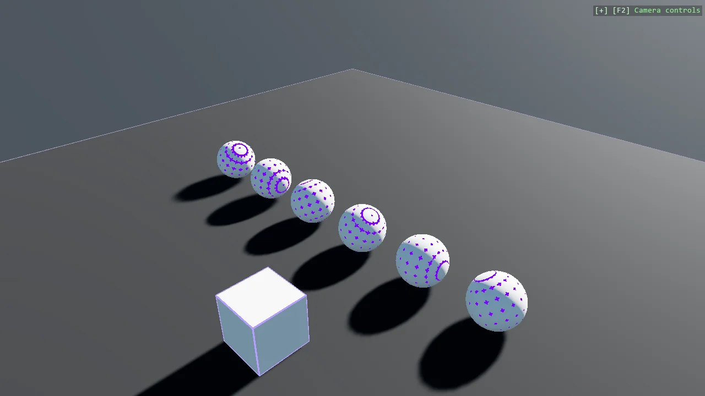
            

                <h3 class="card-title h6"><a class="stretched-link text-decoration-none text-body" href="debug-render-component.md">Debug Render Component</a></h3>
                
Debug

                
The companion to the collidable gizmo: DebugRenderComponentScript draws the wireframe of an entity's own mesh rather than its collider.

            

        

    

## F# Getting Started

    

        

            
            

                <h3 class="card-title h6"><a class="stretched-link text-decoration-none text-body" href="capsule-with-rigid-body-fs.md">Capsule with rigid body in F#</a></h3>
                
Shapes

                
The first code-only scene written in F#.

            

        

    

## F# Intermediate

    

        

            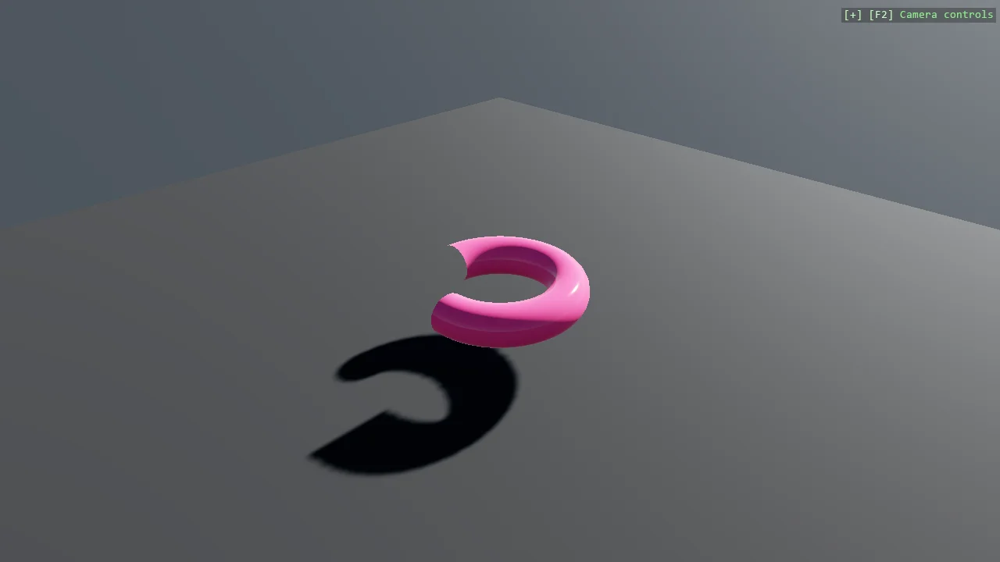
            

                <h3 class="card-title h6"><a class="stretched-link text-decoration-none text-body" href="partial-torus-mesh-fs.md">Partial Torus Mesh in F#</a></h3>
                
Geometry

                
The parametric partial torus, written in F#.

            

        

    

## Visual Basic Getting Started

    

        

            
            

                <h3 class="card-title h6"><a class="stretched-link text-decoration-none text-body" href="capsule-with-rigid-body-vb.md">Capsule with rigid body in Visual Basic</a></h3>
                
Shapes

                
The first code-only scene written in Visual Basic.

            

        

    

