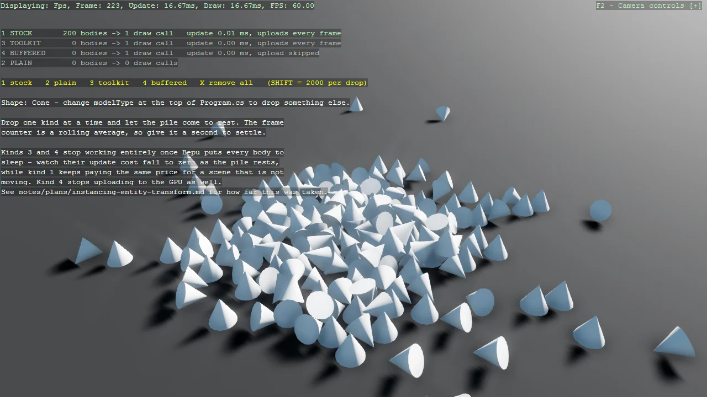

# Instancing with Entity Transforms

Keep every object a real entity - with a transform, a physics body and anything else you need - while
still drawing the whole crowd in a single draw call. A master entity holds a ModelComponent and an
instancing type that reads its members' world matrices each frame, and the members carry no
ModelComponent of their own. Bepu drives the transforms, so the bodies collide and pile up normally.
Four kinds of body can be dropped side by side to compare: Stride's own InstancingEntityTransform,
no instancing at all, the toolkit's BepuEntityInstancing, and BufferedEntityInstancing. The toolkit
types stop working once Bepu puts the bodies to sleep, which takes a settled 20,000-cube pile from
239 to 329 FPS, and the example also shows where the real ceiling lies, because instancing removes
draw calls and does nothing about simulation cost. One line at the top switches the whole pile to
any other primitive, so the same comparison can be run with spheres, cones or hulls.

The `Program.cs` file shows how to:

- Combining physics bodies with instanced rendering
- Comparing four instancing strategies side by side at runtime
- The master and instance split for entity-driven instancing
- Why an instance entity must not have its own ModelComponent
- Skipping instancing work entirely while physics bodies sleep
- Owning GPU instance buffers to avoid redundant uploads
- Deriving a Bepu collider from a primitive type without building a mesh per body
- Switching the whole scene to a different primitive from one line
- Knowing when instancing does not help
- Using helpers: AddInstancingSupport, AddInstancingBufferUpload
- Using helpers: SetupBase3D, Add3DGround, AddBepu3DPhysics

View on [GitHub](https://github.com/stride3d/stride-community-toolkit/tree/main/examples/code-only/Example22_Instancing_EntityTransform).

[!code-csharp]
