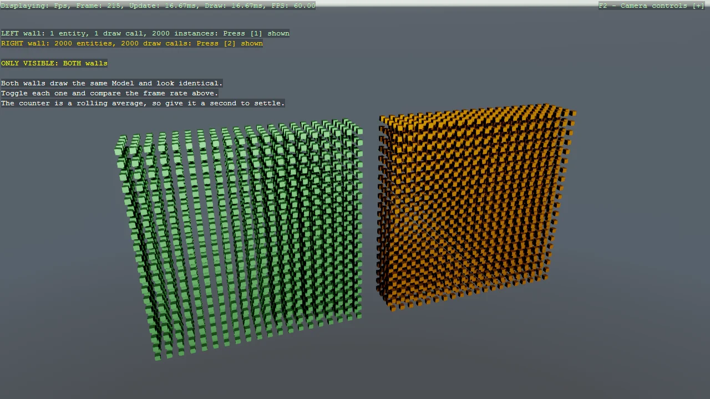

# GPU Instancing

Render two identical walls of cubes built two different ways, side by side. The left wall uses one
entity per cube and costs one draw call each; the right wall uses a single entity with an
InstancingComponent and an array of world matrices, and costs one draw call in total. Both share the
same Model, so the only difference is instancing. Toggle each wall to compare the frame rate, and
note that the InstancingRenderFeature has to be added to the compositor by hand in code-only projects.

The `Program.cs` file shows how to:

- Reducing draw calls with an InstancingComponent
- Building an InstancingUserArray from world matrices
- Registering InstancingRenderFeature on the MeshRenderFeature
- Sharing one Model between many entities
- Toggling a ModelComponent to compare rendering cost
- Using helpers: SetupBase3D
- Using helpers: Add3DCameraController
- Using helpers: AddProfiler

View on [GitHub](https://github.com/stride3d/stride-community-toolkit/tree/main/examples/code-only/Example21_Instancing).

[!code-csharp]
