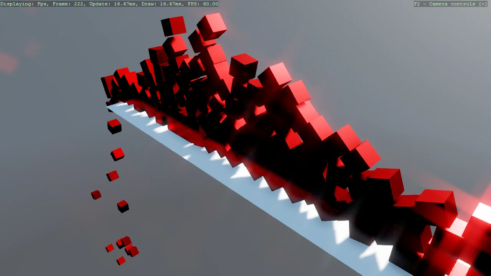

# Jitter2 Physics - Constraining to 2D

Demonstrates constraining a Jitter2 3D physics simulation to 2D-style behaviour. Jitter2 has no
dedicated 2D mode, so each falling cube gets a PointOnPlane constraint locking translation along Z
and a HingeAngle constraint locking rotation to the Z axis, confining it to the X/Y plane while it
keeps running on the same 3D solver. Builds on Example19_Jitter2Physics with the same falling-cubes
setup, spread across a grid so they cascade and pile up sideways.

The `Program.cs` file shows how to:

- Constraining a 3D physics engine to 2D motion
- Creating and initializing Jitter2 constraints (PointOnPlane, HingeAngle)
- Locking translation and rotation axes with world.CreateConstraint
- Synchronizing physics bodies with visual entities
- Fixed-timestep physics update loop, decoupled from the render frame rate

View on [GitHub](https://github.com/stride3d/stride-community-toolkit/tree/main/examples/code-only/Example19_Jitter2Physics_Constraints).

[!code-csharp]
