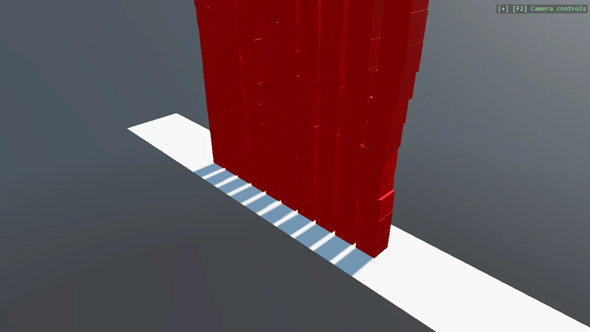

# Jitter2 Physics - Constraining to 2D

Demonstrates restricting a Jitter2 3D physics simulation to 2D-style behaviour using axis locking.
Each falling cube uses AllowedMotion = MotionAxes.PlaneXY to allow translation in X/Y and rotation
about Z while locking the other world-space axes, without additional constraints. Builds on
E06_Jitter2 with falling cubes spread across a grid so they cascade and pile up sideways.

The `Program.cs` file shows how to:

- Constraining a 3D physics engine to 2D motion
- Configuring RigidBody.AllowedMotion with MotionAxes.PlaneXY
- Locking world-space translation and rotation axes without additional constraints
- Synchronizing physics bodies with visual entities
- Fixed-timestep physics update loop, decoupled from the render frame rate

View on [GitHub](https://github.com/stride3d/stride-community-toolkit/tree/main/examples/code-only/E06_Jitter2_ConstrainedTo2D).

[!code-csharp]