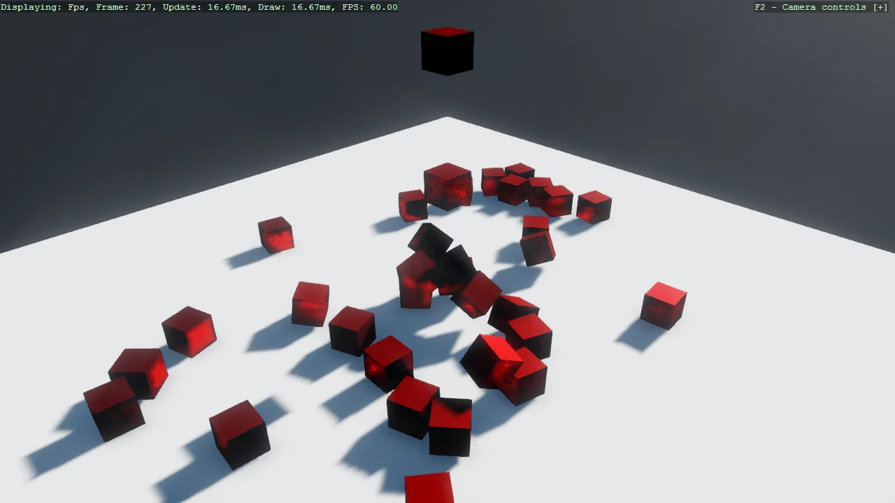

# Jitter2 Physics Integration

Demonstrates integrating Jitter2 physics engine with Stride. Shows how to create a physics world,
synchronize physics bodies with visual entities, and simulate dynamic rigid body interactions.
Features 150 falling cubes with proper collision detection and a static ground plane.

The `Program.cs` file shows how to:

- Integrating external physics engine (Jitter2)
- Creating and managing physics world
- Synchronizing physics bodies with visual entities
- Dynamic rigid body simulation
- Static vs dynamic physics bodies
- Fixed-timestep physics update loop, decoupled from the render frame rate

View on [GitHub](https://github.com/stride3d/stride-community-toolkit/tree/main/examples/code-only/Example19_Jitter2Physics).

[!code-csharp]
