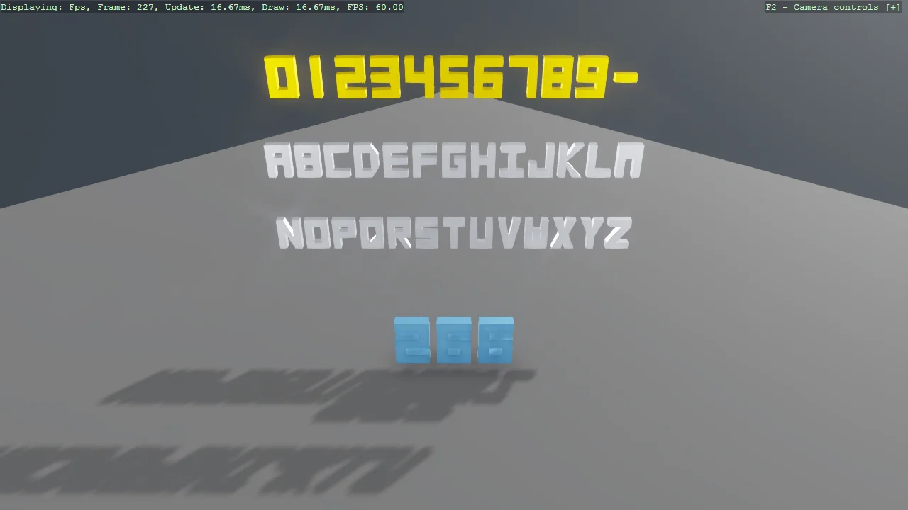

# 3D Letters (Mesh Text)

A gallery of every glyph LetterMeshFactory can build - the digits, the full A-Z alphabet and
the dash - as solid extruded meshes that catch the light like any other geometry, plus a frame
counter whose digits are rebuilt as a new mesh every frame. The counter demonstrates the one
rule of dynamic mesh text: dispose the old GPU buffers before swapping in the new mesh, or leak
a buffer pair per rebuild.

The `Program.cs` file shows how to:

- Solid 3D lettering from code: LetterMeshFactory.CreateTextMeshDraw
- Which characters exist - SupportedCharacters - and why fonts are not involved
- Static lettering built once versus text that changes
- Rebuilding a mesh safely: dispose the old buffers first
- centerOrigin for strings centred on their entity
- When to use EntityTextComponent or WorldTextComponent instead

View on [GitHub](https://github.com/stride3d/stride-community-toolkit/tree/main/examples/code-only/Example01_Letters3D).

[!code-csharp]
