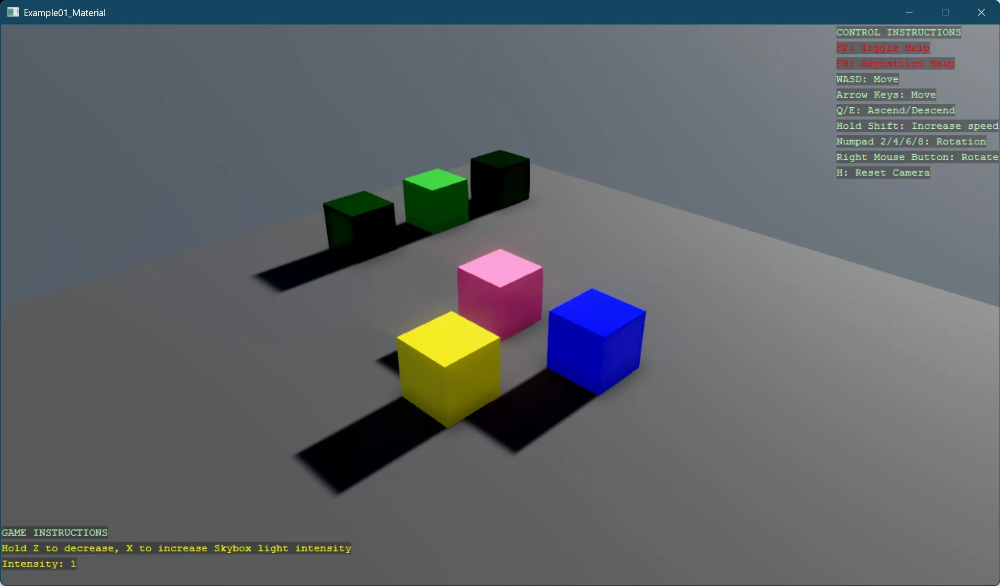

# Material

This example demonstrates how to create and configure various materials. The sample creates multiple cube primitives with different material properties:

- Basic colored materials with varying glossiness and metalness
- Custom materials defined through code with different surface properties
- Three advanced materials showing different combinations of diffuse color, micro-surface properties, and specular reflection

The example also includes an interactive environment where users can adjust the skybox light intensity using keyboard controls (Z to decrease, X to increase), allowing real-time observation of how lighting affects the appearance of different materials.

[!INCLUDE [note-additional-packages](../../../includes/manual/examples/note-additional-packages.md)]

View on [GitHub](https://github.com/stride3d/stride-community-toolkit/tree/main/examples/code-only/Example01_Material).

[!code-csharp]