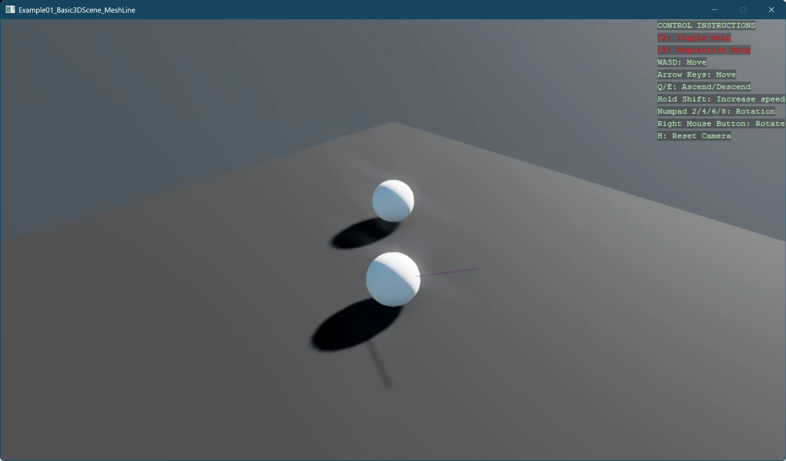

# Mesh line

This example demonstrates how to create a simple 3D scene with a custom mesh line connecting two objects. The code shows:

- Setting up a basic 3D scene
- Creating two sphere entities positioned in 3D space
- Building a custom mesh line by:
  - Defining vertices for start and end points
  - Creating vertex and index buffers
  - Configuring a mesh draw with line list primitive type
  - Applying an emissive color material for visibility
  
The line is attached as a child to one of the spheres, creating a visual connection between the two objects. This approach illustrates how to create basic geometric primitives and custom line visualizations in a Stride 3D environment using low-level graphics APIs.

[!INCLUDE [note-additional-packages](../../../includes/manual/examples/note-additional-packages.md)]

View on [GitHub](https://github.com/stride3d/stride-community-toolkit/tree/main/examples/code-only/Example01_Basic3DScene_MeshLine).

[!code-csharp]