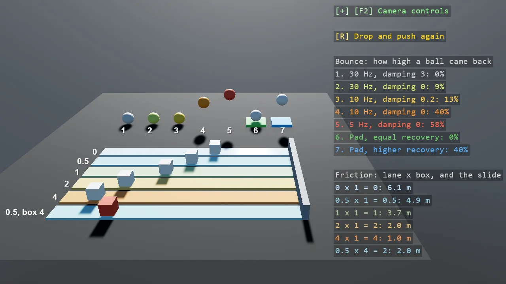

# Physics Materials

How to make something bouncy and how to make something slippery. Seven identical balls are
dropped and six identical boxes are pushed, and the lanes differ only in the four numbers every
Bepu body and static has: SpringFrequency, SpringDampingRatio, FrictionCoefficient and
MaximumRecoveryVelocity. The defaults do not bounce at all; no damping and a low frequency do.
Of the two springs that meet, only the one with the higher MaximumRecoveryVelocity is used, which
two lanes show with the same pad. Friction is the two coefficients multiplied. The overlay prints
the rebound and the slide each lane measured.

The `Program.cs` file shows how to:

- SpringDampingRatio - why the defaults do not bounce, and what lowering it does
- SpringFrequency - a lower frequency bounces higher, and is softer
- Which of two springs a contact uses - the side with the higher MaximumRecoveryVelocity
- FrictionCoefficient - a pair's friction is the product of the two
- Setting the four numbers on a BodyComponent and on a StaticComponent
- Replaying a scene - Teleport, then Awake, then the velocities
- Measuring a rebound from a body's LinearVelocity, which cannot miss a short contact
- Using helpers: SetupBase3DScene, Create3DPrimitive, AddEntityTextRenderer, DebugOverlay

View on [GitHub](https://github.com/stride3d/stride-community-toolkit/tree/main/examples/code-only/E05_3D_PhysicsMaterials).

[!code-csharp]