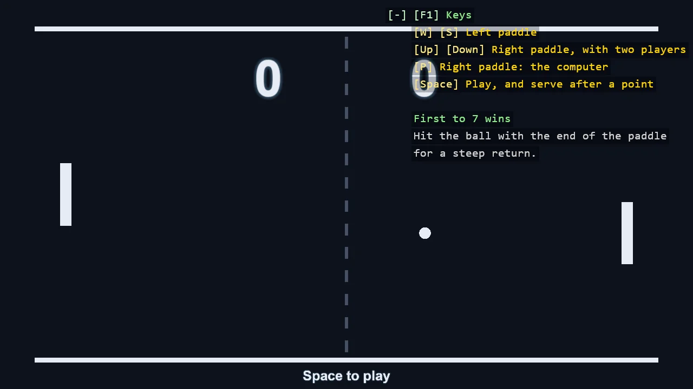

# Game - Pong

Pong, the first game: two paddles, a ball and a score to seven, with no assets and no physics
engine. The game is three small scripts that do not call each other. The paddles and the ball
are SyncScripts; the referee is an AsyncScript, so a whole match reads top to bottom as one
method. The ball announces a point through an EventKey and the referee awaits it. Until Space
is pressed the computer plays both sides.

The `Program.cs` file shows how to:

- SyncScript for what moves every frame, AsyncScript for a flow that waits
- EventKey and EventReceiver - broadcast, TryReceive and ReceiveAsync
- A bounce without a physics engine - reflecting a velocity, and testing the crossing of a line so a fast ball cannot skip through a paddle
- A computer player that can be beaten
- Score and messages as WorldTextComponent

View on [GitHub](https://github.com/stride3d/stride-community-toolkit/tree/main/examples/code-only/E20_2D_Pong).

[!code-csharp]