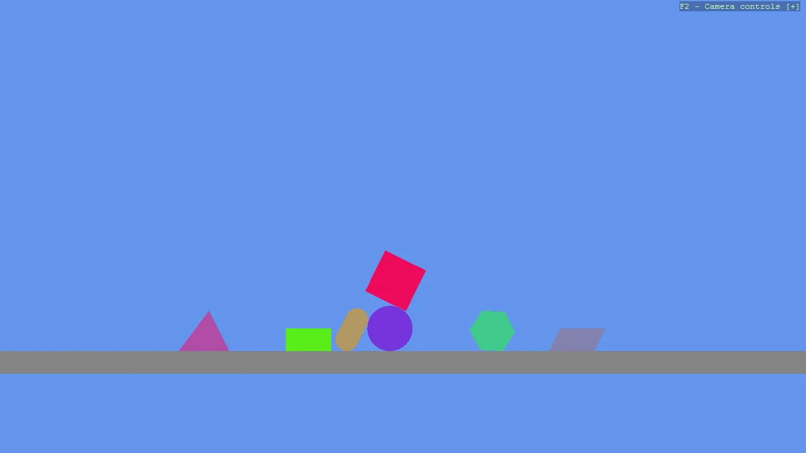

# Basic2D Scene (Multiple Primitives)

Create a minimal 2D scene using toolkit helpers and place multiple different primitive shapes.
Demonstrates entity creation, basic positioning, and attaching the entities to the scene.

The `Program.cs` file shows how to:

- Creating multiple 2D primitives (Circle, Capsule, Rectangle, Square, Polygon, Triangle)
- Positioning entities with Transform.Position
- Adding entities to a Scene (rootScene)
- Using helpers: SetupBase2DScene

View on [GitHub](https://github.com/stride3d/stride-community-toolkit/tree/main/examples/code-only/Example01_Basic2DScene_Primitives).

[!code-csharp]
