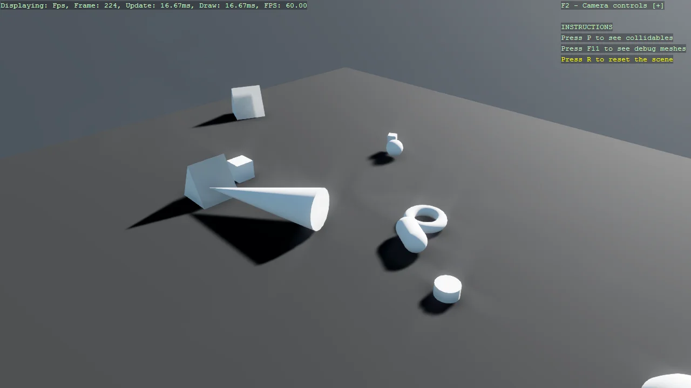

# Basic3D Scene (Every Primitive)

Every 3D primitive the toolkit can build - cube, cone, capsule, sphere, cylinder, teapot, torus and
triangular prism - dropped into one scene so the shapes, their default sizes and their generated
colliders can be compared side by side. Naming each entity is what makes the scene resettable: R
removes everything with that name and rebuilds, which is the simplest safe teardown pattern there
is. P and F11 turn on the collider and debug-mesh overlays.

The `Program.cs` file shows how to:

- Creating each PrimitiveModelType and comparing their defaults
- Sizing a primitive with Primitive3DCreationOptions
- Rotating an entity with Transform.Rotation
- Tagging entities with a name so the scene can be torn down and rebuilt
- Inspecting generated colliders with CollidableGizmoScript
- Adding keyboard instructions as a DebugOverlay section
- Using helpers: SetupBase3DScene, AddSkybox, AddProfiler, Create3DPrimitive

View on [GitHub](https://github.com/stride3d/stride-community-toolkit/tree/main/examples/code-only/Example01_Basic3DScene_Primitives).

[!code-csharp]
