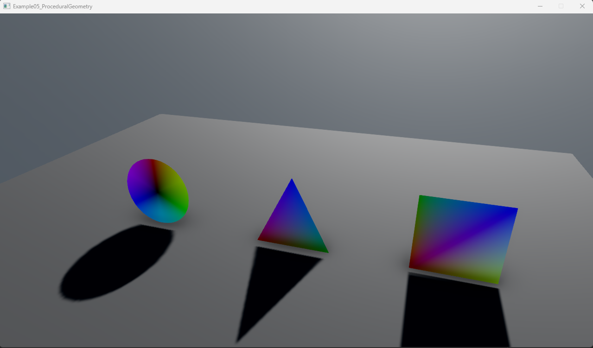

# Procedural geometry

In this example, we delve into creating procedural geometry meshes including a triangle, a plane, and a circle, and integrate them into a Stride scene. Utilizing the @Stride.CommunityToolkit.Rendering.Utilities.MeshBuilder class from the toolkit, the process of crafting and rendering these geometries is streamlined.

The `MeshBuilder` class is employed to define the layout and data for each mesh. For instance, the `GiveMeATriangle`, `GiveMeAPlane`, and `GiveMeACircle` methods demonstrate how to configure vertices, indices, and other properties to form a triangle, a plane, and a circle, respectively.

The `Update` method demonstrates a dynamic adjustment to the circle's segments count over time, showcasing a simple animation effect.

For more details of `MeshBuilder`, refer to our [MeshBuilder manual](../../rendering/mesh-builder.md).

[!INCLUDE [note-additional-pakcages](../../../includes/manual/examples/note-additional-pakcages.md)]

View on [GitHub](https://github.com/stride3d/stride-community-toolkit/tree/main/examples/code-only/Example05_ProceduralGeometry).

[!code-csharp]
