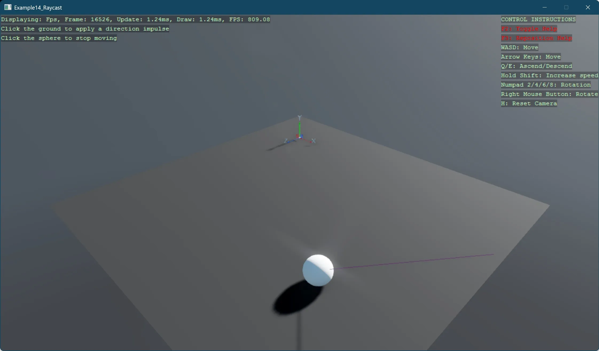

# Raycast

This example demonstrates how to implement raycasting and physics interactions in Stride. The sample shows:

- Setting up a 3D scene with a sphere controlled by physics
- Implementing mouse-based raycasting from the camera
- Applying physics impulses to objects based on click location
- Creating interaction between user input and physics objects

The example features a sphere that responds to physics. When you click on the ground, a ray is cast from the camera to determine the hit point, and the sphere is propelled in that direction with an appropriate impulse. Clicking directly on the sphere stops its movement entirely. A visual line indicator shows the direction of the applied force.

This example demonstrates key concepts for interactive physics-based games, including raycasting for object selection, applying physics forces at specific points, and creating visual feedback for user interactions.

[!INCLUDE [note-additional-packages](../../../includes/manual/examples/note-additional-packages.md)]

View on [GitHub](https://github.com/stride3d/stride-community-toolkit/tree/main/examples/code-only/Example14_Raycast).

[!code-csharp]