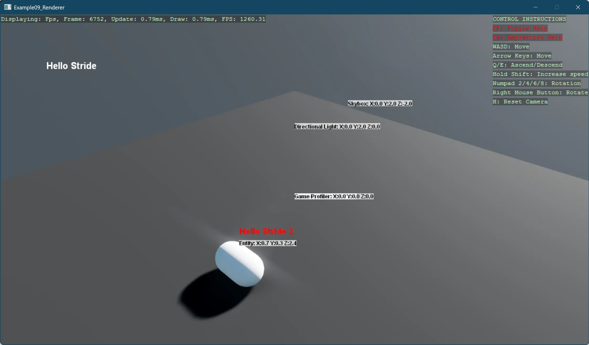

# Renderer

This example demonstrates two distinct approaches for implementing custom rendering in Stride, allowing developers to extend the default rendering pipeline with their own 2D visualization code:

1. Global Scene Renderer Implementation - `MyCustomSceneRenderer`:
   - Creates a custom renderer that operates on all entities in the scene
   - Implements SceneRendererBase to hook into Stride's rendering pipeline
   - Renders both static text ("Hello Stride") and dynamic per-entity information
   - Displays entity names and positions with semi-transparent backgrounds
   - Converts 3D world positions to 2D screen coordinates for text placement
2. Entity-Specific Renderer Implementation - `SpriteBatchRendererScript`:
   - Attaches a custom renderer to a specific entity via a StartupScript
   - Creates a DelegateSceneRenderer to handle rendering without subclassing
   - Displays "Hello Stride 2" text specifically for its parent entity
   - Demonstrates renderer initialization and integration through the component system

The example also includes physics interactions, applying an impulse to make the capsule roll after falling, showcasing how rendering can visualize dynamic object behavior. The combination of these approaches illustrates different architectural patterns for extending Stride's rendering capabilities:

- The scene-wide approach for global visualization needs (debug overlays, HUD elements)
- The entity-specific approach for object-focused rendering (labels, status indicators)

Both techniques utilize SpriteBatch for efficient 2D rendering within a 3D scene context, showing how to properly initialize resources, convert between coordinate systems, and integrate with Stride's render stages.

[!INCLUDE [note-additional-packages](../../../includes/manual/examples/note-additional-packages.md)]

View on [GitHub](https://github.com/stride3d/stride-community-toolkit/tree/main/examples/code-only/Example09_Renderer).

[!code-csharp]