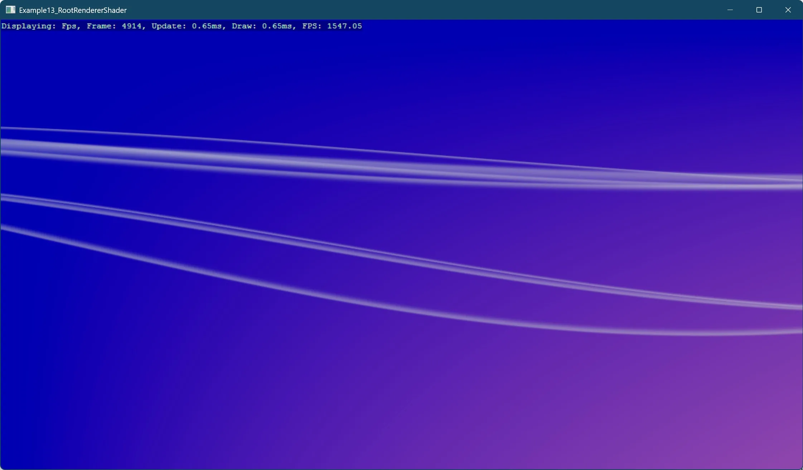

# Root Renderer Shader

This example demonstrates how to implement a custom render feature in Stride using a root renderer shader. The project showcases:

- Creating a custom component that integrates with Stride's rendering system
- Implementing a root render feature that adds custom visual effects to the scene
- Setting up shader parameters through component properties
- Integrating custom rendering into Stride's graphics pipeline

The example creates a visual ribbon background effect that's fully configurable through properties like intensity, frequency, amplitude, speed, and width factor. It illustrates a complete workflow for adding custom shader-based visual effects to a Stride application.

Key components in this implementation include:

- `RibbonBackgroundComponent` - An entity component that stores and manages the visual properties of the ribbon effect
- `RibbonRenderBackground` - A render object that holds the parameters needed by the shader
- `RibbonBackgroundRenderFeature` - A render feature that integrates with Stride's rendering pipeline

The project demonstrates important render pipeline concepts including:

1. Registering a custom render feature with the graphics compositor
2. Specifying render stages and groups for proper rendering order
3. Connecting component properties to shader parameters
4. Creating entity-bound visual effects through the component system

This approach to custom rendering is particularly useful for creating background effects, post-processing, and other visual enhancements that require direct access to the rendering pipeline.

[!INCLUDE [note-additional-packages](../../../includes/manual/examples/note-additional-packages.md)]

View on [GitHub](https://github.com/stride3d/stride-community-toolkit/tree/main/examples/code-only/Example13_RootRendererShader).

[!code-csharp]