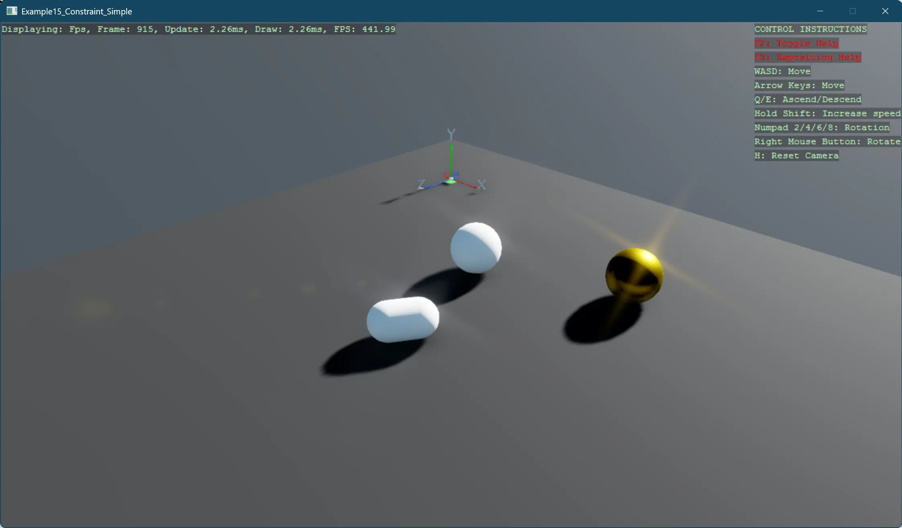

# Simple constraint

This example demonstrates how to create a physics-based constraint between two objects using the BepuPhysics integration in Stride. The code illustrates:

- Setting up a basic 3D scene with skybox, profiler, and ground reference grid
- Creating a capsule and two spheres as visual objects in the scene
- Implementing a distance servo constraint that maintains a fixed distance between two spheres
- Using the `DistanceServoConstraintComponent` to define the relationship between physics bodies

The distance servo constraint connects the two spheres and enforces a target distance of 3.0 units between them, causing them to pull toward or push away from each other to maintain this distance. This example showcases how constraints can be used to create physically-driven connections between objects, which is useful for creating joints, hinges, ropes, and other interconnected mechanical systems.

[!INCLUDE [note-additional-packages](../../../includes/manual/examples/note-additional-packages.md)]

View on [GitHub](https://github.com/stride3d/stride-community-toolkit/tree/main/examples/code-only/Example15_Constraint_Simple).

[!code-csharp]