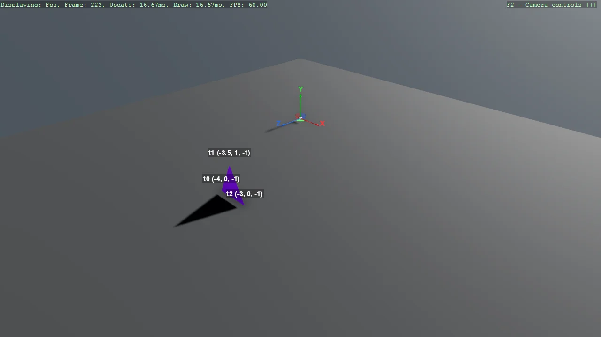

# Simple Geometry (Labelled Triangle)

The smallest possible custom mesh - one triangle from three vertices - with each vertex labelled on
screen so the relationship between the numbers in the code and the shape on screen is visible. The
labels come from EntityTextComponent, which needs its renderer registered once, and the ground gizmo
shows which way the axes point. Useful as a scratchpad when a mesh comes out inside out or facing
the wrong way.

The `Program.cs` file shows how to:

- Building a single triangle from a vertex and index buffer
- Choosing a vertex format: VertexPositionTexture and its Layout
- Labelling vertices on screen to debug a mesh
- Registering the label renderer with AddSceneRenderer(new EntityTextRenderer())
- Orienting yourself with a named-axis ground gizmo
- Using helpers: SetupBase3DScene, AddSkybox, AddGroundGizmo, AddProfiler, CreateFlatMaterial

View on [GitHub](https://github.com/stride3d/stride-community-toolkit/tree/main/examples/code-only/Example05_SimpleGeometry).

[!code-csharp]
