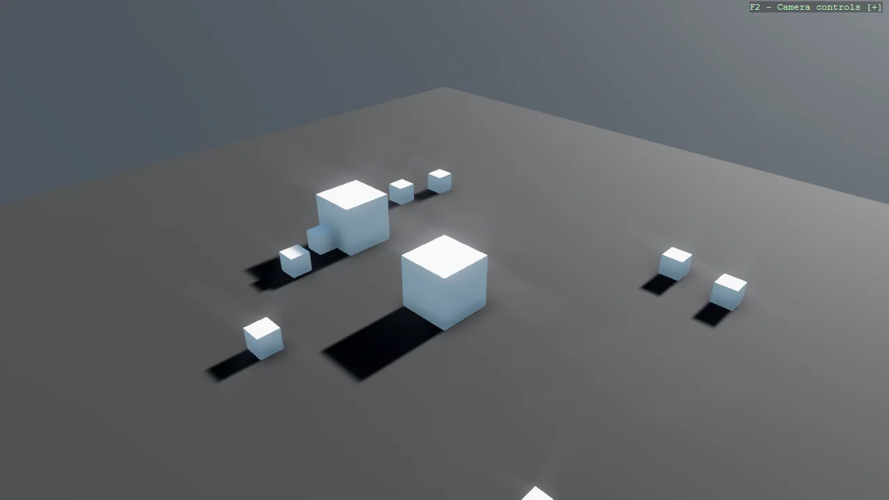

# Give Me a Cube (SimulationUpdate)

Drive an entity from the physics clock instead of the render loop. The script is a StartupScript with
no per-frame Update at all: it implements ISimulationUpdate, so Bepu calls it once per fixed physics
step and Stride registers it automatically. That is what makes SetTargetPose safe, because exactly one
step consumes the velocity it sets. Compare with Example02_GiveMeACube, which sets a bounded velocity
every frame instead.

The `Program.cs` file shows how to:

- Implementing ISimulationUpdate to run on the physics clock
- The difference between a fixed physics step and a frame delta time
- Using SetTargetPose safely, once per physics step
- StartupScript as a component with no per-frame Update
- Moving a kinematic body so it pushes dynamic bodies
- Using helpers: SetupBase3DScene
- Using helpers: AddSkybox

View on [GitHub](https://github.com/stride3d/stride-community-toolkit/tree/main/examples/code-only/Example02_GiveMeACube_SimulationUpdate).

[!code-csharp]
