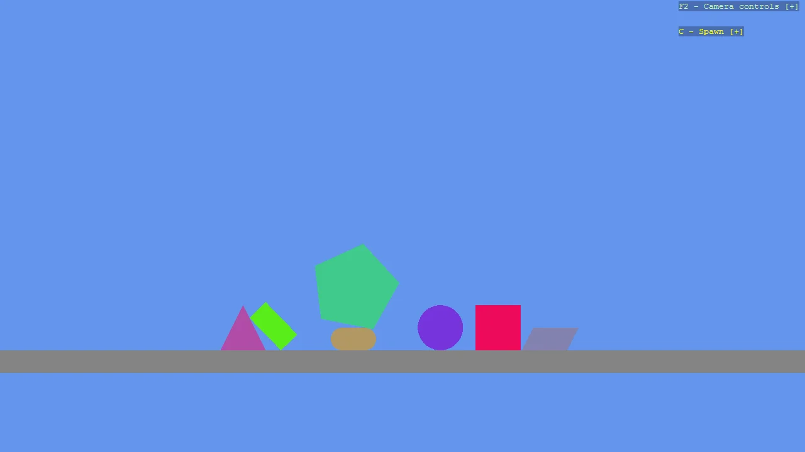

# 2D Spawn Menu

Drive a scene from the keyboard without filling the screen with instructions. DebugTextDropdown
shows a single collapsed line until its key is pressed, then expands into a list where every entry
has its own key, label, colour and callback. Press C to open the menu and 1-7 to drop that shape
into the 2D scene; the menu is configured to stay open so shapes can be added one after another.
The dropdown reads no input by itself and does not draw itself either: the example feeds it the
InputManager each frame and registers its lines as a DebugOverlay section, so it shares one screen
position and one hide key with the camera controller's help instead of being drawn separately.

The `Program.cs` file shows how to:

- Building a collapsible keyboard menu with DebugTextDropdown
- Giving each entry its own key, label, colour and callback
- Keeping a menu open for repeated use with CloseOnSelect
- Sharing one on-screen block with the camera help through a DebugOverlay section
- Spawning entities at runtime from keyboard input
- Creating 2D primitives (Circle, Capsule, Rectangle, Square, Polygon, Triangle)
- Using helpers: SetupBase2DScene, Create2DPrimitive, CreateFlatMaterial

View on [GitHub](https://github.com/stride3d/stride-community-toolkit/tree/main/examples/code-only/Example01_Basic2DScene_SpawnMenu).

[!code-csharp]
