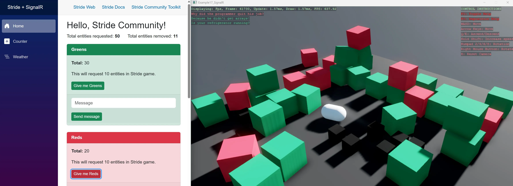

# Stride + SignalR

This example demonstrates two‑way communication between a Stride application and a Blazor web application with SignalR hub to send and receive messages at runtime.

This project will show how to:
- Connect to a SignalR hub and register message handlers
- Send commands/events from Stride to the Blazor app and react to incoming messages
- Drive simple in‑game behaviors (creating entities) from Blazor web UI

This example requires to check GitHub for the full solution, which includes both the Stride project and a minimal Blazor server app with a SignalR hub. Firstly, you would need to run the Blazor app to host the SignalR hub. Use IIS Express. Then, run the Stride application, which connects to the hub and sends/receives messages.

[!INCLUDE [note-additional-packages](../../../includes/manual/examples/note-additional-packages.md)]

View on [GitHub](https://github.com/stride3d/stride-community-toolkit/tree/main/examples/code-only/Example17_SignalR), accompanied by a minimal Blazor server app with a SignalR hub, [source](https://github.com/stride3d/stride-community-toolkit/tree/main/examples/code-only/Example17_SignalR_Blazor).

[!code-csharp]