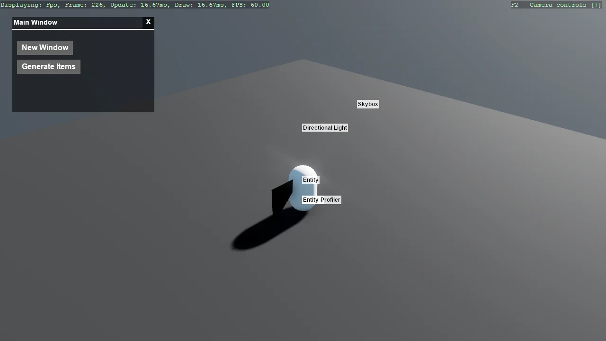

# Stride UI - Draggable Window - Bullet Physics

The draggable window example running on the legacy Bullet physics engine. The UI code is unchanged -
only the spheres the windows spawn are simulated differently. Useful as a direct comparison if you
are maintaining a project that has not moved to Bepu yet.

The `Program.cs` file shows how to:

- Running the draggable window scene on the legacy Bullet engine
- Switching engine by namespace: Stride.CommunityToolkit.Bullet in place of .Bepu
- Why the UI layer is unaffected by the physics engine underneath

View on [GitHub](https://github.com/stride3d/stride-community-toolkit/tree/main/examples/code-only/Example10_StrideUI_DragAndDrop_BulletPhysics).

[!code-csharp]
