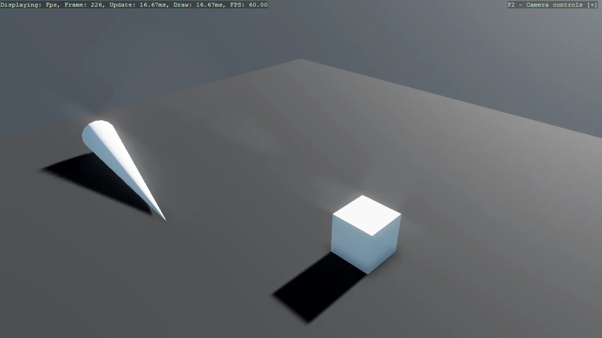

# SyncScript - moving a body every frame

A cube driven in a circle by a SyncScript, which is the ordinary way to run code every frame. The
part worth copying is how it moves: the body is made kinematic and steered with SetTargetPose rather
than by assigning Transform.Position. With a physics body attached the simulation owns the
transform, so writing the position directly is overwritten, and moving a kinematic body correctly is
what lets it still push dynamic bodies out of the way.

The `Program.cs` file shows how to:

- Running per-frame logic by deriving from SyncScript
- Attaching a script to an entity with Entity.Add
- Fetching a sibling component with Entity.Get
- Why physics owns the transform once a body is attached
- Moving a kinematic body with SetTargetPose, not Transform.Position
- Framerate independence with Game.UpdateTime.Elapsed
- Using helpers: SetupBase3DScene, AddSkybox, AddProfiler, Create3DPrimitive

View on [GitHub](https://github.com/stride3d/stride-community-toolkit/tree/main/examples/code-only/Example01_Basic3DScene_SyncScript).

[!code-csharp]
