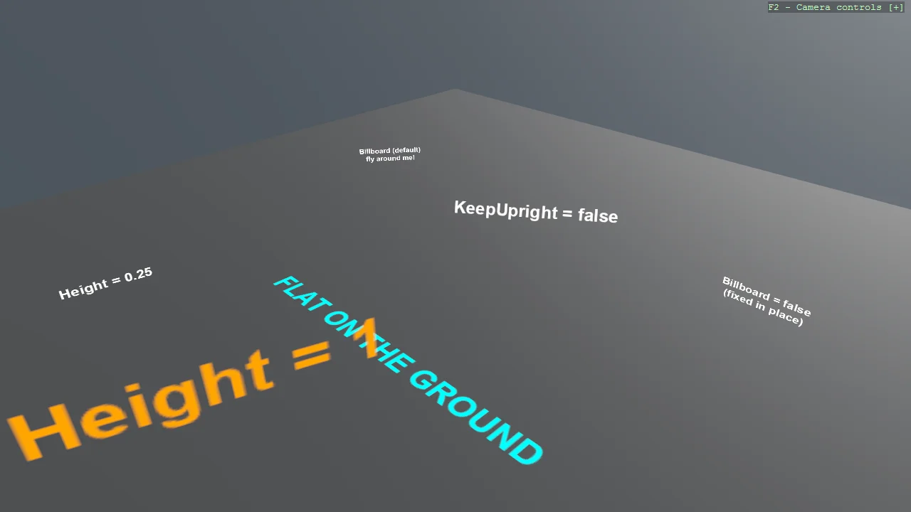

# World Text (In-Scene)

A gallery of everything WorldTextComponent can do, one setting per station: billboarding that
stays upright, free billboarding, text fixed in place, text lying flat on the ground, world-unit
sizing, depth-tested text hidden behind a wall next to text drawn through it, and distance fading.
World text lives inside the scene - it shrinks with distance and geometry can hide it.

The `Program.cs` file shows how to:

- Registering the text renderer once: AddWorldTextRenderer
- Billboarding: KeepUpright versus facing the camera freely
- Text fixed to a surface or lying flat with Billboard = false
- Height in world units versus FontSize as sharpness
- Depth-tested text hidden by geometry, and DepthTest = false to draw through
- Distance fading with FadeStartDistance and MaxDistance

View on [GitHub](https://github.com/stride3d/stride-community-toolkit/tree/main/examples/code-only/Example01_WorldText).

[!code-csharp]
