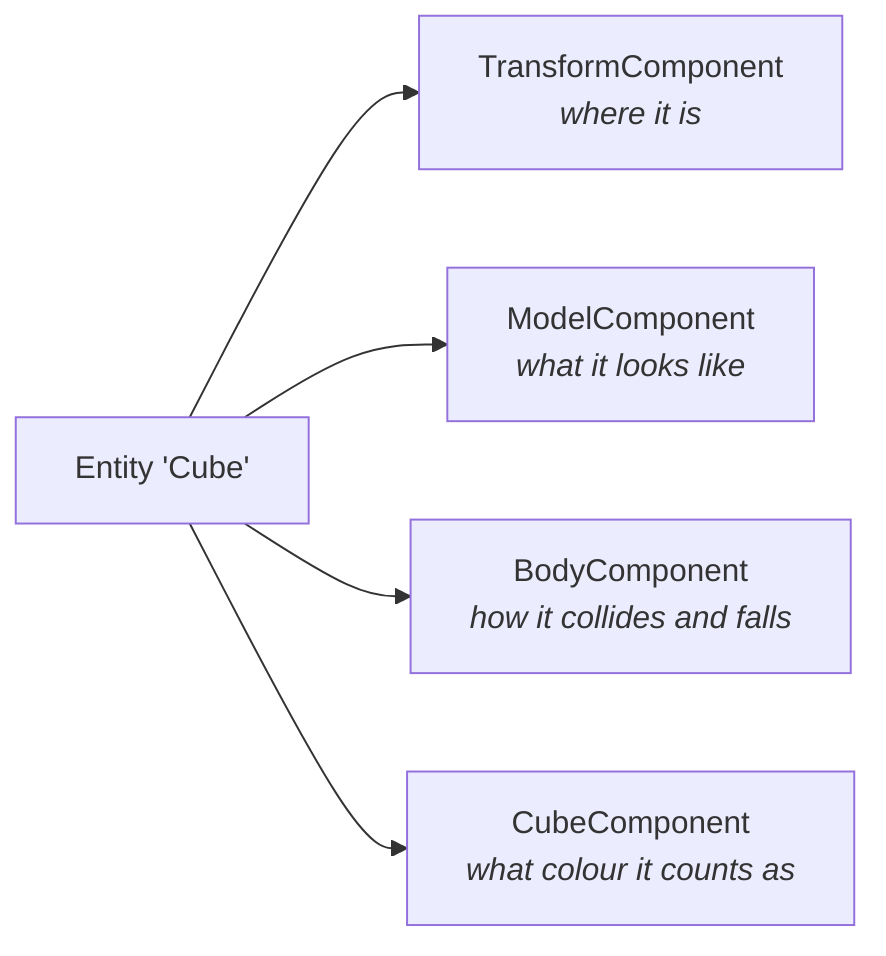
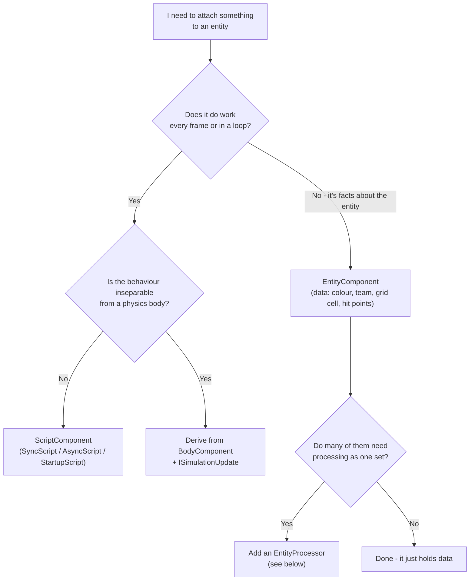
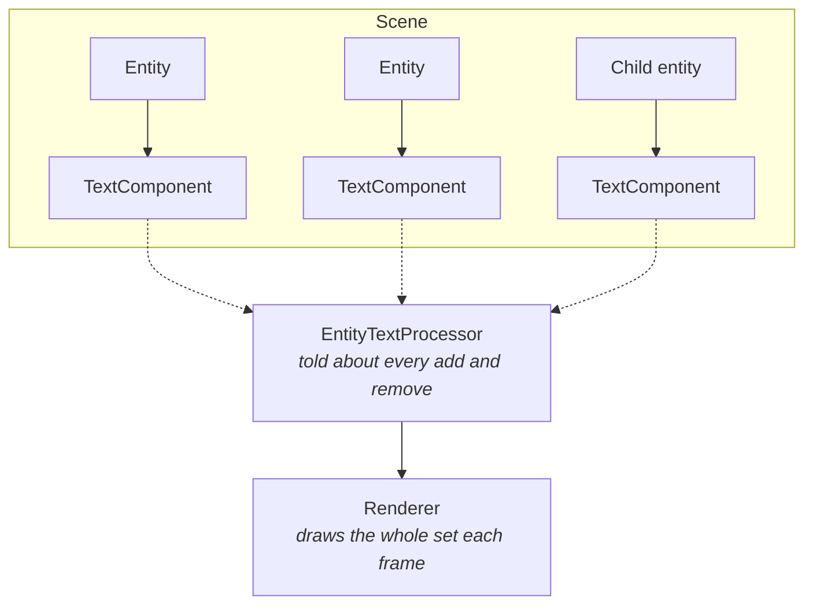

# Components and Scripts - which one, and why

When you start building a game in Stride, everything you attach to an entity looks like "a
component", and the easiest one to reach for is a script - it has an `Update()` method, you can put
anything in it, and it works. This page explains why you often *shouldn't*, what the alternatives
are, and how to pick between them. Every rule here is illustrated by real code in this repository,
so you can open the examples and see each choice living next to its consequences.

## One entity, many components

An entity in Stride is almost nothing by itself: an ID, a name and a transform. Everything else it
*is* or *does* comes from the components attached to it:



The first three come from the engine. The last one is the interesting kind: a component *you* write
to give an entity meaning in *your* game. And here is the fork in the road - you can write it as a
plain data component or as a script, and the two behave very differently.

## The three kinds of component you can write

| Base class | It represents | Has per-frame code? | Example in this repo |
|---|---|---|---|
| `EntityComponent` | What a thing **is** - data, identity | No | `CubeComponent` (a colour and a grid position) |
| `ScriptComponent` (`SyncScript`, `AsyncScript`, `StartupScript`) | What a thing **does** over time | Yes - `Update()` / `Execute()` | `ScorePopupScript` (animates a floating score) |
| A specialised engine component, e.g. `BodyComponent` | Behaviour inseparable from an engine system | Via that system's own hooks | `SlidingCubeComponent` (a body that only falls straight down) |

The rest of this page is about choosing between them.

## Why "just make it a script" goes wrong

A script is a component *plus* an enrolment in the script scheduler. That enrolment is the cost, and
it is easy to pay it for nothing.

Consider a match-3 style game where every cube needs a colour. Two ways to store it:

```csharp
// As a data component - what Cubicle Calamity actually does
public class CubeComponent : EntityComponent
{
    public Color Color { get; set; }
}

// As a script - tempting, works, and wasteful
public class CubeScript : SyncScript
{
    public Color Color { get; set; }

    public override void Update() { } // nothing to do, every frame, times 1000 cubes
}
```

Both compile. Both let you write `entity.Get<CubeComponent>()`. But the script version schedules a
thousand empty `Update()` calls per frame on a 10×10×10 board - pure overhead for data that never
changes on its own. A plain `EntityComponent` just *sits there*; it costs nothing until somebody
asks for it.

There is a subtler benefit too. A component's data **lives and dies with its entity**. The usual
alternative - a `Dictionary<Entity, Color>` somewhere - has to be cleaned up by hand every time an
entity is removed, and when someone forgets, it leaks silently. This repository contains the scar
tissue: a renderer once cached text measurements in exactly such a dictionary, and every short-lived
score popup leaked one entry forever. Attach the data to the entity and that entire class of bug
cannot exist.

Finally, a typed component is **identity you can query**. "Is this a playable cube?" is answered by
`entity.Get<CubeComponent>() is not null` - the compiler checks it, a rename refactors it. The
string alternative (`entity.Name == "Cube"`) matches nothing, silently, the day someone renames the
entity. Cubicle Calamity even exploits this deliberately: its decorative reference cube uses the
same mesh as the playable ones but carries no `CubeComponent`, so the raycast and the colour
matching pass straight over it.

## When a script is exactly right

Scripts are not the junior option - they are the right tool whenever something genuinely *happens
over time*:

- **`SyncScript`** - logic that runs every frame: animating a score popup's rise and fade, orbiting
  a camera, counting a displayed score up toward the real one. (`ScorePopupScript`,
  `CameraRotationScript`, `ScoreboardScript`.)
- **`AsyncScript`** - logic that is naturally a loop with waits: read input, act, `await NextFrame()`.
  (`CubeClickScript` - raycast on click, clear the group, repeat.)
- **`StartupScript`** - one-time setup that needs the entity to exist in the scene first.

The test is simple: **does this component need to be *called* every frame, or only *asked* when
something else is interested?** Called → script. Asked → data component.



## The special case: behaviour that belongs to a physics body

Sometimes the behaviour you want *is about being a rigid body*: fall slower, stay in your lane,
never rotate. You could write a `SyncScript` that finds the entity's `BodyComponent` and pushes it
around - but this repository learned, measurably, why deriving from `BodyComponent` is better:

1. **No finding, no timing bug.** A physics body registers with the simulation the moment it enters
   the scene, but a script's `Start()` waits its turn in the script system - so physics callbacks
   can run *before* `Start`, and a script that cached its body in `Start` reads null. When the
   component *is* the body, `this.LinearVelocity` cannot be null and cannot be stale.
2. **The right hooks exist only there.** Some body state can only be set at the moment the body
   attaches to the simulation - earlier writes are silently ignored. A derived component overrides
   `AttachInner` and acts at exactly that moment; a script can only poll and hope.
3. **Physics-rate, not frame-rate.** `ISimulationUpdate.SimulationUpdate` runs once per fixed
   physics tick. Per-frame velocity math breaks subtly when the frame rate and the physics rate
   diverge; per-tick math cannot.
4. **One component, whole concept.** `entity.Get<SlidingCubeComponent>()` returns the body *and*
   the game meaning in one query - nothing can exist half-configured.

Both live examples are in Cubicle Calamity: `SlidingCubeComponent` (pins a cube to its column and
locks its rotation) and `SlowFallComponent` (a letter that falls under a fraction of gravity):

```csharp
public class SlowFallComponent : BodyComponent, ISimulationUpdate
{
    public float GravityScale { get; set; } = 0.15f;

    public void SimulationUpdate(BepuSimulation simulation, float simTimeStep)
    {
        if (!Awake) return; // a resting body should be allowed to sleep

        // The integrator added one tick of full gravity; remove the share we don't want
        LinearVelocity -= simulation.PoseGravity * ((1f - GravityScale) * simTimeStep);
    }

    public void AfterSimulationUpdate(BepuSimulation simulation, float simTimeStep) { }
}
```

The honest trade-off: deriving couples the class to one physics engine, and C# single inheritance
means one body cannot stack two derived behaviours. When behaviours must mix and match, or must work
on bodies you don't create yourself, a script acting on the body is the composable choice - just
resolve the body lazily (`_body ??= Entity.Get<BodyComponent>()`) inside the physics callback, never
in `Start`.

## Where this is heading: processors (the "S" in ECS)

Stride is an entity–component engine, and this data/behaviour split is the component half of the
**ECS** idea (Entity–Component–System). The system half exists too: an `EntityProcessor` registers
interest in one component type, and the engine tells it whenever such a component enters or leaves
the scene - anywhere in the entity hierarchy. One object then owns the whole population:



This is why data components scale: attach one attribute
(`[DefaultEntityComponentProcessor(typeof(MyProcessor))]`) and your plain data component gains
engine-managed collection with correct lifetimes, with the per-frame work done once, centrally,
instead of in a thousand per-instance `Update()` calls. The toolkit's `EntityTextComponent` and
`WorldTextComponent` both work this way - the component is pure data describing text; a processor
tracks them; a renderer draws them.

A per-entity script is the convenience you start with; a processor is what you graduate to when the
count grows or when membership bookkeeping starts leaking.

## Rules of thumb

- **Data → `EntityComponent`.** Colour, team, hit points, grid position. No `Update`. Free until queried.
- **Per-frame behaviour → a script.** Animation, input loops, timers.
- **Behaviour that *is* the physics body → derive from `BodyComponent`** and use `ISimulationUpdate`.
- **Many instances processed as one set → a processor**, keeping the component pure data.
- Give every component a **public parameterless constructor** - serialization needs it (the
  `STRDIAG010` analyser will remind you). Pass dependencies as `required` init-only properties, not
  constructor parameters.
- Identify entities by **component presence**, not by name strings.
- Never mirror per-entity data in an external dictionary that you must remember to clean up —
  attach it, and let it die with the entity.

## See it all in one example

`examples/code-only/Example_CubicleCalamity` uses every rung of the ladder, each where it belongs:

| Piece | Kind | Why |
|---|---|---|
| `CubeComponent` | `EntityComponent` | A cube's colour and grid cell - pure data, a thousand of them |
| `ScorePopupScript`, `ScoreboardScript`, `CameraRotationScript` | `SyncScript` | Things that visibly change every frame |
| `CubeClickScript` | `AsyncScript` | An input loop: click, clear, await the next frame |
| `SlidingCubeComponent`, `SlowFallComponent` | `BodyComponent` + `ISimulationUpdate` | Behaviour inseparable from the rigid body |
| `EntityTextComponent` + `EntityTextProcessor` (toolkit) | data + processor | Hundreds of texts, collected centrally, drawn by one renderer |
