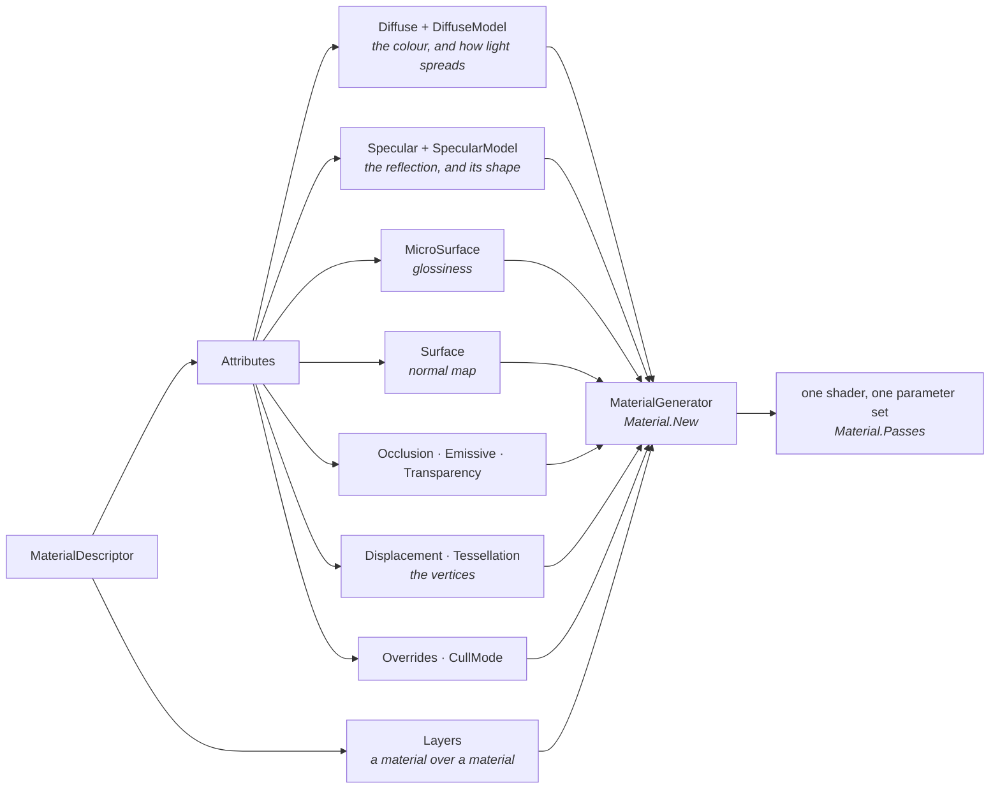

# Materials from code - a bag of features, not a shader

When a cube needs to look like something, the first thing you reach for is `game.CreateMaterial(Color.Green)`,
and the second is its two numbers. That works, right up to the point where you want glass, or brick with
mortar lines the light falls into, or a coat of paint peeling off iron - and then it looks as if the next
step is writing a shader. It is not. Every material in Stride, the ones Game Studio saves as assets and
the ones the toolkit builds in one line, is the same thing: a **descriptor**, a bag of small feature
objects, that the engine turns into a shader for you. This page is about that bag - what goes in it,
what each piece changes on screen, and the handful of things that go wrong when you build one from code.
Every rule is illustrated by real code in this repository, most of it in the
[Material Gallery](../code-only/examples/material-gallery.md) (`E02_3D_Material_Gallery`), a ring of
thirty-two stations you can walk through and compare.

## The wrong path: turn the numbers up

The toolkit's helper is honest about what it is:

```csharp
// src/Stride.CommunityToolkit/Engine/GameExtensions.cs
public static Material CreateMaterial(this IGame game, Color? color = null, float metalness = 0f, float glossiness = 0.65f)
```

Two fractions, and the shader clamps both. Until the day this page was written the parameters were
called `specular` and `microSurface`, and the beginner example asked one of them for a value of 4:

```csharp
// examples/code-only/E02_3D_Material/Program.cs, as it was
Create3DPrimitive(scene, new Vector3(-5f, 0.5f, -5f), game.CreateMaterial(Color.Green, 4f, 0.75f));
```

That is a metalness of 4, clamped to 1: a metal, whose green is mostly thrown away. And the cube did not
even look like a metal; it looked black, for a reason that is the first story below. The numbers are not
knobs to turn; each is a physical claim about the surface, and the claims only make sense once you know
what the bag holds.

## One material, many features

A `MaterialDescriptor` has an `Attributes` object with one slot per *aspect* of a surface, and a
`Layers` list. Each slot takes a small class - a **feature** - and the material generator composes the
features into one shader when `Material.New` runs:



Two consequences follow, and both matter more than any single feature:

- **What you leave out is left out of the shader.** No `Surface` feature means no tangent-space work at
  all; no `Specular` means no highlight and no reflection. The baseline station of the gallery is a
  diffuse colour under Lambert and nothing else, and it is the cheapest material the engine can make.
- **A model is a choice, not a default.** `Diffuse` says *what colour*; `DiffuseModel` says *how light
  spreads* (Lambert, cel-shaded, hair). `Specular` says *how reflective*; `SpecularModel` says *what shape
  the reflection has* (microfacet, thin glass, cel, hair). Every "how does the engine do glass" question
  is answered by swapping a model, not by writing one.

## The four numbers

The material most games are made of is a **PBR** material, physically based rendering: the surface is
described by what it is made of - a colour, how metallic it is, how rough - and the light is computed
from those claims, instead of from highlight settings tuned by eye. In Stride's **metalness workflow**
that is a colour, a glossiness, a metalness and the microfacet specular model. The toolkit keeps it as
a descriptor, because every helper and thirty gallery stations start from it:

```csharp
// src/Stride.CommunityToolkit/Rendering/MaterialDescriptors.cs
public static MaterialDescriptor Pbr(Color colour, float metalness = 0f, float glossiness = DefaultGlossiness) => new()
{
    Attributes =
    {
        Diffuse = new MaterialDiffuseMapFeature(new ComputeColor(colour)),
        DiffuseModel = new MaterialDiffuseLambertModelFeature(),
        MicroSurface = new MaterialGlossinessMapFeature(new ComputeFloat(glossiness)),
        Specular = new MaterialMetalnessMapFeature(new ComputeFloat(metalness)),
        SpecularModel = Microfacet(),
    },
};
```

What the numbers claim, as the gallery's sweep stations show them side by side:

| Number | 0 | 1 | What a value in between means |
|---|---|---|---|
| **Glossiness** | Rough: the highlight is a haze, the sky is a blur | Mirror: a point highlight, the sky in focus | Most real surfaces; a **glossiness map** paints it per texel (varnish on wood, dull patches on iron) |
| **Metalness** | Dielectric: keeps its colour as diffuse, reflects a colourless 4 % | Metal: **no diffuse at all**; its colour is the colour of its reflection | Only where paint meets bare metal - a **metalness map** with mostly 0 and 1 |

The metalness row is the one that surprises people. A metal has no diffuse colour: the green in
`CreateMaterial(Color.Green, metalness: 0.75f)` is mostly thrown away, and what is left is a green tint
on a reflection of the sky. If the sky is dark, the cube is dark. That is not a bug; it is what a metal
is, and it is why the beginner example lets you brighten the skybox light with a key.

There is a second way to say the same thing, the **specular workflow**: give the reflection colour
directly (`MaterialSpecularMapFeature`) instead of deriving it from a metalness. Plastic reflects a grey
4 %; gold reflects gold and has a black diffuse. Game Studio's Material Package textures use this
workflow, so if you transcribe a `.sdmat` you will meet it.

### The scar tissue: black metals

The microfacet model needs an **environment term** - what the surface reflects when no light hits it
directly, which for a metal is nearly everything it shows. The engine's default is a GGX lookup
texture, and the texture is an asset the engine ships (`/Stride.Engine/StrideEnvironmentLightingDFGLUT16`)
that the material holds as an *attached reference*. `Material.New(device, descriptor)` leaves that
reference unresolved: nothing throws, and every metal simply renders black. That is how the gallery met
it, and for a while the toolkit sidestepped it with the polynomial fit, a formula that needs no asset.

The real answer is one argument. Since 4.4 beta 6, `Material.New` takes the content manager and resolves
the reference:

```csharp
// src/Stride.CommunityToolkit/Engine/GameExtensions.cs
public static Material CreateMaterial(this IGame game, MaterialDescriptor descriptor)
{
    var material = Material.New(game.GraphicsDevice, descriptor, game.Content);

    material.Descriptor = descriptor;

    return material;
}
```

Every toolkit helper and every gallery material compiles this way now, with the engine's exact term.
The polynomial fit remains the right choice where there is no content manager to give, a tool or a test:
`Environment = new MaterialSpecularMicrofacetEnvironmentGGXPolynomial()`.

There was a second reason the helper's cubes were black: its default metalness was 1, so every cube
built from a colour alone was a metal with nothing to reflect. The default is a dielectric now, and a
colour alone is a matte cube of that colour. If your metals are black, these two are the first things to
check: the content manager at compile time, and whether you asked for a metal.

The same model has two more functions worth knowing: the **normal distribution** (GGX has the long
tail every modern renderer uses; Beckmann falls off sharply; Blinn-Phong is the classic) and the
**Fresnel** term. Glossiness 1, metalness 1 and `MaterialSpecularMicrofacetFresnelNone` is a mirror,
which is the community's recipe for checking a cubemap.

## Three tiers: a colour, a twist, the bag

The toolkit's helpers are meant to be outgrown, and the way out is built in.

**A colour.** `game.CreateMaterial(Color.Green)` is a matte cube of that colour; add a metalness and a
glossiness when you know what they claim. `game.CreateFlatMaterial(colour)` is the unlit version for 2D
shapes and HUD elements.

**A twist.** Three more helpers cover what the examples reached for most often when a colour was not
enough: `CreateEmissiveMaterial(colour, intensity)` for a lamp or a glowing edge (above 1 it blooms under
post effects), `CreateTexturedMaterial(texture, metalness, glossiness, tiling)` for a texture where the
colour would be, and `CreateScreenMaterial(texture)` for a monitor showing a render-texture camera's feed,
unlit and clamped at the edges.

**The bag.** Every helper compiles a descriptor from `MaterialDescriptors`, and the descriptors are yours
to take. When a helper's material is nearly right, start from its descriptor, add or swap a feature, and
compile it; the overload that takes a descriptor also keeps it on the material, which is what a
material needs to be used as a layer later:

```csharp
var descriptor = MaterialDescriptors.Textured(brick, glossiness: 0.4f);

descriptor.Attributes.Surface = new MaterialNormalMapFeature(new ComputeTextureColor(brickNormal)) { ScaleAndBias = true, IsXYNormal = true };

var material = game.CreateMaterial(descriptor);
```

That is the whole path from the one-liner to the material system: the same bag, with one more thing
in it, and the rest of this page is about what else can go in.

## Every slot is a node

The features above took a `ComputeColor` or a `ComputeFloat`. The slot's real type is a **node**, and a
number is just the simplest node. The others, all shown on their own stations:

| Node | What it puts in the slot | Station |
|---|---|---|
| `ComputeColor`, `ComputeFloat` | A constant | the sweeps |
| `ComputeTextureColor`, `ComputeTextureScalar` | A texture, with a scale that tiles it and an offset | Albedo texture, Gloss and metal maps |
| `ComputeVertexStreamColor` | A per-vertex colour from the mesh, no UVs, no texture | Vertex colours |
| `ComputeBinaryColor` | Two child nodes combined by an operator - a tint, a mask, a whole tree | Node arithmetic |
| `ComputeShaderClassColor` | A shader class of your own, by name | Custom shader node |

The last one is the extension point. A class that derives from `ComputeColor` and overrides `Compute()`
sits in any slot, and the whole of it is this:

```hlsl
// examples/code-only/E02_3D_Material_Gallery/Effects/GalleryChecker.sdsl
shader GalleryChecker : ComputeColor, Texturing
{
    override float4 Compute()
    {
        float2 cell = floor(streams.TexCoord * 6.0);
        float odd = fmod(cell.x + cell.y, 2.0);

        return lerp(float4(0.92, 0.90, 0.84, 1.0), float4(0.16, 0.18, 0.22, 1.0), odd);
    }
};
```

```csharp
// examples/code-only/E02_3D_Material_Gallery/Stations.Inputs.cs
s.PlaceTrio(s.Material(Recipes.Mapped(new ComputeShaderClassColor { MixinReference = "GalleryChecker" }, glossiness: new ComputeFloat(0.45f))));
```

The file lives in the example's `Effects` folder and the asset compiler builds it like any shader (see
[Shaders in a toolkit package](../../contributing/toolkit/shaders.md) for the build reference that makes
that happen). Twenty lines, and the material generator does not know or care that the diffuse slot is
procedural.

### Textures: five ways to load them wrong

A texture is pixels plus a promise about what they mean, and Game Studio's content pipeline keeps that
promise at import: a colour texture is made sRGB and premultiplied, a normal map linear, and every
texture gets its mipmaps. `Texture.Load(device, stream)` with its defaults does none of it - every file
linear, straight alpha, one mip - and nothing fails; the picture is just wrong. The toolkit's
`TextureLoader` does the pipeline's work at runtime, by role:

```csharp
var textures = new TextureLoader(game.GraphicsDevice, "Resources/materials");

var albedo = textures.Color("brick/brick_dif.png");      // sRGB, premultiplied, mipmapped
var gloss = textures.Data("brick/brick_gls.png");        // linear
var normal = textures.NormalMap("brick/brick_nml.png");  // linear, unit normals in every mip
```

The gallery's **Texture loading** station puts each mistake beside its fix, wrong on the left, and V
walks through them:

1. **A colour loaded as data.** The sRGB bytes skip the gamma decode, so every mid-tone comes out
   brighter: a byte of 128 means a fifth of full light, not half. The bricks go pale.
2. **A normal map loaded as a colour.** Now the decode runs on data, and every tilt is squashed towards
   flat. The Normal (tangent) view under M shows it.
3. **The green channel the wrong way.** There are two conventions for a normal map's Y. The engine's
   tangent space has green pointing down the texture, the DirectX convention, which is how the Material
   Package's maps are stored; Blender, Unity and glTF store it pointing up. The wrong one lights every
   bump as a dent. `NormalMap(path, invertY: true)` flips a green-up map.
4. **Straight alpha.** The engine's blend states expect colour premultiplied by alpha. A PNG stores it
   straight, and paint programs leave any colour, often white, under the fully transparent part; loaded
   as it is, that colour is added to whatever is behind. Premultiplied, it is black and adds nothing.
5. **No mipmaps.** A PNG carries one level and the engine builds none at runtime, so a surface seen small
   or at a grazing angle samples one texel of dozens per pixel and turns to crawling noise. The loader
   builds the chain on the CPU, averaging in linear light for a colour (averaging sRGB bytes darkens
   every mip) and renormalising a normal map's vectors.

The third one comes with a warning. Game Studio's normal-map import inverts green by default, which is
right for a green-up map, and the Material Package's texture assets keep that default although their
maps are green-down. The toolkit worked this out by measuring the brick map's green on either side of a
mortar groove and rendering both ways in the world-normal view: loaded as stored, the wall above each
groove faces down and the one below faces up, as a recess should. So the gallery loads the pack's maps
as stored, and it is worth checking a pack's bricks in the editor's normal view before trusting either
default.

Two things the loader leaves alone. **Channel order** is handled for you: `Image.Load` decodes a PNG as
BGRA, and a texture made from its pixels in an RGBA format trades red for blue, which the particles
gallery did to its fire for a while without anyone noticing under an orange tint. **Block compression**
is not done: the texture stays eight bits a channel, four to eight times the memory of the BC formats an
asset gets. For that, or for mipmaps built offline, ship a `.dds`; the loader passes it through with only
its colour space chosen by the role.

The Material Package's normal maps store X and Y and leave Z to be rebuilt, in the 0..1 range a texture
holds, so their feature needs both switches: `new MaterialNormalMapFeature(normal) { ScaleAndBias = true, IsXYNormal = true }`.
A normal map you computed yourself at runtime can use the same convention - the gallery derives one
from a height map by central differences and it lights the bumps like the pack's.

## A material animates through its parameters

Once `Material.New` has run, the features are gone; what remains is a shader and its **parameters**,
the constants the features registered. You do not rebuild a material to change it:

```csharp
// examples/code-only/E02_3D_Material_Gallery/Stations.Maps.cs
var pulse = 0.5f + 0.5f * MathF.Sin(s.Seconds * 2f);

// A material's parameters are the shader's constants; a keyed value set here is picked up
// by the next draw. EmissiveIntensity is the key the emissive feature registers its scalar under.
material.Passes[0].Parameters.Set(MaterialKeys.EmissiveIntensity, 0.2f + 3f * pulse);
```

The keys live in `MaterialKeys` and in the generated key classes of your own shaders. A number in a slot
registers under the slot's key (`GlossinessValue`, `MetalnessValue`, `EmissiveIntensity`); a colour or
texture node can carry a key of your own, which is how a value gets a handle without touching the shader:

```csharp
// examples/code-only/E02_3D_Material_Gallery/Stations.Maps.cs
private static readonly ValueParameterKey<Color4> TintKey = MaterialParameters.ColorKey("MaterialGallery.Tint");

var tint = s.Material(Recipes.Mapped(new ComputeColor(Color.White) { Key = TintKey }, glossiness: new ComputeFloat(0.6f)));
...
state.Tint.SetColor(TintKey, new ColorHSV(hue, 0.7f, 1f, 1f).ToColor());
state.Scroll.SetTextureOffset(new Vector2(s.Seconds * 0.15f, 0f));
state.Gloss.Set(MaterialKeys.GlossinessValue, 0.5f + 0.5f * MathF.Sin(s.Seconds));
```

Three things the toolkit's `MaterialParameters` does that the raw `Parameters.Set` would leave to you,
each learned from the engine's own gizmo materials:

1. **A colour set at runtime must be converted the way the generator converted the node's initial
   value**: to linear, and premultiplied by its alpha. Set the raw sRGB colour and it comes out brighter
   than the one compiled in. `SetColor` does the conversion; `ToMaterialValue` is the conversion alone.
2. **A material may have several passes**, each with its own parameters: clear coat has two, hair
   three, thin glass two or four. Write to `Passes[0]` alone and the other passes keep the old value.
   Every setter writes to all of them.
3. **Every texture node registers its scale and offset**, so a texture scrolls or retiles through
   `SetTextureOffset` and `SetTextureScale` with no recompile. The first texture's keys are the base
   keys; later ones are the base key composed with `i1`, `i2`, which is how the generator names a key's
   later uses, and `TextureKeyAt` spells that out.

A shader of your own goes further: its parameters are set the same way, through the keys the source
generator makes from its constants, which is how the dissolve below burns away on a timer.

## A feature of your own

A node fills one slot's value. When what you need is a change to what a stage *does* - move the
vertices, throw pixels away - the next step is a material feature of your own.

The wrong path first: a custom effect. The engine's SpaceEscape sample bends its world with an `.sdfx` of
its own and a render feature that swaps it in, and that works, but it replaces the forward effect for
everything it draws; lighting, shadows and every other material feature are yours to keep in step. A
material feature is smaller. It is a class the material generator calls while it builds the shader,
and what it adds is composed with everything else the material has, shadows included.

This is the whole of the gallery's wobble:

```csharp
// examples/code-only/E02_3D_Material_Gallery/CustomFeatures.cs
[DataContract]
public class WobbleFeature : MaterialFeature, IMaterialDisplacementFeature
{
    public float Amplitude { get; set; } = 0.08f;
    public float Frequency { get; set; } = 7f;
    public float Speed { get; set; } = 4f;

    public override void GenerateShader(MaterialGeneratorContext context)
    {
        context.SetStreamFinalModifier<WobbleFeature>(MaterialShaderStage.Vertex, new ShaderClassSource("GalleryWobble"));

        var parameters = context.MaterialPass.Parameters;

        parameters.Set(GalleryWobbleKeys.WobbleAmplitude, Amplitude);
        parameters.Set(GalleryWobbleKeys.WobbleFrequency, Frequency);
        parameters.Set(GalleryWobbleKeys.WobbleSpeed, Speed);
    }
}
```

```hlsl
// examples/code-only/E02_3D_Material_Gallery/Effects/GalleryWobble.sdsl
shader GalleryWobble : IMaterialSurface, PositionStream, NormalStream
{
    cbuffer PerMaterial
    {
        stage float WobbleAmplitude;
        stage float WobbleFrequency;
        stage float WobbleSpeed;
    }

    override void Compute()
    {
        float wave = sin(streams.Position.y * WobbleFrequency - Global.Time * WobbleSpeed);

        streams.Position = float4(streams.Position.xyz + streams.meshNormal * (wave * WobbleAmplitude), streams.Position.w);
    }
};
```

It goes in a slot like any feature, `descriptor.Attributes.Displacement = new WobbleFeature()`, and the
shader is compiled by the asset compiler at build like the gallery's other `.sdsl` files. The source
generator makes `GalleryWobbleKeys` from the constants. What `GenerateShader` can ask for:

| Call | What it does | Who uses it |
|---|---|---|
| `AddShaderSource(stage, shader)` | Adds a surface shader to a stage, in the order the slots are visited | The dissolve |
| `SetStreamFinalModifier<T>(stage, shader)` | Makes a shader the last of its stage, once per `T` | The wobble, the engine's displacement |
| `AddFinalCallback(stage, callback)` | Runs after every feature has had its say | The engine's cutoff discard |
| `AddShading(this)` | Adds a shading model, a term added to the light | The engine's emissive |
| `SetStream(...)` | Fills a stream from a node, with its keys | Every map feature |
| `MaterialPass` | The pass's parameters and state: cull mode, blend state, transparency | Most features |

Three rules the gallery's two features taught:

1. **The slot decides the stage and the order.** The displacement slot is the vertex stage's. In the
   pixel stage the slots are visited diffuse, surface, microsurface, specular, occlusion, emissive,
   subsurface, transparency, clear coat, and a shader added later sees what the earlier ones wrote. The
   dissolve writes its glowing edge into the emissive stream, so it lives in the transparency slot,
   after the emissive feature; in the surface slot the emissive feature would overwrite it. One slot
   holds one feature, so a dissolving material cannot also be blend-transparent, and the engine skips
   the transparency slot entirely on a hair material.
2. **Properties become parameters in `GenerateShader`; what changes per frame goes through the keys.**
   A multi-pass material generates once per pass, so each pass gets the properties. The dissolve's
   amount is then driven every frame with `material.Set(GalleryDissolveKeys.DissolveAmount, amount)`,
   which reaches every pass. The wobble needs nothing per frame: `Global.Time` is the engine's own clock,
   there for any shader.
3. **A discard needs the depth pass too.** The shadow caster and the depth prepass run a pixel shader
   only when the pass asks, so the dissolve sets `MaterialKeys.UsePixelShaderWithDepthPass`, the key the
   engine's cutoff transparency sets. Without it the dissolved part still casts its shadow.

The scar tissue: the glow that was not there. The first dissolve burned through the shapes and the edge
looked no warmer than the brick. The Emissive view under M settled it at once: the band was in the
emissive stream, bright and in the right place. The value had arrived; the tone map had compressed an
edge colour of (6, 1.6, 0.3) to a pale peach. It is (24, 6, 0.8) now. When a feature of your own seems
to do nothing, the stream views say whether the value reached the stream before you start doubting the
shader.

Honest limits. The wobble moves positions but leaves the normals, so the light still describes the
undeformed shape; for a larger wave the shader would bend the normal too. On split normals, a cube's
corners, the faces move apart and the seams open, which is why the wobble variation has no cube. The
dissolve's noise runs over the texture coordinates, so it follows the UV layout, seams and all.

## Seeing one stream at a time

Game Studio's toolbar has a row of view modes - Diffuse, Specular, Glossiness, Normal - that draw
every mesh with one material stream as its colour, and they are the fastest way to find out why a
material looks wrong: a normal map loaded as sRGB is a tilted normal view, a glossiness map read from
the wrong channel is a flat grey, a metal whose colour went into the wrong slot shows black where its
diffuse should be. The mechanism is not editor-only. The forward effect has a hook,
`MaterialKeys.PixelStageSurfaceFilter`, a permutation the editor fills with the engine's own
`MaterialSurfaceStreamShading` shader: it runs the material's surface shading and returns one stream
instead of the lit colour. What a code-only game lacks is the sub-render-feature that sets the hook,
and that is what `game.AddMaterialStreamView()` adds:

```csharp
// examples/code-only/E02_3D_Material_Gallery/Program.cs
var view = game.AddMaterialStreamView();        // after the compositor exists

// A DebugTextDropdown in the overlay: M opens the list, a digit picks, 0 is lit again
viewMenu = new DebugTextDropdown
{
    Title = "View",
    ToggleKey = Keys.M,
    Items =
    [
        .. MaterialStreamView.All.Select(stream => new DebugTextDropdownItem((Keys)(Keys.D1 + (int)stream), MaterialStreamView.DisplayName(stream), () => view.Stream = stream)),
        new(Keys.D0, "Lit", () => view.Stream = null),
    ],
};
```

`view.Stream = MaterialStream.Glossiness` picks a stream directly, `Next` steps through them and `null` is
lit shading. The streams are the values the features wrote before lighting ran:

| View | Stream | Shown as |
|---|---|---|
| `ColorBase` | `matColorBase` | The colour as authored |
| `Diffuse` | `matDiffuse` | The colour after metalness took its share - a metal is black here |
| `Specular` | `matSpecular` | 0.02 grey for a dielectric, the colour for a metal |
| `Glossiness` | `matGlossiness` | Grey, black rough to white mirror |
| `NormalTangent` | `matNormal` | The normal map's value remapped to a colour; flat is (0.5, 0.5, 1) |
| `NormalWorld` | `normalWS` | The world normal after the map, remapped; up is green |
| `Occlusion`, `Cavity` | `matAmbientOcclusion`, `matCavity` | Grey, white open |
| `Emissive` | `matEmissive` | The colour without its intensity |

Three things to know. A permutation is part of the effect's identity, so every switch recompiles every
effect and the meshes draw with the fallback for a frame or two, exactly as the editor's toolbar does.
The view applies to every mesh the compositor's mesh feature draws, not to one material. And the value
is the stream's linear value drawn through the post effects like any colour, so it is tone-mapped the
way the lit picture is; a glossiness of 0.5 is not a pixel of 128. In the gallery M opens the list and a
digit picks the view for the whole ring; the Normal map and the Gloss and metal maps stations are where they earn their keep.

## A highlight from a material

Something under the mouse should look under the mouse, and the first ideas for that are both heavier
than they need to be. An outline is a render feature of its own - the toolkit's mesh outline example
is one - drawing selected meshes again in a pass with its own shader. Swapping the hovered object's
material for a brighter copy, as the cube-collapse game does, needs a lit variant of every material in
the scene.

The engine's TopDownRPG template does it with one material and one entity: the hovered model drawn
again, a little larger, with a faint glow over it. The toolkit has that as `HighlightShell`:

```csharp
// examples/code-only/E09_3D_GpuPicking/Program.cs
hover = new HighlightShell(game.CreateMaterial(MaterialDescriptors.Highlight(Color.Cyan)));
picker.Pickable = RenderGroupMask.All & ~RenderGroupMask.Group30;
...
if (picker.Result is { Hit: true, ModelComponent: { } model } hovered)
{
    // A crate has no entity of its own: the shell goes to the instance's matrix instead
    if (model.Entity == crates) hover?.Show(model, crateMatrices[hovered.InstanceIndex]);
    else hover?.Show(model);
}
else
{
    hover?.Hide();
}
```

`MaterialDescriptors.Highlight` is four features and no diffuse: a constant displacement in the vertex
stage pushes every vertex out along its normal, an emissive colour is the whole of its shading, a blend
transparency with a small alpha lets the model show through, and no culling makes the glow read from
inside as well. What reaches the screen is the colour added over the model, like light. `Show` puts the
shell on a model as a child of its entity, filling every material slot, so it follows the model; showing
the same target again every frame costs nothing.

Three things to know:

1. **The shell must stay out of the picking pass.** It is in front of the model it highlights, so a
   picker that sees it answers "the shell" the frame after it appears, and the hover flickers. The shell
   draws in render group 30, and the picker's pickable mask leaves that group out.
2. **Split normals open the seams.** A cube's faces each have their own normals, so the displacement
   moves them apart at the corners. At the default two hundredths of a unit it is a thin bright rim; the
   gallery's thick variation shows it plainly. Smooth models close.
3. **An instance has no entity to follow.** For one instance of an instanced model, `Show(model, world)`
   places a free shell at the instance's matrix; call it again if the instance moves.

The gallery's **Highlight shell** station moves one shell from shape to shape the way it would follow
the mouse, and V cycles the colour and a thick shell.

## Choosing the surface

Past the four numbers, each aspect of a surface is a feature you add, and most of them come with a
choice of model. The decision is mostly "what does the light do at this surface":


Three of these have lessons the class names do not tell you.

**Thin glass is its own multi-pass material.** It draws a transmittance pass that multiplies what is
behind, then an additive reflection pass, per face side. So it takes *no* transparency feature (one
would fight its blend states), and *no* diffuse model (the reflection pass would add lit colour and
the glass would go opaque); the diffuse colour is the transmission tint, what the glass absorbs. That
is how the engine's own sample glass is built. The gallery adds one thing more, because the engine's
transmittance pass ships with its blend state wiped by a 2025 refactor and paints its transmittance as a
grey wall:

```csharp
// examples/code-only/E02_3D_Material_Gallery/Stations.Surfaces.cs
var transmit = new BlendStateDescription(Blend.Zero, Blend.SourceColor);
transmit.RenderTargets[0].AlphaSourceBlend = Blend.One;
transmit.RenderTargets[0].AlphaDestinationBlend = Blend.Zero;

foreach (var pass in glass.Passes)
{
    if (pass.PassIndex % 2 == 0) pass.BlendState = transmit;
}
```

A pass's blend state is yours to set after generation, which is worth knowing even once the engine fix
ships and this workaround goes.

**Displacement moves the vertices, and the shadow pass does not know.** A height map in the
displacement slot moves vertices along their normals, so the silhouette changes; but the shadow map is
drawn from the undisplaced mesh, and the displaced surface then shades itself black in its own stale
shadow. The gallery's displaced models cast no shadow for that reason. Tessellation (PN triangles round
off a five-segment sphere on the GPU) needs feature level 11, which a code-only game does not get unless
it asks:

```csharp
// examples/code-only/E02_3D_Material_Gallery/Program.cs
game.UseGameSettings(settings => settings.GetOrCreateConfiguration<RenderingSettings>().DefaultGraphicsProfile = GraphicsProfile.Level_11_0);
```

**Layers compose whole materials, and the layer needs its descriptor.** Painted iron in the Material
Package is iron with a paint material laid over it through a mask; rusted iron the same with rust; and
the two stack:

```csharp
// examples/code-only/E02_3D_Material_Gallery/Stations.Models.cs
var descriptor = PackMaterials.Iron(s.Textures);

descriptor.Layers.Add(new MaterialBlendLayer { Material = s.Material(PackMaterials.IronPaint(s.Textures)), BlendMap = Recipes.Scalar(s.Textures.Data("iron_blend/paint/iron_paint_msk.png")) });
descriptor.Layers.Add(new MaterialBlendLayer { Material = s.Material(PackMaterials.IronRust(s.Textures)), BlendMap = Recipes.Scalar(s.Textures.Data("iron_blend/rust/rust_msk.png")) });
```

The generator composes a layer from its features, and `Material.New` leaves `Material.Descriptor`
null. A material used as a layer that was built the plain way throws; the gallery's `s.Material`
helper puts the descriptor back on every material it builds, which costs nothing and makes any of them
usable as a layer later.

## What the editor does that code does not

Building materials from code is not free of trade-offs, and it is worth being clear about them before
choosing it for a whole game.

| | Game Studio asset | Code |
|---|---|---|
| Iterating a look | Property grid, live preview, no rebuild | Edit, build, run; a parameter change at runtime is the only live path |
| Textures | The content pipeline: compression, mips, colour space set per asset | You load, you choose the format and colour space, you make the mips |
| Reuse | An asset referenced by many models | A descriptor factory, which is what `Recipes.cs` and `PackMaterials` are |
| Versioning and review | A YAML asset that diffs badly | C# that diffs like C# |
| Generation | Fixed at edit time | Materials from data, from rules, from a texture computed a moment ago |
| Discovering what exists | Every feature in the Add menu | The class names, which this page and the gallery list |
| Seeing one stream | The toolbar's view modes | `game.AddMaterialStreamView()`, the same hook, on a key |

The Material Package transcribed onto a row of spheres is the proof of equivalence: the same features
with the same settings, which is all an `.sdmat` file is. It is also where the pack's authors' habits
show - a metalness map reused as a glossiness map plus a constant, a specular map at 5 % for a
dielectric - which are tuning choices made in nodes, and yours to copy or not.

Two features are honest works in progress on Stride 4.4. **Hair** (the Kajiya-Kay family, highlight
along the strand, written for hair cards) and **subsurface scattering** (light in at one point, out at
another) both need an engine fix that is written up for upstream: their function shaders implement
abstract methods without `override`, which the SPIR-V shader mixer rejects. The three stations are behind
`Stations.EngineHasOverrideFix` (or `--engine-fix` at start) and stand as empty pads with the message
until then: with a package that has the fix, the gallery shows three heads of runtime hair cards that
sway in a wind; without it, the effect fails to compile at the first draw, which no station guard can
catch because it happens in the renderer. The subsurface *blur* stays off either way; what shows is the
translucency term from the shadow map's thickness.

## The gallery, station by station

The ring is ordered the way this page is: the numbers first, then the maps, then the inputs, then the
surfaces and the models. `V` cycles a station's variations; `--station N --variation M` starts there.

| Stations | Concept on this page |
|---|---|
| Diffuse colour · Glossiness sweep · Metalness sweep · Specular colour · Three distributions · Mirror | The four numbers, the two workflows, the microfacet functions |
| Albedo texture · Normal map · Gloss and metal maps · Occlusion · Emissive · Animated parameters | Textures in slots; the emissive and animated stations are the parameters set every frame |
| Vertex colours · Node arithmetic · Custom shader node · Custom feature · Runtime textures · Texture loading | Every slot is a node; a feature of your own; loading a file right |
| Transparency · Thin glass · Clear coat · Cel shading · Hair · Hair passes and functions · Subsurface scattering | Choosing the surface |
| Displacement · Tessellation · Overrides · Layers · Highlight shell | The vertices, the whole-material settings, composition, a material drawn over a model |
| The Material Package, in code · The lot | Equivalence with the editor; a full physically based material as a page of features |

The beginner example, [Material](../code-only/examples/material.md) (`E02_3D_Material`), stays the
first stop: a row of cubes that differ in one number each, with the skybox light on a key so the
metalness lesson can be seen rather than read.